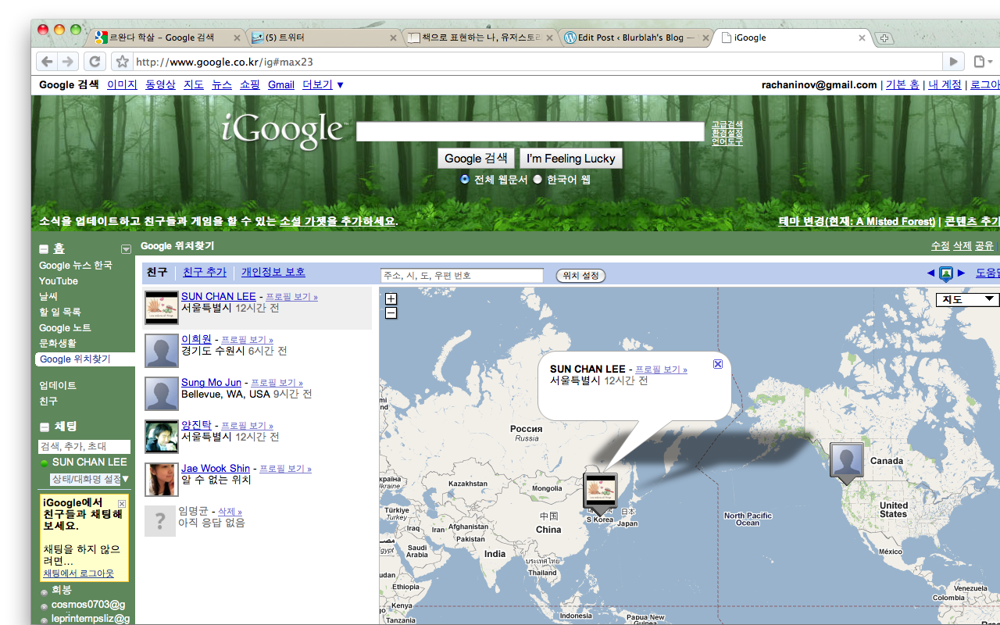

Google에서 latitude 라는 서비스를 발표했던 적이 있다. 기사에서 읽어보고는 어떤 기능을 가지고 있는지 대강 파악만 하고 있다가 옴니아를 사용하면서 google map 을 다운받아 써보기도 했다. 그 당시 가장 아쉽다고 생각했던건 나 혼자만 쓴다는 사실. 주변에 스마트폰을 사용하는 사람도 많지 않았고 그나마 무선인터넷에 접속해야지 사용할 수 있는 google map 이란건 어찌보면 사치스러운 일이었기 때문에 권유조차 하기 쉽지 않았다. 사실 사치라고 불러야 한다는게 좀 이상한게 몇십만원, 혹은 백만원 가까이 돈을 들여서 스마트폰이란걸 사두고도, 상대적으로 더 비싼 가격을 지불하는 것 처럼 느껴지는 무선인터넷 요금제나 wifi에 대한 폐쇄적인 환경이 문제. 라고 지금은 생각한다.  
  
어찌되었건 이 서비스는 google map의 확장된, 또 다른 feature 라고 한다. 사실 겉모습은 google map과 크게 다르지 않다. 단지 google contacts에 있는 내 지인들을 손쉽게 추가를 해놓고 상대방이 accept 하기만 하면 지도 상에 나와 상대방의 위치가 표시된다. 그리고 상대방을 클릭하면(어디에 있든지) 손쉽게, 클릭 몇 번 만으로 email을 보낼 수 있다.  
  
사실 email 전송 자체만 보면, 그리 새로울 것도 없다. 내가 주소록에서 이메일 보내고 싶은 사람을 클릭해서 메일을 보내나 지도에서 그 사람의 사진을 클릭해서 보내나 다를건 없다. 그럼에도 새롭게, 또 편하다고 느껴지는건 상대방의 위치를 볼 수 있다는 사실 때문이 아닐까?  
  
난 예전에 함께 일하던, 나의 role model 이었던 분에게 request를 보냈고, 다행히 그 분이 accept를 해주셔서 좀 더 재미있게 되었다. 아이폰의 도입으로 주변 사람들에게도 많이 권유했는데, 예전과는 다른 반응. 이것저것 해보고 싶어하는 아이폰 구매자들이 흥미를 가질만한 좋은 서비스인 듯 싶다.  
  
  
  
WM나 Symbian OS 등을 사용하는 대다수의 스마트폰에는 전용 client가 있다고 하는데, 아쉽게도 iphone, ipod touch에는 없다. 이상한 생각이 들어 여기저기 찾아봤더니 Apple 측에서 기존의 google map 과의 사용자의 혼동 가능성 때문에 app store에 올리는 걸 막았다고 한다. Apple의 사용자 위주 정책이 정말 깐깐한 듯.  
  
그래서 google에서 어쩔 수 없이 safari로 모바일 단말에서 접속 가능한 페이지를 만들었는데, 직접 해보니 일반 application과 별반 다를게 없다. 너무 깔끔하게 잘 만들어서...
