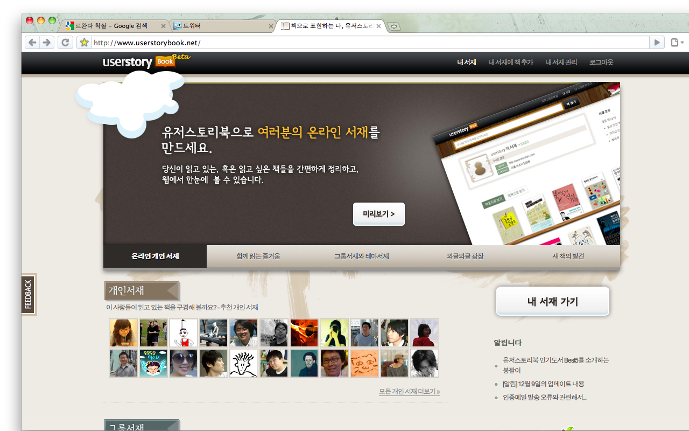

얼마전부터 트위터에 정해진 양식의 기계적인 트윗들이 보이기 시작했다. 누구누구의 서재에 어떤어떤 책이 추가되었다는 식의 고정된 내용이었고, 처음엔 그냥 넘기고 말았다. 어젠가 우연히 정말 우연히 관심이 가게 되서 검색을 해봤더니 친구가 애기했던 '책'이란 매개를 이용한 SNS.  
  
[유저스토리북](http://www.userstorybook.net/)  
  
언뜻 생각해보면 별 것 아닌거 같은데, 관심을 가지면서 생각해보니 나 자신에게 책을 읽으라는 압박(?) 같은 걸 줄 수 있을 것 같아보였다. 집에 읽지 않고 널려있는 책은 많은데 순간 관심이 생기는 책들만 집어들고 읽다보니 무언가 부족한 느낌이 있긴 했는데 잘됐다! 는 느낌이 든다.  
  
  
  
아직 제대로 사용하고 있지도 않고, 무언가 추가해 놓지도 않았지만 대강 훑어보니 난 내가 읽은 책을 '내 서재'란 나만의 공간에 추가해 놓고 그 책에 대한 간단한 메모를 남겨나가면 타인이 그걸 참조하고 추가하는 방식인 듯. 트위터와 연동된다는게 좀 흥미롭다. 한국 사이트, 그것도 아직 많이 알려지지 않은 곳임에도 적극적으로 다른 나라의 것, 이슈가 되는 것들을 받아들이는 모습도 마음에 든다. 자주 이용할 생각.
