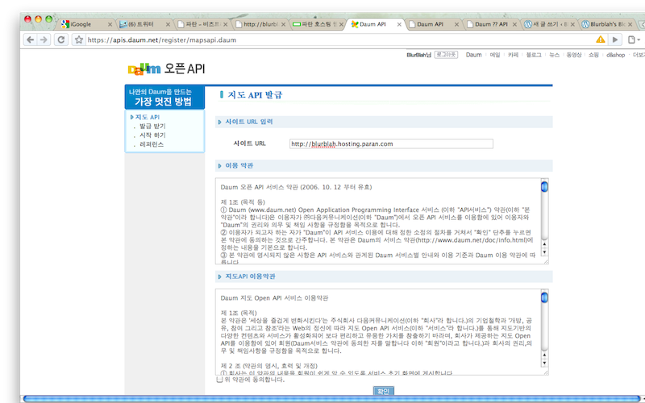
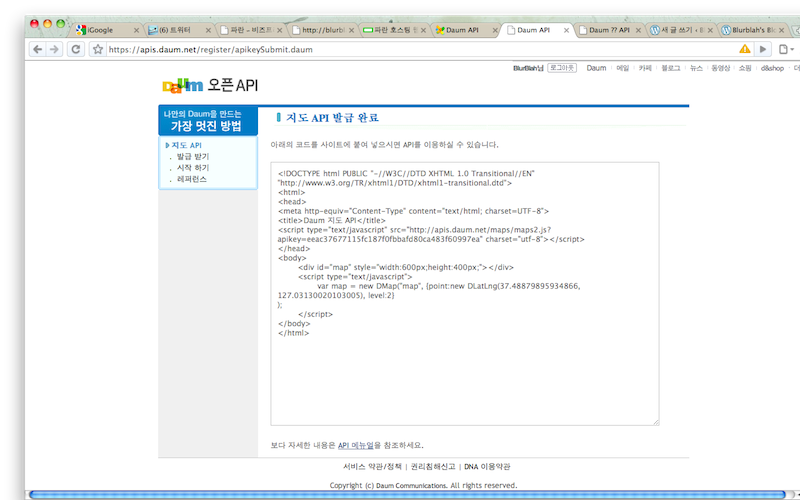

  
부서에서 연구회 활동을 하고 있다. 조별로 나뉘어 4월 혹은 5월쯤엔 산출물을 내어놓아야 하는데, 우리가 만들기로 한 모바일용 클라이언트가 위치 정보를 지도상에 표시해 주어야 하기 때문에 open된 몇가지 중에 daum map을 사용할까 생각하고 있다. Google, Naver 등도 조금 살펴봤지만 어차피 방식은 비슷하다. 모두 웹상에서 서비스하고 있기 때문에 근간이 되는 지도에 대한 데이터는 무작정 받아와야 하고 사용자 혹은 개발자가 컨트롤 할 수 있는 부분은 java script 를 이용해야만 하는 것 같다. 국내 실정에 잘 맞고 위성 사진(스카이뷰)이 조금 더 깔끔하다고 생각하는게 daum map 이었기 때문에 시도해보고 정리할 생각이다.  

# 1. 준비  
Java script 실행에 문제가 없는 공간. 보통 업체들에서 서비스하는 블로그 혹은 게시판에선 보안 등의 이유로 java script 사용에 제한이 있다. 때문에 개인이 웹서버를 운영하던가 별도의 업체에 웹호스팅 서비스를 신청해서 그러한 공간을 마련해야 한다. 나의 경우엔 역량강화의 목적으로 시작하게 된거기 때문에 그냥 무료 웹호스팅 업체를 이용하기로 했다. (제공하는 하드와 트래픽은 좀 작지만 알아보니 쓸만한 무료 웹호스팅 업체가 꽤 되는 듯 하다. 국내뿐 아니라 다른 나라도...) 그래서 [paran](http://hosting.paran.com/)에 신청. 설치비 무료고, 필요한 내용 5분 정도 작성해주면 20분 안에 서비스를 받을 수 있다.  

# 2. Open API 등록
Google, Naver 와 마찬가지로 Open API 사용을 위해서는 허가를 받아야만 한다. [http://dna.daum.net/apis/maps](http://dna.daum.net/apis/maps) 위 페이지에 있는 하단에 등록하기 버튼을 누르면 아래와 같은 화면을 만나게 된다. (물론 daum 로그인이 선행되어야...)

  
이용할 사이트의 URL을 넣게 되어있는데, 입력할 URL 하위의 모든 웹페이지에서는 서비스 이용이 가능한 것으로 보인다. 나의 경우엔 paran에서 제공받은 웹호스팅 주소를 입력했다. 약관 동의 후 정상적으로 처리되면 sample code와 함께 완료화면으로 이동된다.  
  

  
Sample code를 언뜻봐도 기본적인 html에 java script가 포함되어 있음을 알 수 있다. script 태그를 보면 본인이 등록해서 할당받은 key 값이 포함되어 있는데 apikey 뒷 부분이 key 값이다. 항상 key 라는 건 고유한거니 공개되면 좋지 않을 듯 한데, 소스보기를 하면 다 보인다. 모르겠다. 가려야 하는건지, 말아야 하는건지...  

Sample code를 천천히 살펴보면, `var map = new DMap("map", {point:new DLatLng(37.48879895934866, 127.03130020103005), level:2})` 이 부분이 간단한 java script로 된 API 사용 예로 보인다. 직관적으로 DLatLng 의 값들은 좌표고, level은 지도의 해상도(확대, 축소 정도)로 생각되는데 실제 API 설명 페이지를 봐도 그렇다. (Level은 12단계로 구분된다고 함)  

# 3. Sample code 저장 / 사용
Sample code를 복사해서 html 문서로 저장한 후, 웹서버(나의 경우엔 호스팅 서비스 받은 공간)의 적절한 곳에 옮겨놓은 후 브라우저로 페이지를 열어보면...잘 된다. ㅎㅎ 의심스러우면 아래의 링크를 클릭  
  
[http://blurblah.hosting.paran.com/map/map\_test.html](http://blurblah.hosting.paran.com/map/map_test.html)
