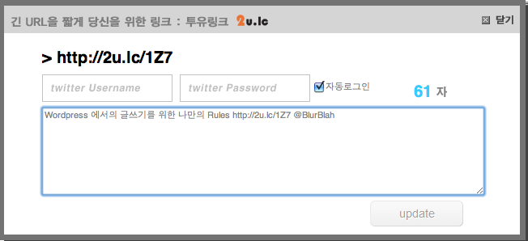
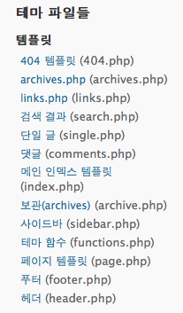
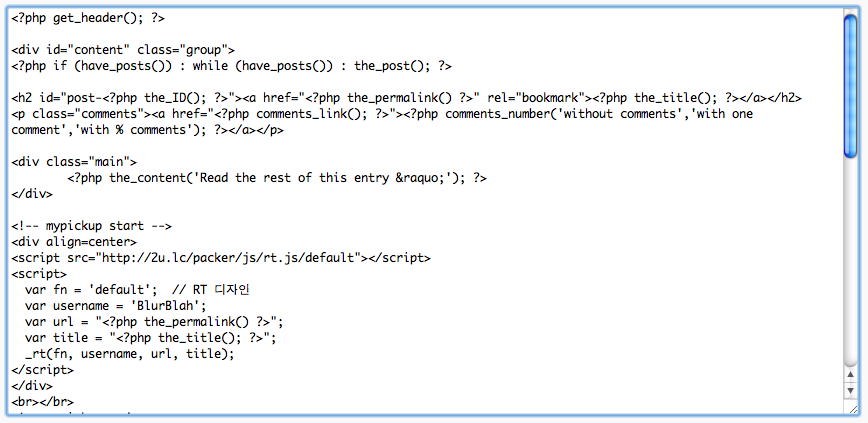

  

설명을 시작하기 전에 먼저 고백을 하자면, 난 웹과 관련된 기술적인 지식이 거의 없는 상태이다. 홈페이지, 블로그라는 걸 만들었다 방치하길 수차례 반복하다가 최근에 다시 개인적인 관심이 급증해서 호스팅 서비스를 받고, 워드프레스를 설치하고, 도메인까지 구매해 지금 이 곳에 자리잡게 되었다. 자랑은 아니지만 웹과 관련된 기술을 어느 정도만 알고 있는 상태냐면, 간신히 html, xml 태그들을 읽을 수 있을 뿐이다. php, java script 같은 스크립트 언어들이 직관적이고 간단하단 얘기는 여기저기서 주워듣긴 했지만 그것들을 이용해 직접 코딩을 해본적은 단 한 번도 없다. 혹시나 나처럼 블로그를 시작한지 얼마 안되었는데 이것저것 해보고 싶지만 마음먹는 것처럼 쉽지 않은 분들이 있을까봐(없을수도...ㅠㅠ), 또 공부도 할겸 정리해보려 한다. 아래의 내용은 완전하게 fix된 상태는 아니고 어디까지나 내가 직접 이것저것 건드려본 내용이니 오해없으시길...

  

  

# 1. 설치형 블로그, Wordpress

이 블로그 가장 첫글도 워드프레스에 대한 내용인데, 대부분 알고 있을거라 생각하지만 wordpress.com에서 서비스하는 무료(용량제한있음) 블로그도 있고, wordpress.org에서 다운받아 개인이 운영하는 웹서버나 호스팅 받은 공간에 설치할 수 있는 것도 있다. wordpress.com에서 제공되는건 보안 측면에서 테마 수정 등에 제한이 있고 플러그인 설치도 불가능하다. 나의 경우엔 이것저것 바꿔보고 수정도 해보고, 공부도 하고 싶은데 무료 블로그의 제약때문에 고민하다 결국은 호스팅을 선택해서 워드프레스를 설치하기에 이르렀고 이 글의 모든 내용은 바로 그런 분들에게만 해당되는 내용.

  

  

# 2. mypickup 이란 무엇?

간단히 설명하면 블로그의 글을 트위터로 올려주는 기능을 수행하는 위젯이다. 누군가의 블로그를 방문해서 글을 읽다가 내용이 좋아서 트위터의 follower 들에게 알려주고 싶을 때 보통은 해당 포스트의 주소를 복사해서 트위터 페이지를 연 후에 간략한 설명과 함께 주소를 붙여넣어야 하는데, 이런 작업이 여간 귀찮은게 아니다. 그런 작업을 좀 더 간편하게 할 수 있고 (글을 읽던 페이지에서 클릭 몇 번으로 끝. 단, 그 블로그에 설치되어 있어야...), 그렇게 여러 사람들이 '이거 괜찮네' 라고 생각했던 글들은 [mypickup.kr](http://mypickup.kr)에 따로 모여서 한꺼번에 구경할 수도 있게 되어있다.

  

]

  

블로그에 설치가 되면, 위와 같은 위젯이 보이게 되고, '트위터 알리기'를 클릭하면 세부 내용을 입력할 수 있는 팝업이 열려 자신의 트위터 id/pw를 입력하고 트위터로 보낼 글을 넣어주면 트위터와 mypickup.kr로 해당 내용이 전송되고 블로그에 있는 위의 twt visitors 수가 늘어나게 된다. 아래는 '트위터 알리기'를 눌렀을 경우의 팝업 화면.

  

]

  

아직은 베타서비스 중이고, 더 자세한 내용을 알고 싶다면 이 곳을 방문하면 된다.

[http://www.estorylab.com/18](http://www.estorylab.com/18)

  

  

# 3\. 내 블로그에 어떻게 넣을 것인가?

티스토리, 텍스트 큐브, 제로보드 XE에 추가하는 방법은 위의 '이스토리랩'에 설명이 되어있다. 근데 워드프레스는?? 난 몇가지 이유때문에 워드프레스를 고집해야만 하고, 아직 워드프레스에 넣는 방법은 제공되지 않았다. 그래서 잘 모르면서도 해보려고 발버둥치게 된건데...'대충 뭐 비슷하지 않겠어?' 라는 말도 안되는 가정에서 출발하게 되었다.

  

일단 워드프레스 관리자 페이지로 들어가보면, 좌측에 여러개의 메뉴가 보이는데 그 중에서 '테마 디자인 > 편집기'를 눌러본다. 그럼 자신이 현재 사용하고 있는 테마의 구성파일들이 보이고, 그 파일들의 세부내용을 관리자가 편집 가능하게 구성된 화면이 나타난다. 우측을 보면,

  

]

  

이런 부분이 보이는데, 이게 테마를 구성하고 있는 파일로 생각된다. 예를 들어 '사이드바'는 사이드바를 보여주는 파일일거고, 'footer.php'는 블로그의 하단을 책임지고 있을거 같고(왠지), 'header.php' 파일은 왠지 블로그의 위에서 무언갈 할 거 같은 느낌이 막 온다. 근데, 그 부분에 위젯을 넣을게 아니었기 때문에 그 파일들은 열어보지도 않았다. 처음에 헷갈렸던건 '단일 글'과 '메인 인덱스 템플릿' 이었는데, 이것저것 시도하면서 나중에 알게 된 사실은 single.php(단일 글) 파일은 글을 클릭해서 블로그에 하나의 글만 보이는 상태의 화면을 만들어주는 파일이고, index.php 파일은 블로그에 접속했을 때 처음 나타나는 화면을 구성해주는 파일이다. (모두 직접 수정해보고, 비교해보면서 알게 된...) 나의 경우엔 블로그를 열었을 떄, 글이 5개씩 나오게 설정해 두었기 때문에 두 가지 파일을 모두 수정해야만 할 것 같았다.

  

그래서 해당 파일들을 열어보니, 아래와 같은 부분을 볼 수 있었는데...

  

]

  

php 파일의 윗부분부터 차근차근 보니, 왠지 뭔가 느낌이 오는 부분들이 보였다. 로 구성된 부분 안에 있는 내용들이 함수 형태를 띄고 있는 걸로 봐서 무언가 행위를 하는 녀석들이겠구나 라는 직감이 든다. 예를 들어 가장 상단의 get\_header(); 는 보나마나 헤더 부분을 보여주는 녀석일 거고, the\_ID(); 는 해당 포스트의 고유 id를 표시해 줄거고, the\_permalink(); 는 보나마나 포스트의 고유주소, the\_title(); 은 제목을 표시할거라는...이 순진한 믿음(? :O). 하지만 실제로 브라우저에서 '소스 보기'를 해서 페이지의 소스와 비교한 결과 일치했다. 그래서 위의 그림처럼 글의 내용을 보여주는 the\_content 아랫 부분에 mypickup 위젯을 붙이게 되었다.

mypickup 위젯을 사용하기 위한 소스는 아래와 같다.

```html
<script src="http://2u.lc/packer/js/rt.js/default"></script>

<script></div> <div id="_mcePaste">var fn = 'default'; // RT 디자인</div> <div id="_mcePaste">var username = 'BlurBlah'; //twitter id</div> <div id="_mcePaste">var url = "<?php the_permalink() ?>"; //글의 고유주소</div> <div id="_mcePaste">var title = "<?php the_title(); ?>"; //title</div> <div id="_mcePaste">_rt(fn, username, url, title);</div> <div id="_mcePaste"></script>
```

mypickup이 내 블로그에서 가져가야 하는 데이터는 트위터 아이디, 링크를 걸어야 하는 고유주소, 글의 제목 정도로 보인다. 왜냐하면, 실제 '트위터 알리기'를 클릭했을 경우 팝업 화면에 기본적으로 등록되어 있는 내용이 '타이틀, 링크, 트위터 아이디' 였기 때문이다. 원하면 찾아서 주면 된다. ㅎㅎ 그래서 워드프레스에서 각 부분을 보여줄 때, 사용되는 함수들을 그대로 변수에 입력하는 식으로 수정했더니...끝.

# 4. 기타 / 유의사항

위의 내용은 워드프레스의 Journalist 테마를 수정해서 테스트하고 만들었기 때문에, 사용하는 테마에 따라서 조금 다를수도 있다는 생각이 든다. 테마 별로 사용하는 파일의 구성이나 내용이 다를 수 있어서인데 그래도 기본적인 내용은 비슷할거라 본다. 또 위 처럼 했을 경우 모든 기능은 제대로 동작하는 것으로 보이는데, 단 하나 twt visitors에 표시되는 수가 이상하게 올라가는 현상이 있다. 아마 count 할 때 사용하는게 무엇이냐에 따라 조금 수정해야 할 수도 있을 것 같은데, mypickup 서비스를 하고 있는 estorylab의 강팀장님께 문의중이니 해결되는 대로 블로그에 추가해서 업데이트 할 예정이다. 또 나의 경우엔 테마의 설정상 index.php와 single.php 파일에 위의 소스를 붙여넣어서 사용했는데, 설정에 따라 다른 파일들도 동일하게 수정해야 할 수도 있다.

To be continued...
