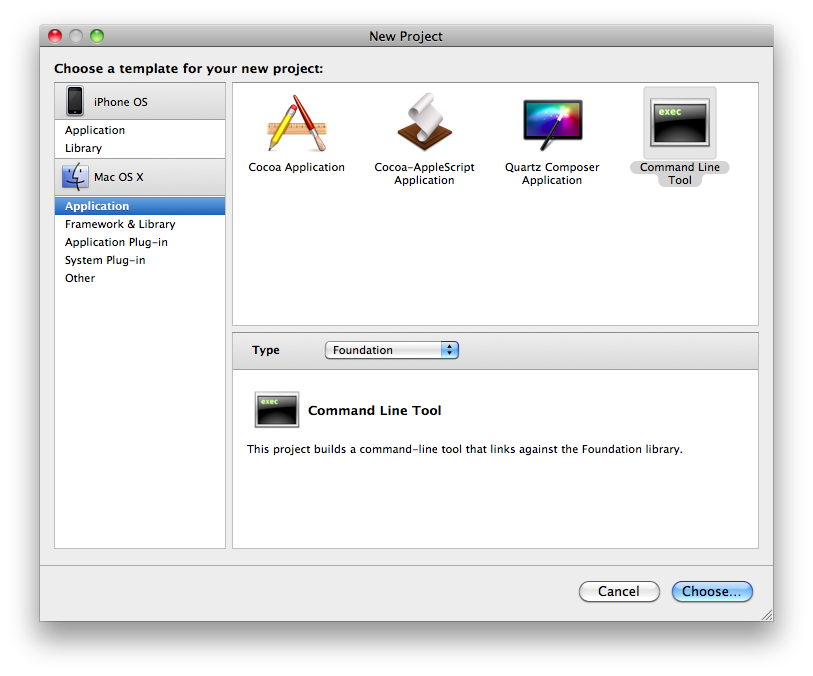
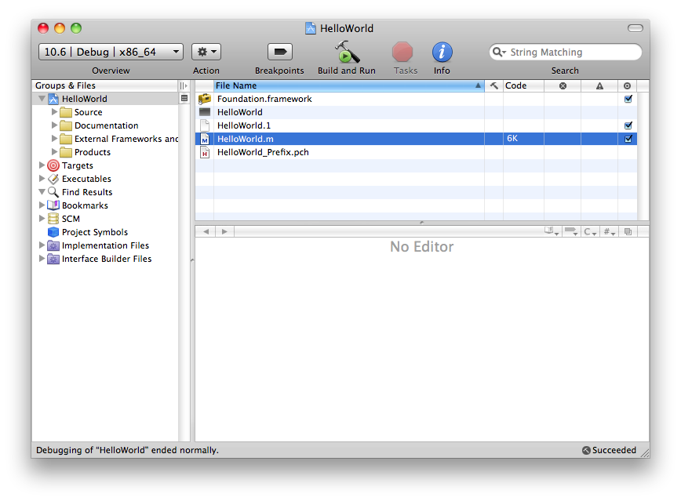
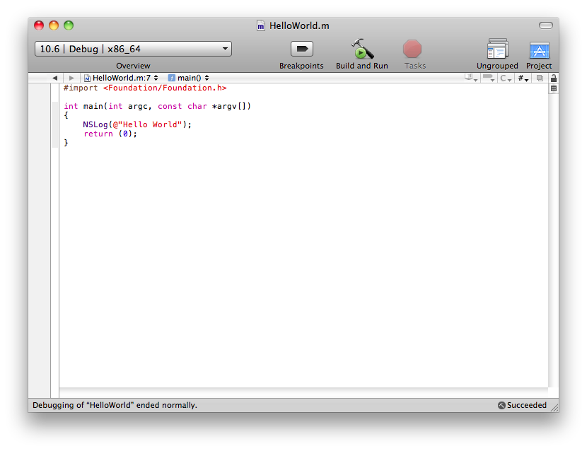
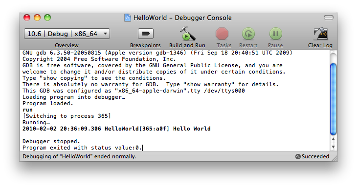
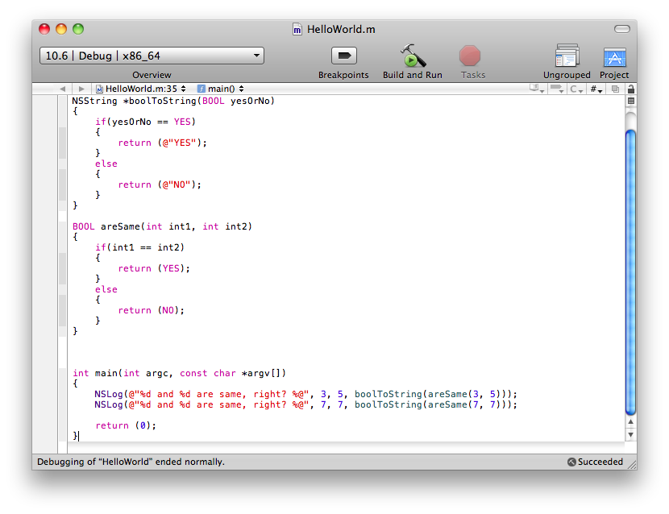
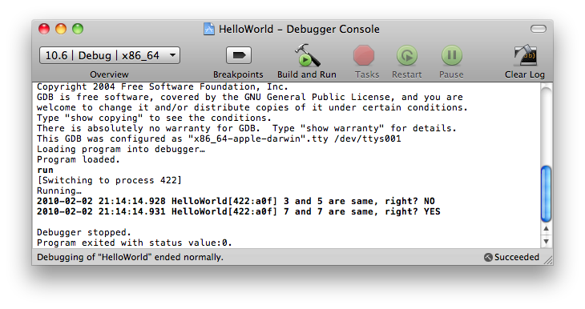

  

특이한 문법 때문에 Objective C 책을 한 권 샀다. 시간날 때 마다 공부해서 정리할 생각. 책은 Apress에서 발간한 원서를 BJ 퍼블릭이란 곳에서 번역한 출판한 "(아이폰과 맥 OS X 개발을 위한) Objective C" 이다. (원래 서명은 굵은 꺽쇠(?)로 감싸줘야 한다고 배웠었는데, 맥북이란게 한글 친화적이지 못한 부분이 조금 있어서 어쩔 수 없이 큰 따옴표를...)

  

  

**1\. Hello World**

누구나 언어를 처음 배우면 처음 해보는게 Hello World 출력하는 프로그램이다. 왜냐하면, 1.간단하고, 2.사용할 IDE의 기본을 후딱 맛보기 좋으며, 3.여러가지 이유로 각종 책들이 젤 첫 예제로 Hello World를 사용하기 때문이다. 아무것도 모르는 우리들이야 어쩔 수 있나 무작정 따라할 수 밖에.

  

IDE로는 OS X 설치된 맥만 있으면 무료로 다운받을 수 있는 Xcode. 무조건 실행해보면, Visual Studio나 Eclipse 등의 IDE들 처럼 프로젝트를 새로 만들거냐 라는 물음의 메뉴가 최상위. 기타 등등은 아래에 배치되어 있다. 새 프로젝트 만들겠다고 선택한 후

위 그림과 같은 화면이 나오면 왼쪽 메뉴에서 Application, 오른쪽에서 Command Line Tool, 중앙의 Type을 Foundation으로 선택한뒤 Choose 버튼을 꾹 누른다. 그리고 적당한 프로젝트 이름과 위치를 지정해주면 끝. Xcode가 뚝딱뚝딱 뭔가 처리하더니 아래와 비슷한 화면이 보이게 된다.

난 HelloWorld 라고 프로젝트 이름을 지정했더니 HelloWorld.m 파일이 보인다. 그게 Objective-C 소스가 들어갈 파일이다. 나머지 파일에 대해선 천천히 공부할 예정. 책에서 언젠간 언급이 되겠지. (난 시간이 없다. ㅎㅎ 언급이 안되더라도 언젠간 알아야 할 시점이 올거다. 아마도...) 더블클릭해서 원래 Xcode가 만들어준 소스를 지우고 아래처럼 입력해본다.

C와는 다르게 #import 라는게 있지만, 생김새보니 딱 #include 역할이다. stdio.h 대신 Foundation.h 가 쓰인다고 생각하면 될 듯 하다. 참고로 Foundation.h 파일의 위치는 /System/Library/Frameworks/Foundation.framework/Headers/ 이다. 분명 나중에 해당 헤더들을 한번쯤은 열어볼 필요가 생길 것 같다. C처럼 생각한다면...

  

헤더파일 import를 제외하고는 어색한 부분이 딱 하나 보인다.

NSLog(@"Hello World");

NS는 스티브 잡스가 애플에서 쫓겨났을 때 만들었던 NeXT 라는 회사에서 만든 NextSTEP의 약자라고 하는데, 저 앞부분만 제외하고 보면 Log니까 콘솔에 글자를 찍어주는 함수일거란 느낌이 든다. 근데 @는 뭘까? @는 뒤에 오는 문자열이 NSString 형태라는 알려주는 기호라고 한다. 그러니까 NSLog는 C의 printf와 비슷한데, printf에서처럼 일반 문자열을 사용하는게 아니라 NSString type을 사용하기 때문에 @를 넣어준다고 생각해주면 쉽다. printf 보다 편리한 점은, 뿌려주고 싶은 문자열 마지막에 개행문자(\\n, \\r\\n)를 넣지 않아도 된다는 점. 빌드해보면 아래와 같은 결과를 얻을 수 있다. (Build + Run 은 Command + R이고, 이전에 콘솔 창을 먼저 열어줘야 하는데 단축키는 Command + Shift + R)

굵은 글씨로 Hello World 라고 떡하니 찍혀있다. 어찌보면 당연한건데 항상 처음하는건 신기하고 기쁘다.

  

  

**2\. %@, BOOL**

좀 더 예제를 다뤄보기로 하자. 역시 전부 다 지우고 이리저리 입력해 보았다. 아래의 그림.

그냥 단순히 숫자 비교하는건데, 속도를 위해 main 함수를 보면 아래와 같은 구문이 있다.

NSLog(@"%d and %d are same, right? %@", 3, 5, boolToString(areSame(3, 5)));

printf 처럼 형식지정자가 비슷하다. int type 받을거니까 %d 사용했는데, %@ 라는 것도 있다. 직관적으로 NSString type을 받을 것임을 느낄 수 있다. 간단하다. 특이한 것 하나는 YES, NO 같은게 있다는건데 이건 뭘까? 바로 BOOL type 이다.

C에서도 bool type 이 있고 true, false 가 있으니 마찬가지라고 생각하면 된다. 보통 C/C++ 로 개발하다 보면, 편의성이나 type들이 꼬이는걸 막기 위해 개발자들이 별도로 사용하기 위해 type을 재정의하는 경우가 있는데 Objective C도 마찬가지인 듯 보인다. 그냥 쓰기 편하게 unsigned char를 재정의 한 것이고 각각 1을 YES, 0을 NO 라는 키워드로 정의해 두었다. (1바이트 이상의 값을 BOOL 변수에 대입하면 하위 바이트 값만 저장되므로 유의)

며칠전 자기 전에 30분 정도 본 내용인데 정리하려니 시간이 배는 더 걸리는 것 같다. 하지만 이래야 복습이 된다. 간단한 것도 잘 익혀둬야 나중에 삽질하지 않으니 기본은 철저히 익히는게 좋은 듯. 계속 정리할 거다. 꼭...

참! 결과 화면. ㅎㅎ 결과를 봐야 재미 있는게 개발인데...빠져선 안된다.

