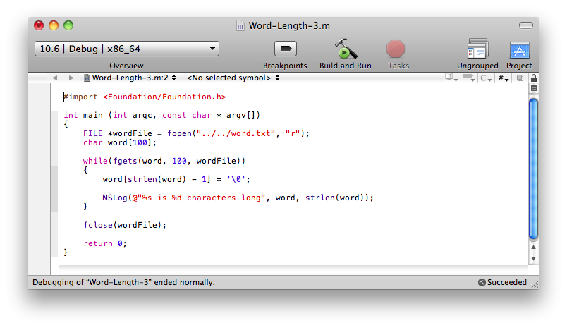
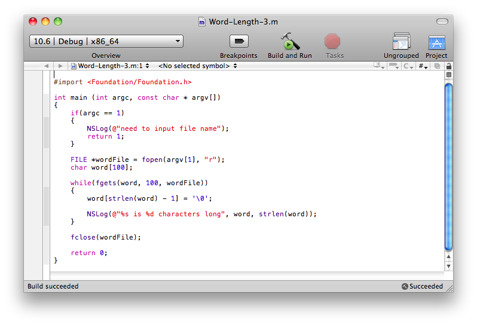
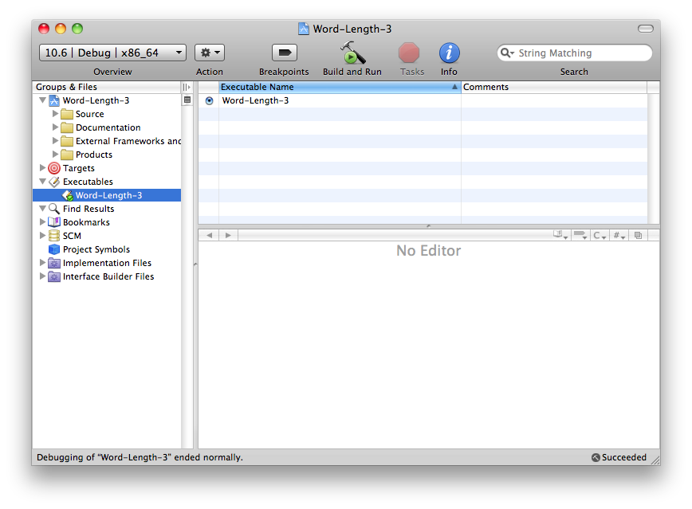
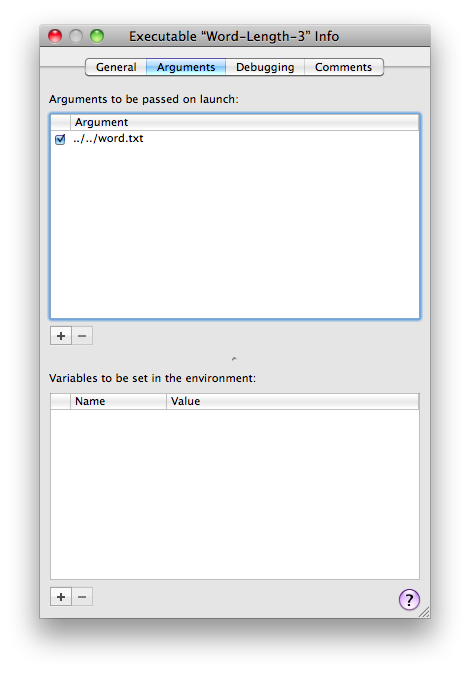

  

책을 보고나서 정리한다는게 생각처럼 쉽지 않다. 특히 예제가 많거나 할 때는, 가장 좋은 방법이 직접 해보는거라 다 넣고 싶지만 너무 길어지게 되어서 고민된다. 그래서 이후로는 그냥 팁이나 문법적인 내용만 간략하게 정리할 생각이다. 어차피 대부분의 Objective-C 책들이 C 문법을 어느정도 알고 있다는걸 가정하고 쓰여졌으니까.

  

1\. Indirection

책에선 간접적인 방법에 의한 참조를 indirection이라고 표현하고 있다. 코드에 직접 값을 입력하거나 하는 방법이 아닌 포인터 등을 이용해 접근하는 방법을 의미한다. 예를 들어 for 문을 돌리는데 원하는 반복횟수를 직접 숫자로 입력하는게 가장 간편한 방법이 되겠지만 이런 방법을 아무 생각없이 사용하게 되면 이후의 유지보수나 확장성 측면에서는 별로 좋지 않다. 그래서 함수 상단에 반복횟수를 저장하는 변수를 하나(예를 들어 흔히쓰는 count나 cnt 등으로) 두고 그 변수를 for문이나 함수 내의 다른 곳에서 사용하게 되면 수정할 필요가 있을 때, for 문이나 함수 전체를 훑어보고 수정할 필요 없이 저장된 변수의 값만 하나 살짝 바꿔주면 된다. 책에선 이런 식의 접근 방법을 indirection 이라하고 객체지향의 의미를 설명하게 전에 언급해 두었다. 실제 예는 아래에.

위의 그림은 word.txt 파일에서 문자열을 한줄씩 읽어 문자열과 함께 문자열의 길이를 출력해 주는 예이다. 이걸 indirection의 의미를 이용해 어떻게 바꿀 수 있을까? 파일명을 코드에 넣지 않고 인자로 입력받는 방법을 쓴다면 여기서 좀 더 나아간 코드가 될 것 같다는 느낌이 든다. 물론 위의 예제 자체도 indirection을 약간 사용한 내용이다. 파일에서 읽어오는 것이 아니라 문자열을 직접 코드 안에 넣었다면 유지보수나 확장이 더 힘든 코드가 될 것이다.(물론 때에 따라 코드 안에 직접 문자열을 넣어두는게 좋을 때도 있지만...) 어찌되었든 위의 코드를 조금 더 개선해보면 아래와 같이 된다.

main 함수 상단만 변경했다. 먼저 인자의 갯수를 판단해서 파일 이름을 넣어두었는지 판단한 후에 해당 인자를 파일 이름으로 해서 fopen을 하는 내용으로 변경되었는데, 책과 거의 비슷하게 만들어 보니 오류가 있다. 해당 파일이 없을 경우를 고려해서 파일이 없을 땐 아무 작업도 하지 않고 종료되게 해야 하는데 위의 예제는 fopen에 실패해도 그냥 fgets를 호출해 파일포인터를 사용하게 된다. 분명 잘못된 파일이면 run time error 가 발생할게 뻔하다. 하지만 어차피 indirection 을 설명하기 위한거니까 이해해 주시길. 이렇게 변경하면 최초의 예제보다는 좀 더 간편한 코드가 만들어진다.

2\. XCode에서 argument 설정하기

두번째 예제를 만들어보면서 XCode에서 argument는 어떻게 설정하는지 알게 되었다. 바로 다음의 그림 참조.

코드가 보이는 편집기 말고 XCode 화면을 보면 왼쪽에 Executables가 보이고 화살표를 눌러 하위 내용을 보면 코드가 들어있는 m 파일이 빌드된 바이너리가 보인다. 그 바이너리를 더블클릭하면 아래와 같은 창이 열리면서 다양한 설정메뉴들이 나타난다.

상위의 탭에서 두번째에 위치한 Arguments를 클릭하면 처음엔 비어있는데 가운데쯤에 있는 + 버튼을 누른 후에 인자로 넣고 싶은 내용을 추가해주면 끝난다. 나의 경우엔 문자열이 들어있는 텍스트 파일이 빌드된 실행파일보다 두 단계 상위 디렉토리에 있었기 때문에 상대경로로 지정해 두었다. 여기까지 입력한 후에 콘솔창을 띄우고 Run 해보면 끝. 물론 txt 파일이 정상이어야 하고 인자로 입력한 위치/파일명과 동일한 파일로 이미 만들어져 있어야...^^
