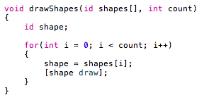
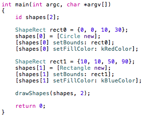
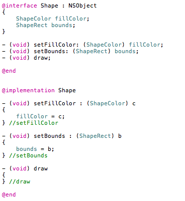
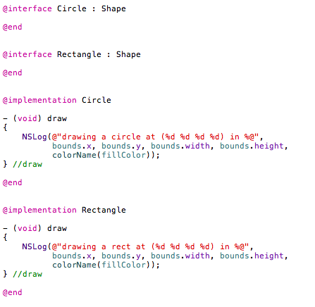

  

Indirection에 이어 OOP에 대한 부분을 공부했다. Objective C 자체가 객체지향 때문에 C에서 small talk를 차용했다고 알려져 있기 때문에 얼마나 효율적인가가 궁금하긴 했다. 일단 C++ 과 비교했을 때 비슷하다는 느낌도 들었지만 가독성 면에서는 더 낫다는 생각이다. 또 java와 비슷하게 interface와 implementation 부분을 구분하기 좋다는 것도 장점이지 않을까 싶다. 내용 정리하면서 사용했던 예제는 보통 C++이나 java에서 OOP 설명에 많이 사용하는 도형 예제이다. (Circle, Rectangle, Triangle 을 처음엔 구조체로 작성했다가 클래스로 바꾸고, 나중엔 상속 개념을 도입하면서 추상화 클래스인 Shape 라는 걸 만들면서 refactoring 하는 그런...)

  

**1\. 용어**

다른 언어에서는 볼 수 없었던 조금은 생소한 용어를 아래에 따로 정리했다. 사실 메세지의 경우엔 Objectvie C 코드에서 가장 특이하다고 생각했던 문법에 관련된 내용으로 이 부분만 책에서 봤는데도 Objective C 예제 코드들을 이해하기가 쉬웠다.

Message : Objective C에서 객체가 수행하는 액션.

Method dispatcher : Objective C의 코드에서 메세지가 보내지면 method dispatcher 가 메소드를 찾는다. 가장 먼저 해당 클래스에서 찾고, 없으면 상위 클래스로 올라가면서 찾는 방식을 취하며 찾아도 없으면 오류를 내보낸다.

  

**2\. Message**

아래의 그림을 살펴보면,

이상한 부분이 하나 눈에 띈다.

\[shape draw\];

이게 뭔지 도대체 알 수 없었다. 배열도 아니고...Objective C 샘플들을 보면 대괄호로 묶인 저런 문장들이 자주 보인다. 메세지를 보낸다는 의미로 해석하면 된다고 하는데, 책 내용 그대로 보면 shape 라는 객체에 draw라는 메세지를 보낸다는 의미라고 한다. 근데 왠지 뭔가 뒤죽박죽 이상해서 내 나름대로 편하게 해석하기로 했다. shape에게 draw 라는 명령을 내리는 거라고 생각하면 훨씬 편한 듯 하다. 뭐 그게 그거일 수도 있다...ㅎㅎ

다시 정리하면 shape라는 객체가 존재하는데 그 객체는 멤버함수로 draw를 가지고 있어야 하고 그 draw를 호출하는 내용이라고 볼 수 있다. 그런데 그건 그렇다고 하더라도 또 이상한게 보인다. "id". 객체를 가리키는 포인터로 이해하면 쉽다. 난잡하게 생긴 포인터 대신 깔끔하게 id 라는 타입을 사용하는 듯 하다. 그러니까 \[shape draw\]의 shape가 id 타입의 변수이지만 어차피 객체를 가리키기 때문에 shape가 가리키고 있는 객체에게 draw 를 지시하는 내용.

  

헷갈릴 수 있으니 또 다른 예문을 보자.

첫번째 예제와 같은 프로젝트에 사용한 main 함수의 내용이다. 첫번째 예제와 비슷한 부분이 몇 군데 보인다. 일단 재미있는 부분은 shapes\[0\] = \[Circle new\]; 문장인데 처음에 다루었던 내용을 보면 같다. 단지 Circle 이라는 클래스에 new라는 메세지를 보내고 있을 뿐이다. 한마디로 Circle 객체를 새로 만들라는 의미.

두번째로, 비슷하지만 좀 이상한 부분이 보인다.

\[shape\[0\] setBounds: rect0\];

shape\[0\]는 객체를 가리키는 id 배열 중 하나이니 어차피 객체를 가리키는 거라 생각하면 되지만 뒷 부분의 콜론 좌우는 좀 어색하게 느껴진다. 알고보니 간단했는데, setBounds는 메세지. 그러니까 멤버함수인거고 콜론 이후의 rect0는 setBounds에 전달하고 싶은 parameter. 끝. 이상한거 없음.

  

**3\. Interface / Implementation**

첫 부분에 언급했던 것처럼 Objective C에서는 interface 와 implementation이 구분하기 좋게 문법적으로 구성되어 있다. 아래는 상속개념까지 적용해서 refactoring 까지 마친 상태의 도형의 최상위 클래스 Shape이다.

클래스를 interface와 implementation으로 구분해 놓은 내용이고, @interface로 시작해 @end로 끝맺음을 하는 형태를 갖추어야 한다. Shape 옆의 콜론은 상속을 받는 의미로 해석하면 편할 듯 하고 extends 정도로 해석하면 되지 않을까? (나만의 생각) 그러니까 Shape는 NSObject (C++에서 Object 클래스 같은 최상위 클래스)를 상속받고 그 아래의 중괄호로 싼 내용은 멤버변수라고 생각하면 된다. 특이한 부분은 '-' 로 시작하는 3줄. 직관적으로 멤버함수를 의미한다는게 느껴진다. (void) 는 리턴타입을 의미하며, 위에 있는 main 함수 예문을 참고해서 보면 setFillColor 라는 method는 ShapeColor 타입의 fillColor를 인자로 받는 method 라는 걸 명시해주고 있다.

구현부인 implementation도 @로 시작해 @end로 끝맺음한다. Interface 부분과 동일한 형태로 method를 나열해 중괄호로 묶어 구현내용을 넣어두었다. 마지막에 있는 draw는 Shape를 상속받을 Circle, Rectangle 등의 sub class에서 overriding 해서 쓸 거라 빈 내용으로 두었다.

  

**4\. Inheritance**

상속이다. OOP에서 가장 중요한 개념 중 하나. 역시나 예제 위주로 보는게 편하다. 아래의 그림.

Shape를 상속받는 Circle과 Rectangle 클래스의 interface와 implementation 부분이다. 대충보면 대부분 이해가 되는데 하나 이상한게 interface 안에 내용이 없다는 사실. 두 클래스 모두 Shape의 멤버변수와 멤버함수 이외에 추가할게 없는 경우엔 저렇게 빈 공간으로 두어도 무방하다. implementation 부분을 보면 Shape의 draw를 overriding 해서 쓰려고 재정의해 두었다. 두 클래스의 draw의 차이점은 NSLog에 들어가는 circle과 rect 문자열의 차이. ㅎㅎ

  

초반에 용어정리해 두었던 method dispatcher를 생각해보면, method dispatcher는 내가 사용한 예제에서 draw를 호출할 때 각 클래스(Circle, Rectangle)에 있는 draw를 먼저 호출하려 할거고 만약 재정의되어 있지 않다면 상위의 Shape로 올라가 draw를 찾아서 있다면 Shape의 draw를 호출하게 만든다.
