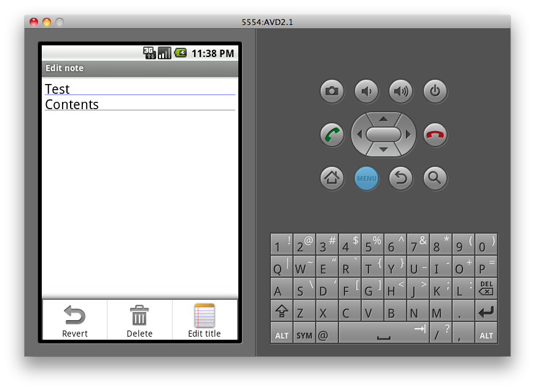
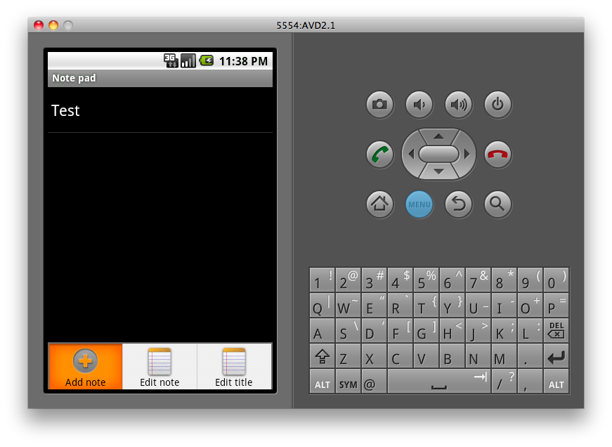

회사 업무 이외에 연구회 활동을 하고 있다. 다뤄본 사람이 조금 있어서 진입장벽이 나름 낮았던 WM은 이후 프로젝트에 별로 유용하지 않을 듯 하여 안드로이드로 옮겨타게 되어서 짬짬이 준비하고 있다. 덕분에 iphone 에 대한 공부는 좀 더 미뤄질 예정. 시간관계상 갑작스럽게 새로운 무언가를 만들기는 힘들듯 해서 제공되는 sample 중 하나인 notepad 를 응용하기로 했는데, 이리저리 돌려보니 notepad sample 자체의 기능이 조금 부족한 감이 없지 않아 개선작업부터 먼저 할 생각을 하게 되었다. 간단히 메뉴나 작은 기능만 추가하면서 익힐 예정. 아래는 기본 기능에서 개선이 필요한 부분들.

  
  
  
  

1\. 메모 저장 기능

  
  

  
  

notepad 실행 후 menu 버튼을 눌러 새 메모를 추가하게 되면 간단히 글 입력이 가능하지만, 별도의 저장버튼이 존재하지 않는다. 단지 글 입력 후 되돌아가기 버튼을 누르면 저장이 되는 형태. 별도의 저장 기능이 있는 것 보다 편할 수도 있지만 사람 헷갈린다. 그러므로 저장 메뉴가 필요함. (Delete는 있는데 왜 Save는 없는걸까?)

  
  
  
  

2\. Title과 본문 분리

  
  

저장 아닌 저장을 마치고 note list로 빠져나가서 확인해보면 처음에 입력했던 모든 내용이 title로 등록되어 있다. 물론 별도로 title을 수정하면 title만 변경되고 실제 내용엔 변화가 없다. 이걸 보면 입력한 내용과 동일한 data를 title에도 복사하고 저장은 별도로 하고 있음을 유추해 볼 수 있다. 개선이 필요하다. 새 메모 입력시 Title과 본문을 분리해 두어야 하고, 본문 입력시 제한적인 화면크기를 생각해서 title은 숨겨야 한다. 물론 저장시 숨겨두었던 title은 다시 꺼내서 보여주어야 함.

  
  
  
  

3\. Menu list에서의 Delete 기능

  
  

  
  

Note list에서 메모 하나를 선택 후 메뉴 버튼을 눌러보면 Add Note, Edit Note, Edit Title 세 가지의 메뉴만 나타난다. 물론 메모를 선택해 롱키를 누르면 context menu에 Delete가 보이지만 별도의 메뉴로 존재해야 한다. Edit이 있는데 Delete가 없다는건 말이 안되니까.
