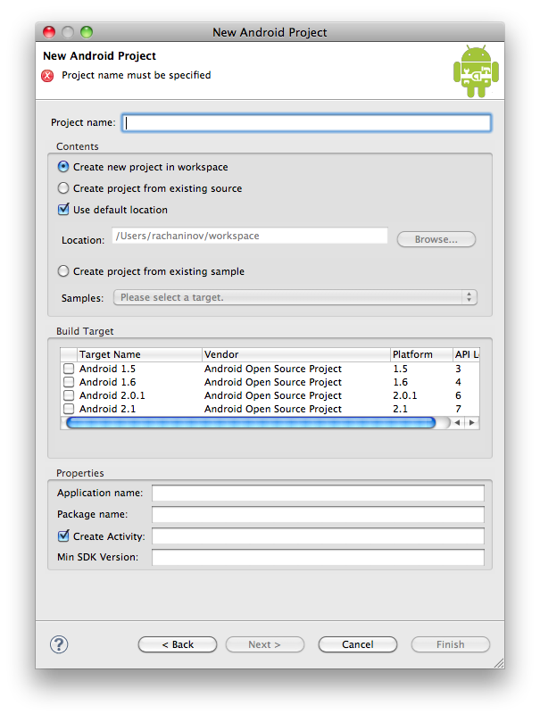
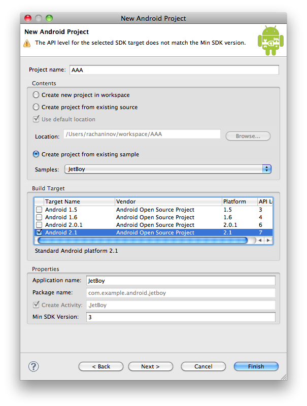

  

내가 가진 책이 너무나 좋은 관계로 책 전반을 구글 혹은 출판사에서 제공하는 샘플을 사용해 설명하고 있지만 해당 샘플을 어떻게 import 하는지에 대한 설명이 없다. IDE를 이클립스로 사용하고 있기 떄문에 제공되는 샘플에 프로젝트 파일만 들어있다면 클릭 몇 번으로 import는 마칠 수 있지만 유감스럽게도 구글에서 제공하는 샘플에는 프로젝트 파일이 들어있지 않다. .classpath도 물론 없다. 프로젝트 생성에 관련된 파일들만 제외하고 샘플 자체에 대한 파일들만 들어있는 셈이다. 처음엔 프로젝트를 새로 만들면서 manifest 파일이나 각종 소스파일과 리소스들을 그냥 복사, 붙여넣기 등을 통해서 해결하려고 해봤는데 그나마 건드려야 하는게 너무 많아서 짜증을 내고 있던 찰나에 이런 생각에 이르게 되었다. '구글에서 과연 이렇게 하라고 해둔걸까?' 역시 그렇지 않다. 제대로 꼼꼼하게 살펴보지 않아서 삽질만 한 셈. 구글에서 제공하는 샘플들을 사용하는 방법은 아래와 같다.

  

1\. 프로젝트 생성

  

  

기본적으로 프로젝트 생성을 해보면 위와 같은 pop-up 을 만날 수 있다. 여기서 default로 설정된 항목들을 그대로 두고 필수항목인 프로젝트 이름이나 activity name 등을 채운 후에 Next를 해버리면, 나와 같은 삽질을 해야만 한다. 그래서 천천히 살펴보면 이런 걸 볼 수 있다. Create project from existing sample.

  

  

2\. Sample 추가

  

  

Create project from existing sample 을 선택하면, 바로 위에 선택되어 있던 라디오버튼 항목들은 비활성화가 되고, Build Target 까지 적당히 원하는걸로 선택해주면 해당 platform 아래에 있는 sample 들을 선택할 수 있게 되어있다. (실제로 platform 별로 sample 디렉토리가 별도로 존재한다.) 그래서 맘에 드는 sample 을 골라주기만 하면 끝. 물론 프로젝트 이름 등의 필수항목들은 본인이 직접 채워줘야...
