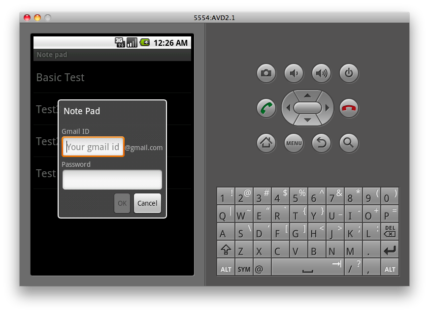
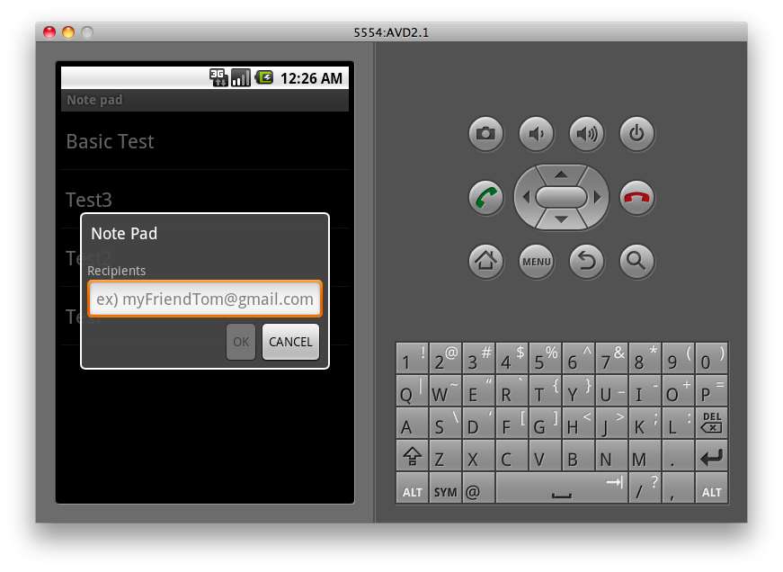

  

Android 연구회 과제로 notepad에 몇 가지 기능 추가하기로 했었는데, 내가 맡은 부분은 완료했다. 입력된 메모를 email로 전송하는 간단한 기능인데 책도 보고 여기저기 뒤지면서 android 에서 제공하는 기본적이고 중요한 내용은 어느 정도 익힐 수 있었다. 사실 제공되는 notepad sample 자체가 가지는 몇가지 문제점 때문에 그것부터 개선한 후에 가려고 했으나(예전에 포스팅 했던), 내 능력의 미숙함과 더불어 게으름 때문에 신규 기능만 추가하는 선에서 마무리 하기로 했다.

  

  

**1\. User account**

내가 참조했던 어떤 블로그에서 android 가 아직 자체적으로 email 관련 라이브러리를 제공하지 않는다고 봤는데, 예전 버전에서 안되었던건지 그래서 현재는 제공되는 것인지는 확인을 해봐야 하지만 일단 해당 라이브러리를 import 해서 사용했고 덕분에 Gmail 계정 사용자만 이용 가능한 상태. 어쨌든 공부의 목적으로 시작한거니 문제없는 기능구현이 우선이었다. User account 를 입력할 수 있는 activity 를 별도로 구현했으며 sample 의 NoteList activity 에서 intent로 넘겨받은 계정 정보를 처리. SharedPreferences 로 한 번 입력한 내용은 activity 나 application 이 종료되더라도 계정정보를 다시 입력하는 일이 없도록 작성했다.

  

  

**2\. Recipients**

User account 정보를 입력한 이후에는 수신인 email 주소를 입력하는 activity를 실행하게 되는데, 필수 항목이므로 한글자도 입력하지 않으면 OK 버튼을 비활성화 상태로 두어 진행 불가능하게 구현했다. (User account 도 마찬가지) 여기까지 필요한 정보를 입력하고 OK 버튼을 누르면 이메일이 전송된다.

  

  

**3\. 결론**

  

Notepad sample의 소스를 들여다보면 application 작성에 필요한 거의 대부분의 내용을 담고 있다는 걸 알 수 있다. Activity 간 data를 주고받는 Intent 의 사용은 물론이고, database, ContentProvider 를 모두 사용해서 구현되어 있기 때문에 이런 필수적인 API 들의 사용방법을 익히기에 딱 적당한 내용인 듯 하다. 추가로 배운 내용들은 아래에 간단히 요약.

  

**Popup dialog**

popup 형태의 activity 를 만들기 위한 방법은 여러가지가 있을 수 있는데 가장 간단한 방법은 일단 popup 형태로 만들고자 하는 activity 를 일반적인 activity 처럼 구현한 이후에 AndroidManifest.xml 파일의 해당 activity의 속성에 아래의 항목을 추가하면 끝.

android:theme="@android:style/Theme.Dialog"

  

**Activity 는 호출순서의 가장 마지막에서 시작할 수 있도록 작성할 것.**

sample 이 제공하는 것 이외에 별도로 작성한 activity 가 두 개인데 (User account와 recipient 정보 입력하는), 시나리오상 두 개가 연속으로 불려야 할 때도 있고, 따로 불려야 하는 경우도 있다. 두 개의 activity가 연속으로 시작해야 하는 경우 (User account 입력 후 바로 수신인 메일 주소를 입력하는 시나리오)를 위해 처음엔 startActivityForResult 를 연속으로 호출하게 작성했었다. 내 생각엔 하나의 activity 가 활성화되면 입력이 끝나야 main activity 로 넘어가서 다시 두 번째 activity 가 시작될거라고 생각했기 때문이었는데, 실제로 구현해보니 main activity는 두 개의 activity 를 모두 호출하고 그 아래에 있던 디버깅용 구문들까지 모두 순서대로 호출해버리는 사태가 발생했다. 이리저리 머리를 굴려서 적당히 분리해 문제가 없도록 개선은 했는데, 이런 경험하면서 가능한 startActivity나 startActivityForResult 호출한 이후엔 다른 메소드가 호출되는 일이 없도록 작성하는게 좋겠다는 생각을 하게 되었음.

  

**Hint / Toast**

EditText 에 data 를 입력하지 않은 상태에서 예시를 보여주는 hint 의 사용법과 Activity 에 짧은 메세지를 보여주기에 적당한 Toast 의 존재를 알았다. 그 중 Toast 는 간단히 구현결과 확인하는데도 아주 좋음.
