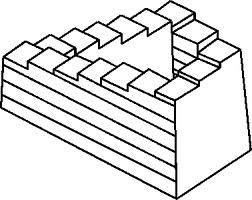

  

Title은 이렇게 적었지만 사실 뾰족한 수가 없다. 오늘 우연히, 또 오랜만에 테스팅에 대한 책을 읽다보니 문득 얼마전까지 고민하던 문제들이 떠올라서 계속 생각해볼까 한다. 책에서 언급된 내용을 대충 요약하면 아래와 같다.

  

1\. Regression test 는 반복적으로 수행해야 하는 test 기법이다.

2\. 매번 반복하는데 공수가 많이 들어가므로 가능한 자동화 하는게 좋다.

3\. 자동화를 하면 편해질 것 같지만 나름의 고통이 따른다.

4\. 그 나름의 고통이란 testcase maintenance 를 의미한다.

5\. Regression test 를 수행하는 이유가 소스코드의 수정에 따른 side effect 때문인데, 코드가 수정되면 testcase 도 수정되어야 하기 때문이다.

  

먼저 Regression test 부터 정리해보면

어떤 개발자가 특정 application을 구성하는 Module A, B, C 를 구현했다고 치자. 처음에 component test 혹은 integration test를 진행해서 Module A에서만 defect이 검출되었고 테스터는 테스트 매니저에게, 매니저는 개발팀과 유관된 타 부서에도 reporting을 했다. 개발자는 test report를 받아들고는 '아! A의 이런 부분이 잘못되었군. 요렇게 수정하면 되겠다' 는 생각을 하고 수정을 한다. 그리고는 이제는 문제가 없을테니 테스터가 더 이상 괴롭히는 일이 없을거라 기대한다. 물론 맞게 수정되었다면 A에 대한 테스트는 통과할 것이다. 하지만 A, B, C는 application을 구성하는 하부 module이기 때문에 유기적으로 연관이 있을 수 밖에 없고, 때문에 A의 코드 수정사항이 다른 B, C에 영향을 끼칠 가능성을 배제할 수 없다. 보통 얘기하는 side effect는 바로 이런 상황에서 발생한다.

때문에 A의 수정사항 때문에 다른 부분에 문제가 생겼는지를 확인하고자 전 module에 대해서 테스트를 진행해야만 하는게 일반적이고 이러한 테스트를 우리는 regression test라 부른다.

  

테스트를 진행하다보면, side effect 같은게 많지 않을거라 생각하지만 경험상 의외로 많이 발생한다. 개발자들은 regression test의 결과를 받고는 바로 항변하는데, '난 이 부분의 코드를 수정하지도 않았는데, 왜 defect이 발생한거죠? 테스트가 잘못된거 아닌가요?' 이런 반응이 일반적이다.

  

이런 일이야 비일비재하니 뒤로 넘기고, regression test에 대해서 다시 집중을 해보면 코드 수정사항에 대해 매번 전 부분에 걸쳐 테스트를 재수행해야 하기 때문에 일을 덜기 위해서는 자동화가 필수적이라고 할 수 있다. 그리고 자동화를 하더라도 필연적으로 마주치게 되는게 바로 Testcase maintenance이다. 사실 경험상 자동화 환경을 구축하는 일 자체는 그렇게 어렵지 않다. 왜냐하면 '무에서 유를 창조'하는 작업이기도 하기 때문에 나름 재미도 느낄 수 있고, 보람도 있다. 때문에 실제로 어렵더라도 덜 어렵게 느껴진다.

하지만 매 수정사항에 대해 Testcase를 유지보수 하는 일은 정말 지루한 작업이다. 절대적인 시간과 노력을 들여야 하는 작업임에도 '표시'가 나질 않고, 이미 했던 것이기 때문에 흥미도 떨어지는게 일반적이다.

  

  

어떻게 하면 maintenance에 소요되는 노력을 줄일 수 있을까?

또는 어떻게 해야지 조금이라도 덜 힘들고 지루한 느낌이 덜 들게 만들 수 있을까?

  

항상 고민이 되는 부분이다.

SW Testing 부분에 몸을 담고 있는 대부분의 사람들도 마찬가지겠지만...

  

가도 가도 끝이 없는 테스트...

올라간 듯 보여도 다시 보면 제자리.

쉽지 않다.
