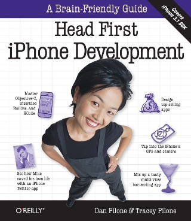

  

부서에서 새로 iphone application 개발연구회를 시작하게 되었습니다. 얼마전까진 android에 대해서 공부하고 있었는데, 원래 iphone app 때문에 맥북을 구매한게 있어서 다시 처음으로 돌아갔지요. Android는 약간 맛만 본 수준이지만 언제든지 다시 돌아가도 된다는 생각이 있었고, 맥북을 산지 6개월이 되었는데 별 다른 성과가 없어서 그게 제일 아쉬운 상태였습니다. 다른 분들과 협의하면서 책을 한 권 더 구매하긴 했지만 (이번 책까지 무려 3권이라는...) 책에 돈 들이는건 전혀 아깝지 않다고 생각하기 때문에 문제 없십니다. 저는 objective c를 약간 (아주 약간) 공부했지만 다른 분들은 대부분 처음이고 objective c를 연구회에서 다루지 않을 예정이라 다른 분들이 교재를 이해하기 좋을 정도로만 문법적인 내용을 정리할 예정입니다. 또 제가 막내라...투철한 서비스 정신 :)

  

[](https://blurblah.net/wp-content/uploads/2010/06/headfirst_iphone_dev_book1.jpg)

요 책 샀습니다. 번역서로 출간된지 그리 오래되지 않아서 ipad 란 단어도 찾아볼 수 있네요. SDK 3.1.3을 기반으로 설명되어 있는 듯 합니다. Head First 시리즈가 갖고 있는 공통점인 대화형 기술. 아주 즐겁습니다. ㅎㅎ 주인공도 등장하고 말도 안되는 배우들 사진 붙여넣고...

  

아래는 Ch.1 에서 등장하는 예제에 대해 필요한 설명입니다. 저도 모르는 부분은 뺐습니다. @property 같은거요. 책에서는 나중에 설명한다고 되어있으니 저도 나중에...

  

  

`#import <UIKit/UIKit.h>`

C/C++ 에서 사용하는 #include와 동일

  

**.m / .h 파일**

.h는 헤더파일. 구현은 .m 파일에 작성

  

**@interface / @implementation**

Class를 만들고 싶다면 선언은 @interface에 하면 되고 (보통 헤더파일에), @implementation으로 구현부를 시작한다. 두가지 모두 끝 부분에 @end를 추가해 주어야 함.

  

**예제 이해하기**
```objectivec
@interface
iDecideViewController : UIViewController    // UIViewController를 상속받는 iDecideViewController interface
{
  IBOutlet UILabel *decisionText;    // 멤버변수는 중괄호 안에 선언
}

- (IBAction)buttonPressed : (id)sender;    // 멤버함수 선언은 '-' 로 시작. 상세내용은 아래
@end    // interface 종료
  

@implementation
iDecideViewController    // iDecideViewController 구현
- (IBAction)buttonPressed : (id)sender
{
  decisionText.text = @"Go for it!";    // buttonPressed가 수행할 내용
}
```
  

**위 예제에 대한 추가설명**

`- (IBAction)buttonPressed : (id)sender;`

return type은 괄호 안에 표시 여기서는 IBAction 임을 의미 . (id)sender는 parameter이며 type은 id, 이름은 sender. id type은 객체의 instance를 의미하는데 C++에서 가장 상위클래스이면서 특정 type으로 결정되지 않아 범용으로 사용하는 Object 와 유사.
