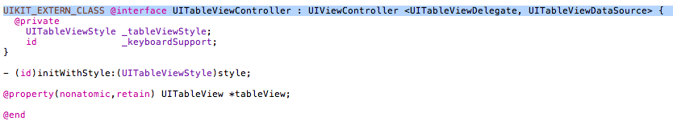

  

Ch.4 부터는 독특한 Objective C 문법이 나오질 않네요. 객체에 메세지 보내는 방법, property, protocol 등만 익숙하면 크게 어려울게 없는 듯 해서 중요해 보이는 부분이나 이상했던 부분 위주로 정리해볼까 합니다.

  

UITableViewController

이전 chapter 들에서 picker 라는게 나오면서 DataSource와 Delegate를 protocol로 지정해 사용했었는데, Chapter 4에 사용되는 UITableViewController는 DataSource와 Delegate를 이미 protocol로 사용하고 있기 때문에 개발자가 별도로 선언할 필요가 없다고 합니다. 실제로 UITableViewController의 정의 부분을 찾아보니 아래처럼 protocol로 선언되어 있네요.

그래서인지 이미 UITableViewController가 구현해야만 하는 method 들이 이미 만들어져 있습니다.

  

NSMutableArray

NSMutableArray를 사용하는 부분이 있는데 초기화를 개발자가 원하는 문자열을 사용해 초기화 하는 것으로 예제들이 되어 있습니다. 물론 다른 방법(method)을 사용해도 무방하겠지만요. 재밌다고 생각한건 초기화 할 때 일련의 문자열 마지막에 nil이 들어있다는 사실입니다. 이전 chapter 들에서도 비슷한 부분들이 있었는데, C / C++ 과 비슷하게 문자열 마지막의 nil은 문자열의 마지막임을 알려주는 용도로 사용된다고 합니다. 물론 배열 안에 추가되는 것은 아니구요.

  

NSBundle

이번 chapter에서 독특한 클래스가 등장합니다. NSBundle 이라는. Property list를 DB 대신 이용하면서 property list의 경로를 찾기 위해 사용하고 있는데, 문서들을 찾아보니 프로그램에서 사용되는 resource나 code 들을 그룹핑한 파일시스템에서의 위치를 표현한다고 하네요. Cocoa에서 몇개의 파일들과 디렉토리들을 묶음으로 관리하는데 그 묶음을 bundle이라고 한다고 합니다. 자세한 내용은 더 찾아봐야 하겠지만 일단은 우리가 작성하는 application에 존재하는 파일이나 resource 들을 읽어올 때 사용해야 한다고 생각하면 편할 듯 합니다. 나중엔 음원이나 영상들을 얻어와서 읽어들일 때도 사용가능할 듯 싶네요.

  

UIViewController subclass 생성시 유의사항

이번에 사용되는 예제에서 detail view를 위해 UIViewController subclass를 생성해서 작성하게 됩니다. 이 때 책에 표시가 되어있는데 저는 깜빡하고 넘어갔던 부분이 "with XIB for user interface" 옵션인데요. 이걸 체크하지 않으면 h와 m 파일만 생성됩니다. 전 xib 파일을 따로 생성해서 작업을 했었는데, 어찌된 일인지 나중에 run 해보면 빌드는 정상인데 run time error가 발생하더군요. xib 파일을 따로 인식하지 못하는 모양이었습니다. 분명 별도로 생성한 xib 파일을 나중에 엮어주는 방법이 있을텐데 한참이나 고생하다가 옵션 체크해서 새로 작성했던 기억이 있습니다. 저처럼 고생하는 일이 없기를... 그래도 이런 실수들 한거 전 좋습니다. 알아낸게 있으니까요. :)

  

Debugger와 Console 단축키

단축키는 여러모로 편리합니다. 머릿속에 각인시켜 두는게 힘들긴 하지만요. 이번 chapter에서 debugging에 대한 맛보기가 등장하는데 따로 debugger 윈도우나 console이 올라오지 않으면 아래의 단축키를 사용하세요.

Debugger : Command + Shift + Y

Console : Command + Shift + R
