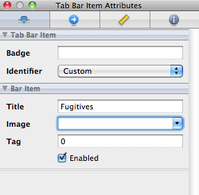
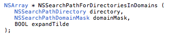

오랜만에 정리합니다. 계속 미루고 있다가 책을 마지막까지 다 보고 나서야 정리할 생각을 하게 되었습니다. 했던거 마무리는 해야 하니까요. 이번 chapter 7에서는 새로운 application을 만드는 것으로 시작을 합니다. 수배자에 대한 정보를 listing 해주는 application 인데, chapter 9 까지 이어지네요. chapter 7에서는 tab bar를 사용해서 수배자와 검거된 사람들의 list를 분리하고 그에 필요한 data 관리는 Core Data로 하는 방법을 알려주고 있습니다. Core Data는 다시 별도로 정리를 해야할 것 같습니다. 꽤 복잡해 보여서요. 물론 직접 DB 관리하면서 쿼리문을 코드에 넣는 것보다는 훨씬 낫겠지만요.

  

**Tab bar icon 추가 혹은 변경**

Tab bar에 있는 물음표를 선택하던가 직접 구성요소를 다 펼쳐서 Tab bar item을 선택합니다. 그 이후에 오른쪽의 속성 창에서 Identifier 부분을 Custom으로 변경하고 Image에 넣고자 하는 혹은 바꾸고자 하는 image 파일을 선택해주면 됩니다.

위의 그림처럼 설정하면 끝. 간단합니다. :)

  

**Core Data에서 Entity의 attributes 옵션들**

Entity를 새로 구성하려고 attribute 들을 추가하고 수정하다보면 몇 개의 옵션들이 있는 것을 볼 수 있습니다. 그 중에서 Transient는 data를 따로 저장할 필요가 없는 임시 attribute 라는 걸 알려주는 용도이며, Indexed는 Core Data가 index 값을 별도로 만들어 빠른 검색을 가능하게 만들 필요가 있을 때 사용합니다.

  

**Core Data의 세가지 요소**

Core Data는 세가지 요소로 구성된다고 책에 언급되어 있습니다. 개인적으로는 entity도 하나의 요소가 되는거 아닌가 싶은데 일단 책에서는 그렇게 말하고 있네요. 세가지는 아래와 같습니다.

Managed Object Context : Data를 관리하는 녀석. Entity로 만들어낸 data model 들도 context가 관리합니다.

Persistent Store Coordinator : 아래 store를 관리하는 역할을 수행합니다.

Persistent Object Store : 용어 그대로 store 입니다. 책의 예제에서는 sqlite 파일이 되겠습니다.

  

**NSFetchRequest**

Managed Object Context에게 찾고자 하는 객체를 알려주기 위한 용도로 NSFetchRequest 라는 클래스를 사용해야 합니다. NSFetchRequest를 사용할 때 크게 세가지를 결정해줘야 하는데, Entity Info, Predicate, Sort Descriptor 가 그 것입니다. 어떤 entity를 찾을건지 결정해주고(Entity Info), 충족해야 하는 조건 혹은 검색 조건을 만들어줘야 하구요(Predicate). 조건을 충족하는 data가 있을 경우에 정렬시켜서 뽑을 수 있습니다.(Sort Descriptor)

  

**NSSearchPathForDirectoriesInDomains**

책에서 계속 simulator를 사용하고 있기 때문에 실제 device와 약간 차이가 나는 부분들이 있습니다. 그 중에 하나가 DB가 존재하는 위치인데, device와 달리 simulator 사용시에는 다른 디렉토리에 저장이 되기 때문에 별도의 method를 사용해서 DB file을 찾아줘야만 합니다. 그 때 사용하는 method가 NSSearchPathForDirectoriesInDomains 입니다. 이 method의 prototype을 살펴보니 지금까지 보아왔던 Objective C의 method와는 많이 다르네요. C, C++, Java 등에서 흔히 사용하는 method와 같은 모습입니다. (아래의 그림, NSSearchPathForDirectoriesInDomains prototype)

NSSearchPathForDirectoriesInDomains method의 문서를 살펴보니 특정 directory, domain을 위한 경로 문자열을 리스트로 넘겨준다고 되어있습니다. NSSearchPathDirectory와 NSSearchPathDomainMask는 각각 enum으로 여러가지 상수들을 포함하고 있습니다. Chapter 7의 예제에서는 각각 NSDocumentDirectory, NSUserDomainMask를 사용했구요.

  

**NSManagedObject의 생성**

예제에서는 NSManagedObject를 context에서 가져오는 것으로 설명되어 있습니다만, 별도로 생성하는 방법도 있다고 합니다. 일반적인 클래스 객체의 생성처럼 alloc, init만 해서 생성하는 것은 안되고 아래처럼 entity에 대한 정보도 필요하다고 되어있네요.

\[NSEntityDescription insertNewObjectForEntityForName:@"Fugitive"

inManagedObjectContext:managedObjectContext\];
