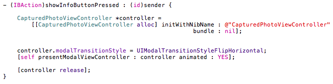

Chapter 9가 마지막입니다. 몇 주 전부터 느끼던 건데, 제가 보고 있었던 Head First iPhone Development 라는 책이 초심자들이 무작정 따라하면서 흥미를 느끼기에는 괜찮긴 한데 Head First 시리즈가 가지고 있는 특성 (여기저기 낙서하듯이 흐트러져 있는) 때문에 종종 복잡하고 혼란스럽게 느껴질 때가 있었습니다. 또 진도가 나갈수록 새로운 control의 사용법들이 등장했는데, 이런 내용은 어차피 나중에도 참조해야 하는 거라서 chapter 7 쯤 되니까 직접 부딪히면서 배우는게 낫겠다는 생각이 들더군요. 어쨌든 마지막 chapter에서는 고급과정인 카메라와 맵킷을 사용하는 방법이 등장합니다. 시뮬레이터 기반으로 구현했기 때문에 실제로 카메라를 직접 동작시킬 수는 없었지만 Map Kit과 Core Location의 활용은 꽤 흥미로웠습니다.

  

Flipping

여러 application을 사용해보다 보면 화면전환시의 animation 중에 화면이 뒤집히면서 변경될 때가 있습니다. 이게 flipping 입니다. 이것을 구현하는 방법은 매우 간단합니다. 전환하는 스타일을 flip 하겠다는걸 의미하는 UIModalTransitionStyleFlipHorizontal 상수만 사용하면 되더군요. 물론 몇가지 작업도 해야하지만 보통의 view를 사용할 때와 같습니다.

위의 사용예문을 보면, 우선 CapturedPhotoViewController.xib 파일로 CapturedPhotoViewController의 객체를 생성했습니다. 그리고 생성한 controller의 modalTransitionStyle을 UIModalTransitionStyleFlipHorizontal로 지정해주고 controller를 modal view로 설정해주는 걸로 끝이네요. 간단합니다. 정말. 참 showInfoButtonPressed 는 화면 전환을 명령할 수 있는 button 등을 미리 만들어두고 IBOutlet으로 만들어서 연결되어 있어야 호출이 가능하겠죠.

  

UIImagePickerController

카메라를 사용하기 위해서는 UIImagePickerController를 이용하면 된다고 합니다. UIImagePickerController를 사용하게 되면 일반 사용자들은 카메라로 사진을 찍거나 라이브러리에서 사진을 선택해서 가져올 수 있게 됩니다. Controller를 생성한 후에 sourceType이라는 속성에 어떤 값을 지정하는냐에 따라 기능을 선택할 수 있는데, 속성값으로는 UIImagePickerControllerSourceTypePhotoLibrary, UIImagePickerControllerSourceTypeCamera, UIImagePickerControllerSourceTypeSavedPhotosAlbum 세가지가 있습니다. 각각은 photo library, camera, photo album에서 이미지를 가져오겠다는 것을 의미하며 복수 선택도 가능합니다. 일반적인 경우처럼 "|(OR)" 를 쓰면 되겠죠. 또 현재 application이 동작중인 device에서 어떤 것을 지원하고 있는지 알고 싶다면, isSourceTypeAvailable 이라는 method를 써서 분기하면 되겠습니다.

  

AR (Augmented Reality)

최근 유행하고 있는 증강현실을 구현해보고 싶다면 어떻게 해야 하는지 궁금했습니다. 뭔가 복잡할 것 같기도 했고, 구석구석 따져보면 간단할 것 같기도 했는데 카메라로 비치는 실사 자체가 호기심을 자극하기 때문에 그런 혼란을 갖게 되는지도 모르겠습니다. 책에서는 아주 짧게 언급되어 있는데 UIImagePickerController 위에 overlay view를 올리면 된다고 하네요. 이 부분은 관심이 많기 때문에 나중에 자세히 확인해보고 정리할 생각입니다.
