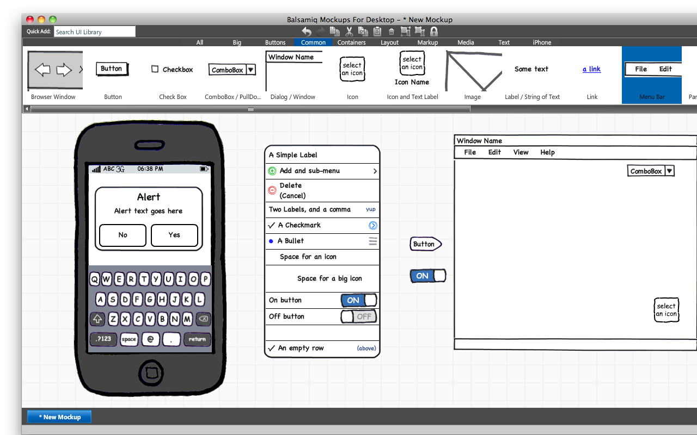

꽤 전에 설치를 해두긴 했는데 계속 공부만 하느라 따로 사용할 시간이 없었습니다. 이제부터는 좀 사용해볼까 하고 있는데요. 제목처럼 Balsamiq Mockups(이하 Balsamiq)란 application 입니다. 예전에 보면 화면 디자인이나 구성하기 편하게 아이폰 모양의 메모지가 판매되기도 했었던 걸로 기억합니다. Balsamiq은 UI design을 하기 위한 tool로 별도로 아이폰에 필요한 항목도 마련해 두고 있습니다. 아이폰 모양의 메모지 같은게 필요 없는거죠. 사실 가볍게 사용하기엔 메모지가 더 좋긴 하겠습니다만, 더 마음에 드는 이유는 제공되는 이미지들이 모두 손으로 직접 그린 듯한 느낌의 이미지들이기 때문입니다. 저처럼 그림은 좋아하지만 소질이 없는 사람들에게 딱 적합한 tool이 아닐까 싶네요. :) 아무거나 이것저것 드래그해서 막 나열해본 화면은 아래와 같습니다.

  

그림 괜찮은가요? 이렇게 구성하는데 1분 정도 걸린 것 같습니다. 디테일한 부분들도 수정은 가능하지만 거의 건들지 않고 그냥 드래그만 했을 때의 상태랍니다. 아이폰 이외에도 일반적으로 UI 구성할 때 필요한 것들은 거의 다 템플릿으로 제공되고 있습니다. 그리고 나서 파일로 저장할 때 PNG, PDF 등으로 저장이 가능한데 근데 전 아직 데모버전을 사용하고 있어서 저장이 불가능한 상태에요. :(

  

정말 괜찮고 멋진 UI 디자인을 해보고 싶으시다면 아래의 공식 사이트에서 다운로드 하셔서 한 번 사용해보시면 되겠습니다.

[http://www.balsamiq.com/](http://balsamiq.com)

라이센스 비용은 $79 네요. 그냥 구매해버리고 싶은 생각도 듭니다. :)
