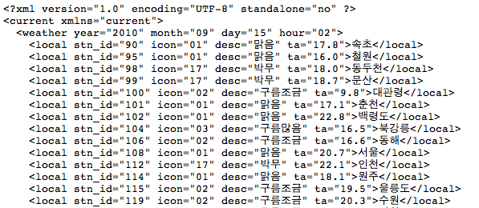
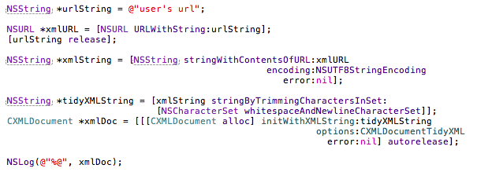
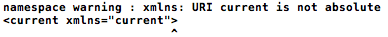
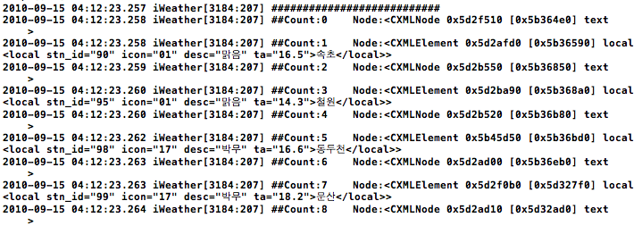
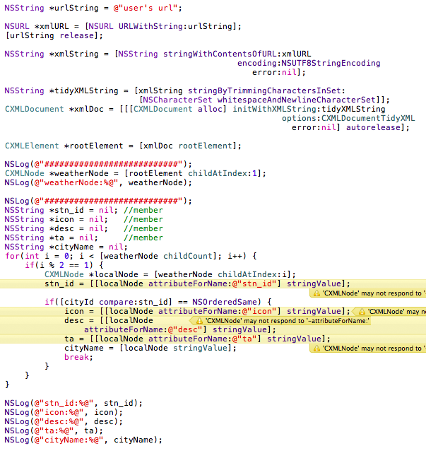
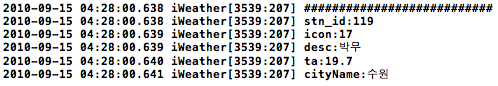

기상청에서 제공하고 있는 DB를 다룰 일이 생겼습니다. 상세 스펙 등이 기술된 문서를 살펴보니 꽤 종류도 많고 상세하더군요.(문제점도 있습니다.) 제가 담당하고 있는 부분이 xml로 넘어오게 될 몇 종류의 data들을 처리해야 하다보니 머리가 아픕니다. 분명 되어야 하는데 제대로 값을 만들어내질 못해서 고생 좀 했습니다.

  

**1\. XML Parsing 준비**

예전에 교육받을 때 사용하던 것도 있고 iphone sdk가 제공하는 xml 처리 부분이 미흡하다는 이야기 때문에(물론 업데이트가 되면서 좋게 변했을지도 모릅니다. 확인은 아직....:)), TouchXML 이란 라이브러리(?)를 사용하기로 했습니다. 살펴보시면 알겠지만 C/C++로 작업할 때 이용하게 되는 보통의 xml parser와 사용법이나 생김새가 유사합니다. 설치나 기본 준비사항에 대해서는 아래의 블로그를 참고해 주세요. (처음 시작할 때 참고하기 좋게 잘 작성해 놓으신 것 같습니다.)

[http://lambert.tistory.com/254](http://lambert.tistory.com/254)

  

  

**2\. XML 형태**

제가 사용해야 하는 여러가지 XML 중에 해결이 쉽지 않았던게 바로 아래와 같은 XML 입니다. Attribute와 Value가 혼합된 형태인데, 혼합된 형태라 해도 어차피 XML parsing 할 때 일반적인 절차처럼 root나 특정 node를 찾으면 거기서 attribute와 value를 각각 빼오면 되는거라 별 문제 없을거라 생각했는데 뭐가 문제인지 값을 얻어낼 수가 없더군요. 아래 그림을 들여다보면 current가 가장 상위에 있고 그 아래 weather, 그리고 각 지역별 기상정보가 담겨있는 local element 들로 구성되어 있음을 알 수 있습니다.

  

  

**3\. 시작**

일단 xml 문서를 읽어들여야 합니다. 아래와 같은 코드를 작성하면 Document 덩어리는 문제없이 얻을 수 있습니다. 대략적으로 해석해보면, 우선 정해진 url에서 contents를 읽어 문자열로 저장하고, 공백과 줄바꿈을 제거해 순수하게 문자값들로 이루어진 문자열 data를 만들고 그 덩어리를 CXMLDocument로 만드는 내용입니다.

위의 내용대로 작성해서 run까지 해보면 별 문제는 없는데 로그에 이상한 부분이 보이더군요. Namespace가 이상한가 봅니다. 이 부분은 제가 건드릴 수 있는 부분이 아닌 것 같아서 그냥 넘어가긴 했는데, 이 때 부터 뭔가 찝찝해지기 시작했습니다.

  

  

**4\.  Xpath로 node 찾기**

XML 표준을 따르고 있는 문서들을 다루다보면 xpath에 대해서 알아야 할 필요가 있습니다. 저도 업무상 필요했던 경우가 있어서 가볍게 익힌 적은 있는데 간단하게 얘기하면 xpath는 xml 문서 안에서 element의 위치를 찾기 위한 경로를 표준처럼 정해둔 형식을 의미합니다. 자세한 내용은 google 등을 이용하시면 엄청나게 많은 문서를 만날 수 있으니 생략하겠습니다.

  

(1) local 찾기

제가 가장 먼저 필요했던 내용이 local에 대한 data였기 때문에 local 부터 무작정 찾으라고 해봤습니다. 해보니 아무것도 나오지 않더군요. 이상했습니다.

NSArray \*localArray = \[xmlDoc nodesForXPath:@"//local" error:nil\];

  

(2) weather, current 찾기

그래서 local 보다 상위에 있는 weather를 찾으라고 했는데 마찬가지여서 가장 상위에 있는 current를 넣어봤습니다. 재미있게도 결과는 같았습니다.

  

(3) 결론

root에서 각각의 element 이름으로 node 검색결과 아무것도 나오지 않기 때문에 //current/weather/local 형태를 이용해도 결과를 얻지 못할거라 추측할 수 있었는데, 실제로 해보니 추측했던대로 아무것도 나오지 않았습니다. 이상해서 혹시 입력한 xpath 형태가 잘못된거 아닐까 싶어 여기저기 찾아보면서 다른 경우에 대해서 해봤는데 뭐가 문제인지 알 수가 없더군요. Google weather API를 이용할 경우에는 문제가 없었습니다.

참고 : [http://blog.naver.com/senjuny?Redirect=Log&logNo=150092832718](http://blog.naver.com/senjuny?Redirect=Log&logNo=150092832718)

  

  

**5\. CXMLDocument의 rootElement로 접근하기**

어쩔 수 없었습니다. 손쉬운 방법을 사용하고 싶었는데 허락하지 않으니 최악의 경우 문자열 만으로 해결하겠다는 각오를 하고 low level에서 접근하기로 했습니다. 그 중 첫번째로 사용한 방법이 element, node를 직접 얻어내서 child로 한단계씩 내려가는 방법이었습니다. TouchXML의 CXMLDocument class를 보면 rootElement라는 method가 있는데  prototype은 아래와 같습니다. 사실 이렇게 시작한 이유 중에 하나는 "root가 있기는 한거냐?" 라는 짜증 때문이었습니다.

\- (CXMLElement \*)rootElement;

  

method 이름처럼 root인 element를 return할 것이기 때문에 root element를 추출해 child의 child로 접근하는 방법을 생각했지요. rootElement를 추출한 상태에서 xpath를 적용해봤는데 결과는 예전과 동일했습니다. 참 이상해요. CXMLElement는 CXMLNode를 extends 하고 있기 때문에 CXMLNode의 method를 사용해 child에 접근을 시도할 수 있습니다.

\- (CXMLNode \*)childAtIndex:(NSUInteger)index;

  

여기까지 하면서 이상했던게 원래 기상청에서 얻어온 xml data의 weather node가 하나뿐임에도 CXMLNode의 childCount를 호출해보면 결과가 3이라는 사실이었습니다. 그래서 강제로(다른 method 들을 사용할만게 보이지 않아서) index 값을 조절해 weather node에 접근해서 childAtIndex를 childCount만큼 반복해 결과를 보니 local node 사이에 "text"가 존재한다는 걸 확인할 수 있었습니다. (element 사이에 무언가 존재하는 걸로 인식하고 있음. 아래 그림 참조)

  

  

**6\. 결론**

Node 사이에 무언가가 있다고 인식하고 있기 때문에 원인은 정확하게 알 수 없지만 임시로 홀수 부분에 대해서만 처리하도록 작성하기로 했습니다. 하지만 계속 궁금합니다. 그리고 내가 뭔가를 빠뜨린게 아닐까 라는 의문도 생겼는데 혹시 아신다면 도움말 부탁드리겠습니다. 처음에 언급했던 것처럼 기상청의 다른 XML 들도 좀 살펴봤는데 부족한 점들이 몇가지 있습니다. 그 중 가장 아쉬웠던 부분이 XML 형태의 통일성인데, 제가 고생했던 XML은 attribute와 value를 함께 사용해 작성되어 있지만 어떤 XML은 정말 단순한 구조를 가지고 있었습니다. 똑같이 단순하거나 똑같이 복잡하면 그걸 이용해 개발하는 사람들의 입장에서는 작성하게 될 코드의 양도 줄고 재사용할 수 있는 가능성도 높아질텐데 그런 점이 좀 아쉽더군요. 그렇게 제공할 수 밖에 없었던 어떠한 이유가 있었는지도 모르겠지만요...참! 작성했던 코드는 아래와 같습니다. 그 아래엔 결과가...

  

