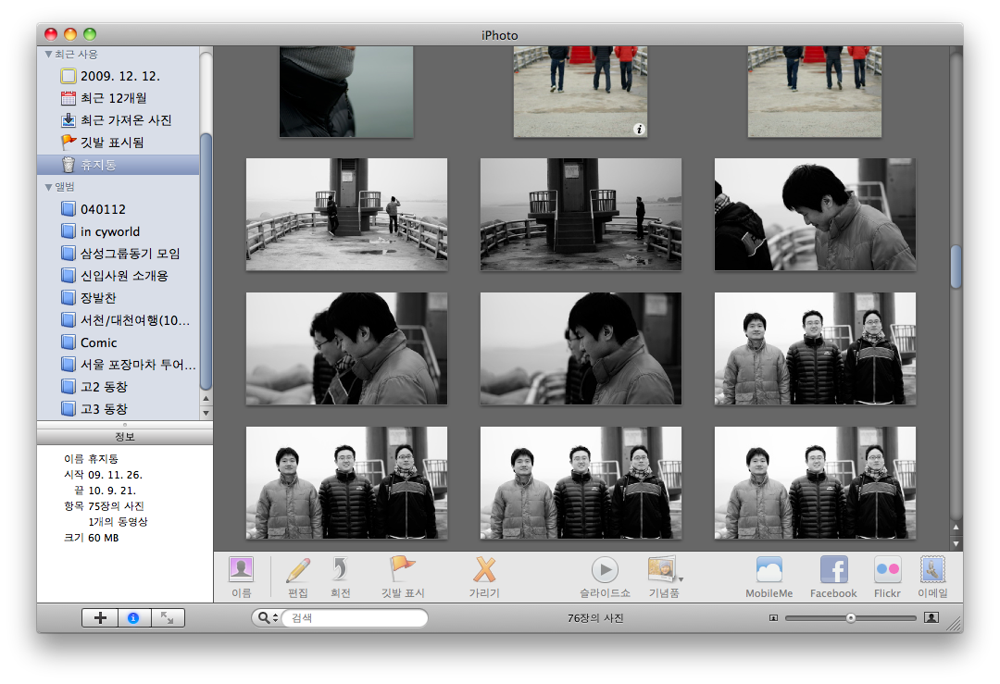
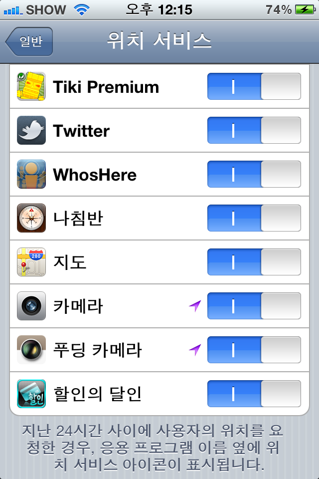
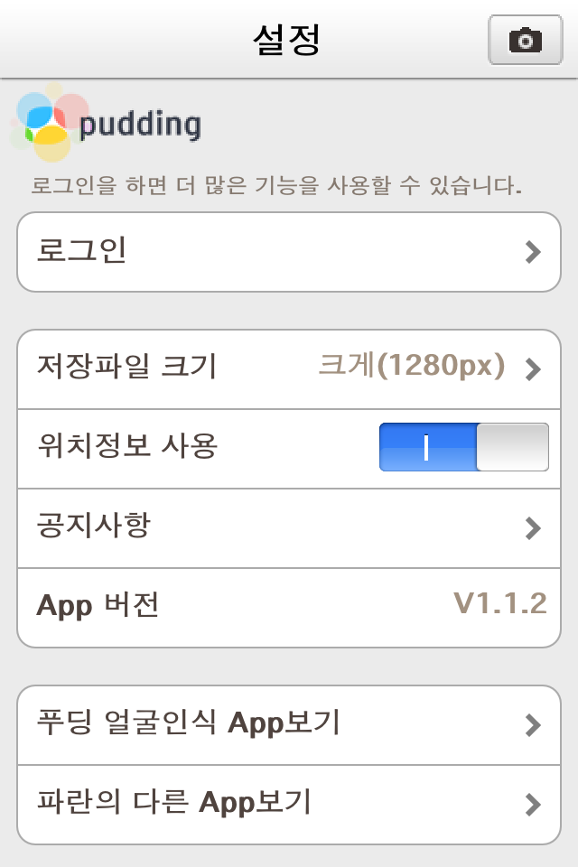
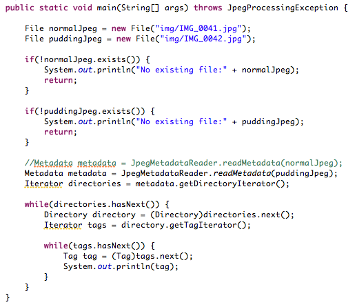
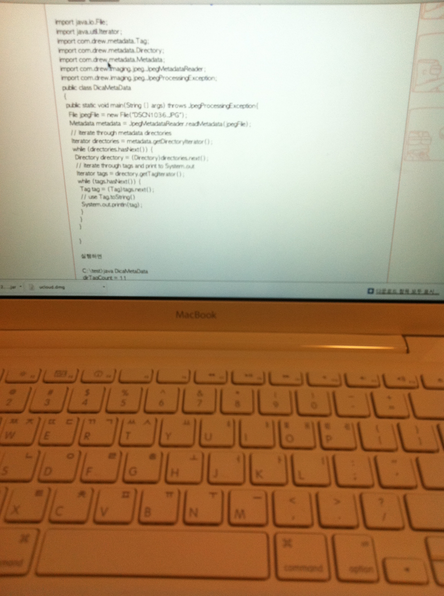
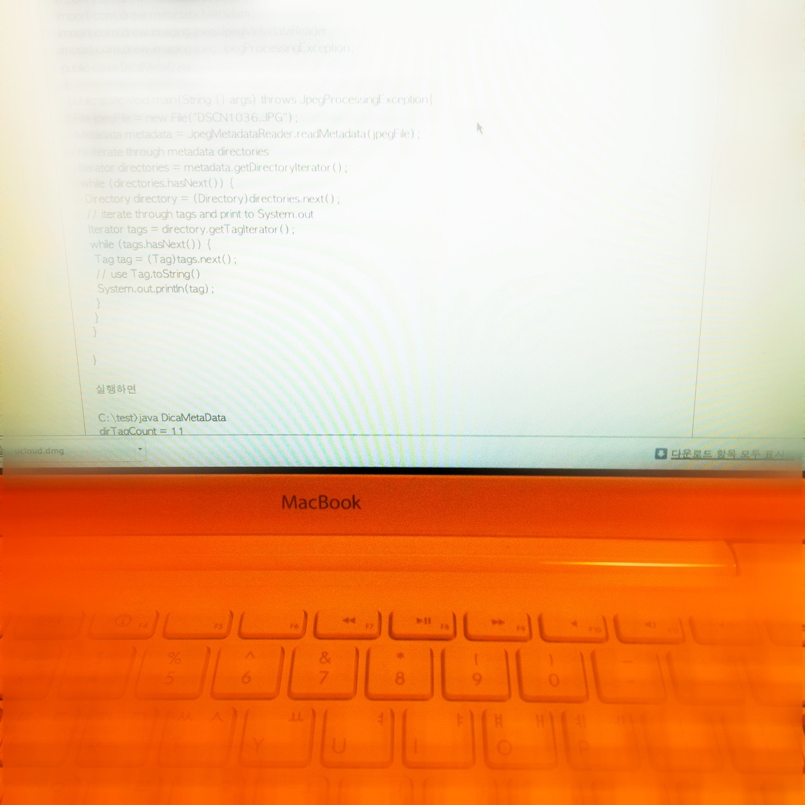
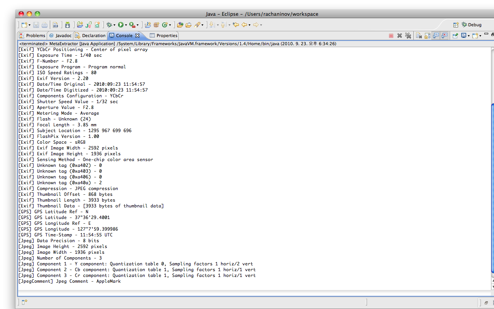
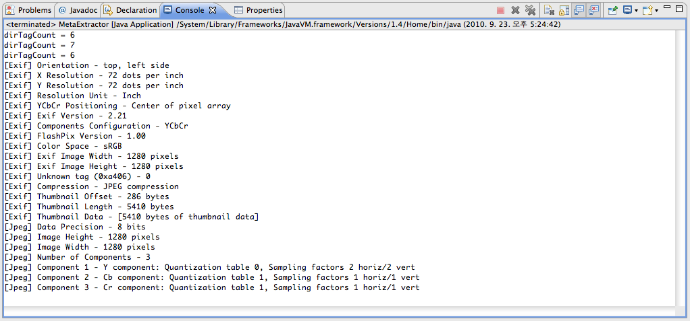

ipod touch를 사용하면서 느낀 아쉬움 중에 하나가 카메라 기능이었습니다. 카메라가 내장되어 있지 않았기 때문에 트위터를 사용할 때도 무언가 부족했고 블로그 등도 마찬가지였지요. 버스나 이동하면서 글을 쓰려고 해도 간단히 문자들만 저장해 놓고 나중에 기억을 되살릴 수 밖에 없었습니다. 그러던 중에 iPhone4를 장만하게 되었지요.

  

**1\. 시작점**

사진을 찍을 일이 사실 많지는 않았습니다. 그러다가 어느날 친구와 밤새도록 서울시내를 돌아다닐 일이 생겼습니다. 친구를 만나러 가면서 마음 먹었던 일이 사진을 가능한 많이 찍어서 장소별로 모아두자는 계획이었습니다. 이후에 기억하기에도 좋고 iPhone 뿐만 아니라 보통의 스마트폰에도 요즘엔 대부분 GPS와 카메라가 함께 내장되어 있기 때문에 손쉽게 정리가 가능할거라고 생각했습니다. 왜냐하면 사진을 찍을 때 사진을 찍는 위치에 대한 정보를 사진에 포함할 수 있는 기능이 있었기 때문이죠. 이런걸 Geotagging 이라고 합니다. 트위터를 사용하신다면 트위터에서도 글쓰는 위치를 표시해주는 지오태깅 기능을 제공하고 있음을 조금만 찾아보면 알 수 있습니다. 그런데 친구와의 여행 아닌 여행을 마치고 돌아와서 많지도 않은 사진을 정리하다보니 문제가 있더군요. iPhone4에 기본으로 설치되어 있는 기본 카메라로 찍은 사진은 맥북과 동기화하고 iPhoto에 옮기고 Picasa에 업로드 하는 모든 과정에서 지도에 자연스럽게 찍은 위치가 표시되었는데 또 다른 카메라 app (저의 경우엔 푸딩카메라)는 그렇지 않더군요. 분명 설정을 해줬는데도 말입니다. 참 이상했습니다.

  

**2\. 간단한 용어설명**

먼저 위에도 잠깐 언급되었고 아래에도 계속 나오게 될 용어들부터 설명하는게 나을 것 같습니다. 자세한 내용은 저도 잘 모르는 부분이기 때문에 혹시 필요하시다면 용어의 링크를 따라가서 유심히 살펴봐 주시면 되겠습니다.

[Geotagging](http://en.wikipedia.org/wiki/Geotagging) : 간단하게 풀면 GPS 등을 이용해 자신의 위치 정보(경도, 위도)를 비디오나 사진 등의 metadata에 저장해 두는 기능을 의미합니다.

[Metadata](http://en.wikipedia.org/wiki/Metadata) : Metadata는 데이터의 데이터라고 흔히 표현합니다. 어떤 data, 예를 들어 이미지가 있다면 그 이미지 파일의 해상도나 사이즈, thumbnail 등의 정보를 안에 저장해두는데 이 저장되는 data를 metadata라고 합니다.

  

**3\. iPhoto와 Picasa**

그 다음으론 iPhoto와 Picasa에 대해 설명해두면 도움이 되실 것 같아서 간단히 언급해 봅니다. iPhoto는 맥의 OSX에 딸려오는 기본 application인데 맥 내부에 존재하는 이미지들을 편리하게 정리할 수 있도록 해줍니다. 예를 들어 사진에 찍은 장소에 대한 위치 정보가 있다면 나중에 특정 위치별로 모아서 볼 수 있게 한다거나 사진 속 인물이 누군지에 대해서 사용자가 지정해주면 이후에 특정 인물이 찍힌 사진만 따로 모아서 볼 수 있습니다. 물론 그렇게 손쉽게 모아놓고 앨범 등으로 작업할 수 있는데 아주 매력적인 기능입니다. :)

Picasa는 구글에서 제공하는 웹앨범인데 iPhoto 만큼은 못하지만 지도에 표시가 가능하고 친구들과 공유가 쉽기 때문에 역시 괜찮은 서비스라고 생각하고 있습니다. 예전에 고등학교 동창들과 여행했을 때 찍은 사진을 모두 정리해서 picasa에 업로드해 친구들과 공유했더니 아주 좋아하더군요. 그 이후로 공유하고 싶은 사진들은 picasa를 이용하고 있습니다.

  

**3\. 푸딩 카메라와 기본 카메라 app의 비교 방법**

이상하게 기본 설치된 카메라 app은 되는데 3rd party에서 제공하는 푸딩 카메라 같은 application에서는 안되는게 이해가 되질 않았습니다. 분명 기능을 제공하고 있었거든요. 물론 위치정보를 사용하겠다고 설정까지 마친 상태였습니다. 아래처럼요.

  

(일부러 로그아웃한 상태에서 캡춰했으니 혹시 오해는 없으시길 바랍니다.)  웹에서 검색을 해봤더니 저와 같은 문제가 있다는 글들이 몇 개 눈에 띄더군요. 대부분 정확한 이유는 알 수 없다는 식이었는데 현상은 같았고 모두 3rd party의 application 들만 안되는 것 같았습니다. 여기까지만 보고 그냥 안되는구나 하면 되는 거였는데, 푸딩 카메라가 제공하는 기능이 너무 아까웠고 기본 카메라만 사용하기에는 약간 아쉬웠습니다. 그래서 혹시 문제가 있다면 해결해보자는 생각을 하게 되었지요. 그리고 명확하게 원인을 따져보기로 마음을 먹었습니다. 그래서 생각한 방법은 두 개의 app에서 위치 정보를 사용하겠다고 설정해둔 상태에서 사진을 찍어 그 사진 이미지의 metadata를 직접 들여다 보는 방법이었습니다. 가장 확실한 방법이니까요. :)

  

**4\. Metadata 얻어오기**

그래서 그 다음으로 이미지 파일의 metadata를 얻어오는 방법을 알아보기 시작했습니다. 다행히 관련 포스트가 몇 개 되더군요. 그래서 그 방법 중 하나를 이용하기로 했습니다.(아래 링크된 포스트를 이용했습니다.)

[관련 블로그 링크](http://blog.naver.com/koko8829?Redirect=Log&logNo=140001227611)

위의 블로그에 적힌 내용은 디카로 찍은 사진의 metadata를 뽑는 방법인데 어차피 이미지 파일은 같으니 똑같이 적용해도 문제될 건 없었습니다. 요약하면 metadata 추출 기능이 있는 라이브러리를 사용해 java로 간단히 코딩해서 모든 metadata의 tag들을 콘솔에 뿌려주는 내용입니다. 제가 작성한 코드는 아래와 같습니다. 결론이 빨리 보고싶어 코드를 정리하거나 하진 않았습니다. 참고만 해주시길...

  

**5\. 결론**

Metadata를 비교하기 위해 사용했던 이미지는 아래와 같습니다. 왼쪽 이미지가 기본 카메라로 촬영한 이미지고 오른쪽은 푸딩카메라를 사용한 이미지 입니다. 효과를 줬더니 뭔가 이상하네요. :)

  

  

  

그리고 드디어 Metadata를 뽑아봤습니다. 결론만 요약하면 푸딩카메라로 찍은 이미지에는 위치정보가 빠져있습니다. 그리고 metadata를 구성하고 있는 요소들의 수가 훨씬 적네요. 콘솔에서 뽑아서 확인한 metadata의 스샷은 아래에 있습니다. 먼저 기본 카메라의 metadata 입니다. 한 화면에 다 보이지 않을 정도로 내용이 많습니다. 그리고 그 중엔 분명 GPS로 기록된 위치 정보가 존재합니다.

그 다음은 푸딩카메라 결과 스샷입니다.

위의 스샷에 보이는게 푸딩카메라에서 기록하는 metadata의 전부입니다. 분명 위치정보는 빠져있구요. 이제 푸딩카메라로는 geotagging이 안된다는 걸 확실히 알았습니다. 사진 정리의 불편함 때문에라도 당분간은 기본 카메라만 사용할 예정입니다. 그리고 푸딩카메라를 개발한 업체에 연락을 해볼 생각입니다. 아예 위치정보 사용여부를 결정할 수 있는 설정 항목을 삭제하던가 정상적으로 사용할 수 있게 업데이트 해주기를 부탁하려구요. 푸딩카메라가 정말 다양한 효과를 줄 수 있어서 좋은 application임엔 분명한데 너무 아쉽습니다. 업데이트를 기대해 볼 수 밖에요. :)
