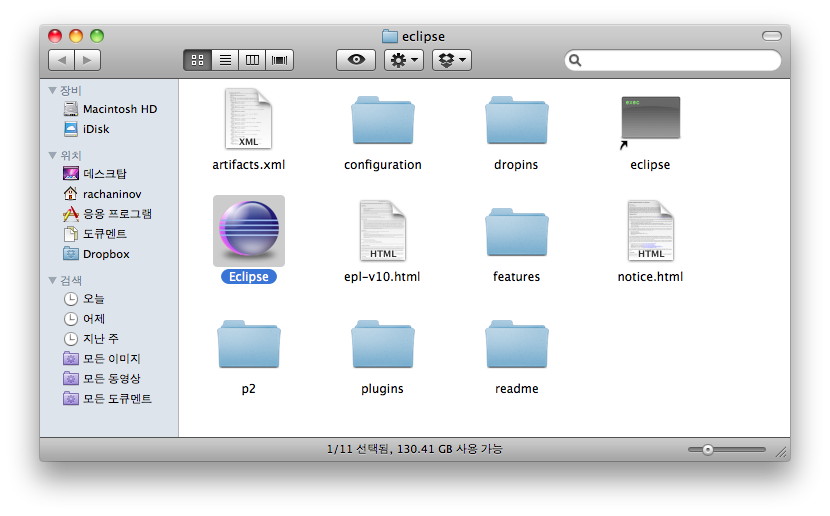
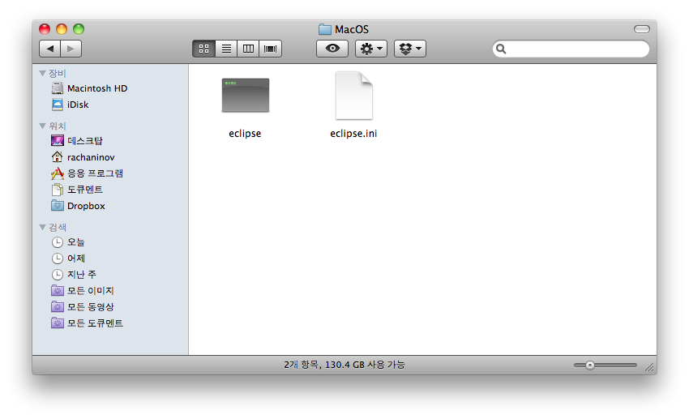
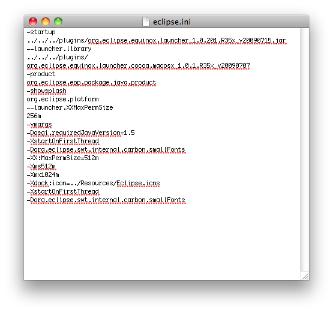

보통 windows 에서는 eclipse 설치 경로 (Eclipse home)에 실행파일과 함께 eclipse.ini 파일이 들어있다. Mac OS X에 eclipse 설치하면 그 eclipse.ini 파일이 보이질 않는데 수정이 필요한 경우에는 아래의 방법을 사용하면 편집이 가능하다.

 

1\. Finder로 Eclipse 설치 경로를 연다.

 

2\. Eclipse 실행파일을 선택하고 마우스 오른쪽 버튼 (저의 경우)을 눌러 나타나는 메뉴에서 "패키지 내용보기" 클릭

 

3\. 새로 열리는 finder 창(Eclipse 실행파일의 내부를 보여줌)에서 Contents/MacOS 경로에 가면 eclipse.ini 파일이 보인다.

 

4\. 텍스트 편집기 등의 에디터로 열고 편집.

 

끝.
