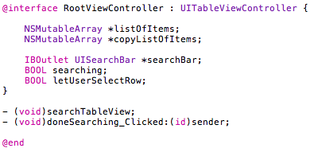
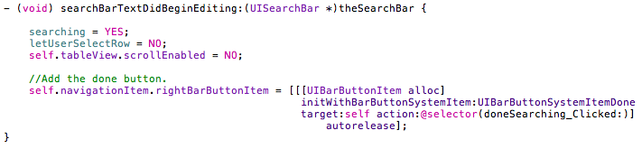
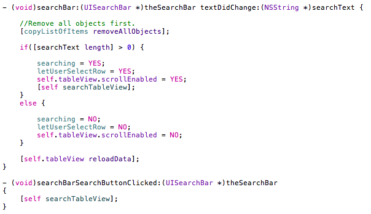
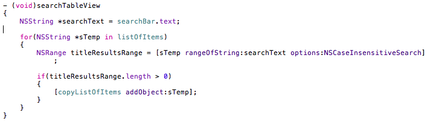
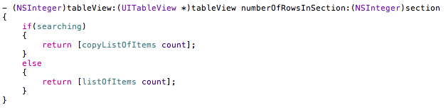
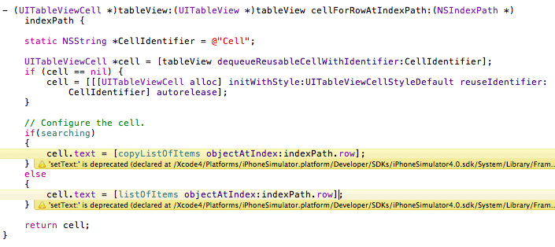

검색기능을 추가할 일이 생겨서 여기저기 살펴봤으나 서점에 진열된 책들을 뒤져봐도 내가 필요한 부분을 찾지 못했다. 애플에서 제공하는 문서가 있기는 했으나 익숙하지 못한 나같은 초보에겐 그냥 문서에 불과했고 며칠간 고심하면서 인터넷을 뒤진 끝에 괜찮은 사이트를 발견. (아래 링크 참조) 복습도 할 겸 간단히 정리해본다.

  

  

1\. 시작 / 준비

이 예제에서 설명에 사용하는 프로젝트는 기본적으로 Navigation based application으로 작성되어 개발자가 보여주고자 하는 어떤 리스트가 table view에 표시되는 application에서 시작한다. 목표로 하고 있는 완성 이후의 모습은 평상시엔 원본 데이터가 table view에 표시되고 화면 상단에 위치한 search bar에 찾고자 하는 문자열 입력 시 원본 데이터가 표시된 table view에 검색 결과가 나타나게 만드는 것이다. (아래 데모 동영상 참고) 그리고 원래의 navigation based application project의 Interface Builder에서 UISearchBar를 추가해 두어야 한다. 아래의 단계들을 거치고 나중에 UISearchBar의 Outlet과 delegate를 File's Owner로 설정하는 것 또한 기본적으로 해주어야 하는 작업.

[demo](https://blurblah.net/wp-content/uploads/2010/12/demo2.swf)

  

  

2\. Header

원본 데이터를 저장하는 listOfItems와 검색된 결과를 저장할 copyListOfItems를 만들어야 한다. 실제 table view에 검색결과를 보여주고자 할 때는 copyListOfItems에 있는 내용을 보여주고 view를 reload 하면 끝. searchTableView는 실제 검색을 수행할 로직이 포함된 함수이고 doneSearching\_Clicked는 검색 완료 후 누를 done 버튼 클릭시 호출될 함수이다.

  

  

3\. searchBarTextDidBeginEditing

UISearchBarDelegate protocol에 포함되어 있는 함수로 UISearchBar에서 사용자가 어떤 문자열을 입력하려고 선택하면 자동으로 호출되는 함수이다. 이 함수가 자동으로 호출되기 위해서는 UISearchBar의 delegate가 File's Owner 혹은 다른 것으로 연결되어 있어야만 한다.

위의 코드에서 searching, letUserSelectRow 등은 상태를 알기 위해 사용할 flag 용도의 BOOL 멤버변수들이다. 많은 책에서 다루고 있는 예제들에서 종종 등장하는 navigationItem에 버튼 추가 루틴이 제일 하단에 포함되어 있다. Done 버튼을 추가하는 내용이고 Done 버튼 클릭시 doneSearching\_Clicked 를 호출하라고 selector가 설정되어 있다.

  

  

3\. textDidChange / searchBarSearchButtonClicked

UISearchBarDelegate protocol에 포함되어 있는 또 다른 함수 둘. 하나는 UISearchBar에 입력된 문자열이 변경되었을 경우 호출되는 함수이고 searchBarSearchButtonClicked는 UISearchBar가 focusing 되었을 경우 자동으로 나타나는 Soft keyboard의 Search 버튼을 클릭했을 때 호출되는 함수이다.

두 함수 호출시 모두 실제 검색작업을 수행해야만 한다. textDidChange에서는 사용자에 의해 입력된 문자열의 길이로 검색여부를 판단하고 (0일 경우에 검색하면 안되니까) searchBarSearchButtonClicked 에서는 단순히 검색 로직을 수행한다.

  

  

4\. searchTableView

실제 검색 로직이 포함된 함수이다. 이 함수가 호출되었을 경우 검색결과 데이터를 저장할 copyListOfItems array의 내용을 업데이트 해주어야 한다.

위의 코드를 보면 rangeOfString이라는 함수를 사용하고 있는데 내용은 다음과 같다. 검색 대상이 되는 원본 데이터 listOfItems에 사용자가 입력한 searchText가 포함되어 있으면 그 문자열의 시작위치와 길이를 리턴하게 되는데, 길이가 0 이상이라는 얘기는 포함되거나 일치하는 부분이 있다는 의미이므로 그 문자열의 원본 데이터를 copyListOfItems에 추가한다.

  

  

5\. numberOfRowsInSection

Table view를 사용하는 모든 프로젝트에 필수적으로 포함되어야 하는 함수로 몇개의 row를 보여줄거냐를 결정해 주어야 한다. 평상시에는 원본 데이터의 갯수를 표시해주면 되고, 검색시에는 검색된 데이터의 갯수를 리턴해야 한다.

  

  

6\. cellForRowAtIndexPath

위의 row 갯수처럼 cell을 어떻게 표시할지도 결정해 주어야 한다. 위와 마찬가지로 평상시에는 원본 데이터의 문자열들을 표시해주면 되고, 검색시에는 copyListOfItems의 데이터들을 표시해주어야 함.

  

  

여기까지 해놓고 보면 기본적인 검색 기능은 제대로 동작을 한다. 내가 실제로 응용할 내용은 이것과는 조금 차이가 있지만 이런 기본적인 검색 기능을 살펴봐야 감이 와서...남은 오늘 하루는 어떻게 적용해야 하는지를 놓고 머리를 싸매야 한다. ㅠ

  

참조 사이트 : [http://www.iphonesdkarticles.com/2009/01/uitableview-searching-table-view.html](http://www.iphonesdkarticles.com/2009/01/uitableview-searching-table-view.html)
