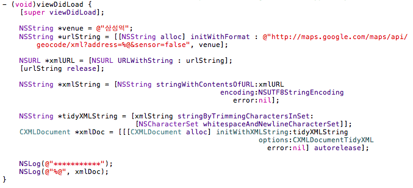
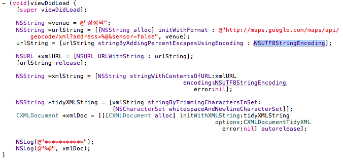

지난 주말 그동안 잘 사용하고 있던 XML Parser의 Document가 생성되지 않아 이번주에는 그 부분부터 보고 있다. Debugging을 해보니 XML Document 객체를 만들기 이전에 NSURL 객체 생성을 하게 작성해 두었는데, NSURL 객체 자체가 제대로 생성되지 않고 있었다. (아래의 코드)

더 따져보니 위의 코드에서 urlString 자체는 문제없이 만들어지는데, urlString으로 만들려고 하는 NSURL 객체만 문제가 있었다. NSURL 문서를 살펴보니 RFC 2396을 꼭 지켜야 한다는 문구를 볼 수 있었는데 RFC 2396은 대체 뭔가? RFC는 IETF (Internet Enginerring Task Force)에서 작성한 인터넷 기술에서 지켜야 하는 규칙 등을 작성해 놓은 문서이다. 2396은 그 문서 일부의 일련번호. 찾아보니 URI에 대한 규칙 등을 다루고 있다는 걸 알 수 있었다. 참조한 내용으로 미루어 짐작해보니 한글이 문제가 되는건 아닌가 싶었다. 그래서 임시로 "삼성역" 대신 "abc"를 넣어 돌려보니 정상.

  

문제는 간단해졌다. 어떻게하면 한글이 포함된 문자열로 NSURL 객체를 만들어낼 것인가만 고민하면 끝. 여기저기 문서들을 뒤적뒤적 거리니 역시 간단한 해결책이...문자열을 인코딩해서 사용하면 된다. (아래 코드 참조)

원래의 코드에 한 줄만 추가했다. stringByAddingPercentEscapesUsingEncoding 호출. Encoding 방법으로 NSUTF8StringEncoding을 지정해주면 끝난다. 추가한 함수는 특수 문자 같은걸 처리하기 위해 encoding을 해서 문자열을 돌려주는 함수. 사용한 encoding은 UTF-8.

  

빌드하고 다시 디버깅해서 찍어보니 모든게 정상.

디버깅을 생활화하고, 표준 문서 잘 살펴보고 따져봅시다!!
