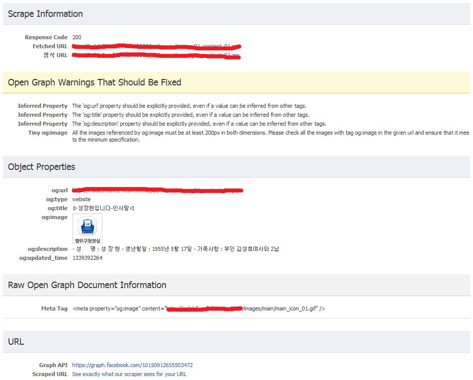

특정 사이트의 글을 쉽게 공유하기 위해 Facebook에서 몇 줄만으로 공유 기능을 적용할 수 있도록 코드를 제공하고 있다.

Title과 URL 등은 쉽게 Sharer에 Parameter로 입력가능하도록 되어 있으나 Thumbnail 설정은 공유하고자 하는 페이지 소스 내에 메타태그를 하나 추가해야 한다.

<meta property="og:image" content="Image URL" />

이런저런 시도를 해보니 Image URL은 상대경로로 지정하면 안되고 꼭 URL 전체 경로를 입력해야 가능한 듯 싶다. (http:// 포함, 왜 이렇게 불편하게 했을까?)

위의 메타태그를 추가했는데도 공유시에 Thumbnail이 뜨지 않는다면 아래의 페이지에 접속해서 메타태그가 추가된 페이지 주소를 입력해본다.

[https://developers.facebook.com/tools/debug](https://developers.facebook.com/tools/debug)

(여기저기서 https://developers.facebook.com/tools/lint 로 가라고 하는데 결국은 위의 주소로 넘어가게 됨)

입력한 메타태그가 문제가 있다면 오류 내용을 보여주고 없다면

아래 그림처럼 Thumbnail이 보이게 되며 이 때 부터는 지정한 Thumbnail이 공유시에 나타난다.

왜 이런 불편한 과정을 거쳐야 할까?

이유는 명확하지 않으나 추측하건데 facebook 서버쪽에 반영이 잘 되지 않는 듯 싶다.

lint에서 한 번 검사를 하면 그 때서야 반영이 되는 것 같고...

Facebook 이니까 머지않아 개선된 기능을 보여줄거라고 기대해본다.
