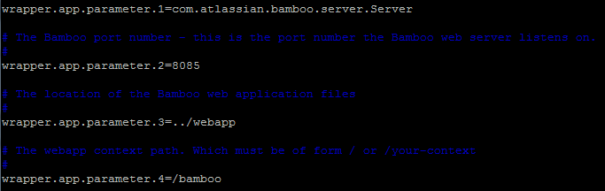

사용중인 Bamboo가 3.2 버전이었는데 최신 버전인 4.1.1로 upgrade 할 일이 생겼다.

Upgrade 방법을 알기 위해 검색해보니 공식 매뉴얼이 있는데 하위 버전별로 upgrade 방법이 다른 것처럼 기술되어 있다.

[https://confluence.atlassian.com/display/BAMBOO/Bamboo+4.1+Upgrade+Guide](https://confluence.atlassian.com/display/BAMBOO/Bamboo+4.1+Upgrade+Guide)

몇 개 링크를 눌러보니 링크가 잘못 걸린건지 하위버전에서 4.1로의 upgrade가 아니라 하위 버전으로 upgrade 방법들이 나와있어서 [Bamboo generic upgrade guide](https://confluence.atlassian.com/display/BAMBOO/Bamboo+generic+upgrade+guide)만 참조.

가이드 문서만 따라해도 문제없이 진행은 된다.

과정을 요약하면

1\. export / data (bamboo-home) 백업

2\. 최신버전으로 재설치

3\. properties 파일을 설정에 따라 수정

4\. start

새로 설치된 파일이 같은 data (bamboo-home) 경로를 참조하길래 혹시나 문제가 없을까 했는데 다행히 깨지거나 인식을 못하는 문제는 없어보인다.

3.2와는 다르게 4.1.1은 시작 주소를 http://ip:8085 가 기본이다. 3.2의 경우엔 뒤에 /bamboo란 path를 넣었었고 다른 Atlassian tool들이 해당 경로를 참조하도록 설정되어 있었기 때문에 $\{bamboo\_install\_path\}/conf/wrapper.conf 파일을 수정.

기타 LDAP 등의 설정도 해줘야 하지만 현재는 User 정보를 모두 JIRA에서 땡겨오도록 되어있기 때문에 skip 했다.
