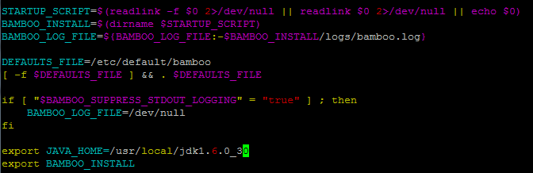

Atlassian의 Bamboo를 사용중인데 얼마전 서버의 root 계정 대신 특정 계정에 sudo 설정을 한 이후에 문제가 발생했다.

bamboo.sh 실행시 start 옵션을 주면 시작하게 되어있는데 시작했다는 로그와 pid 값은 뿌려지지만 실제 프로세스는 실행되지 않았다. 실행시에 기록되는 로그파일을 열어서 확인해보니 java 프로세스 자체를 시작하지 못하는 것으로 보였다. 그래서 bamboo.sh 파일을 열어 내용을 확인해보니

```bash
export JAVA_HOME
````

이라고 환경변수를 `export` 하고는 있었으나 실제 파일 어느 곳에도 JAVA\_HOME이 설정된 부분은 없었다. 그래서 추가.

[](https://blurblah.net/wp-content/uploads/2012/06/bamboo_javahome.png)

왜 이전엔 잘 되다가 갑자기 JAVA\_HOME 설정이 빠진건지 이해가 되지 않는다.

어쩌면 file 자체는 변경사항이 없었으나 (원래 비어있는 상태) root 계정에서는 원래 서버에 환경변수로 잡혀있는 JAVA\_HOME을 인식하는지도 모르겠다. 왜 그럴까?
