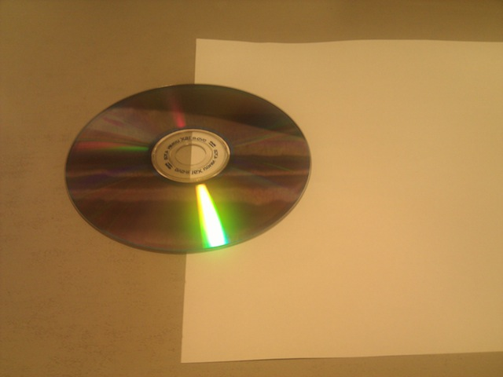
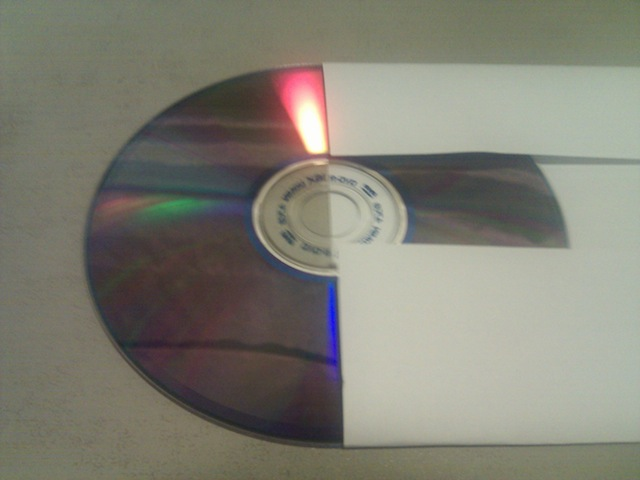
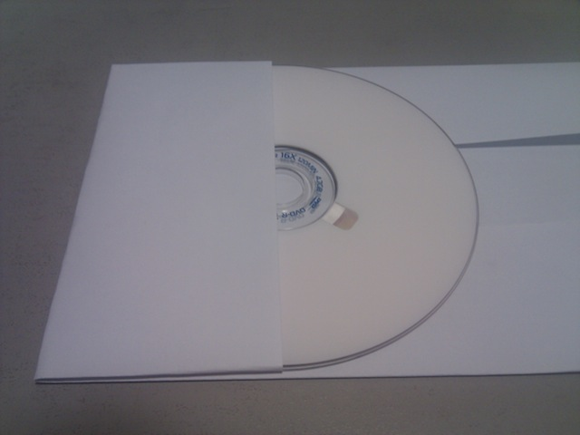
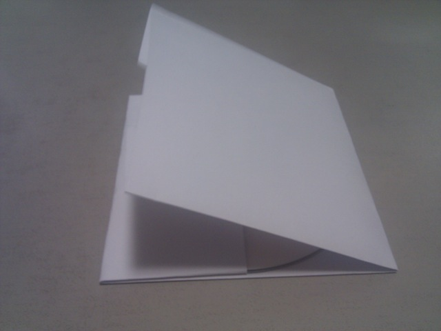
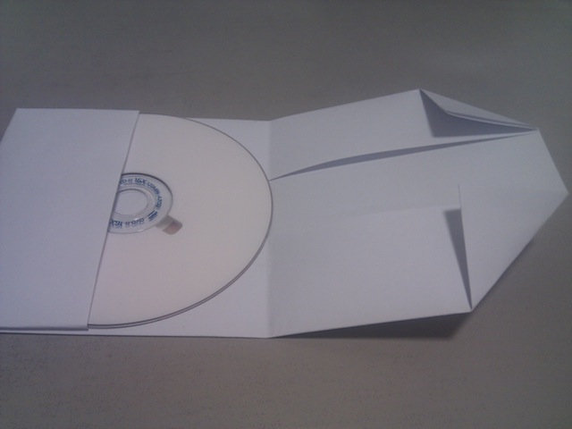
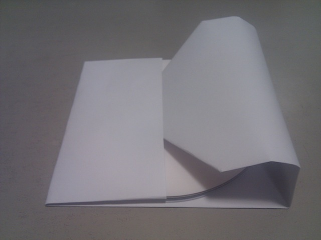
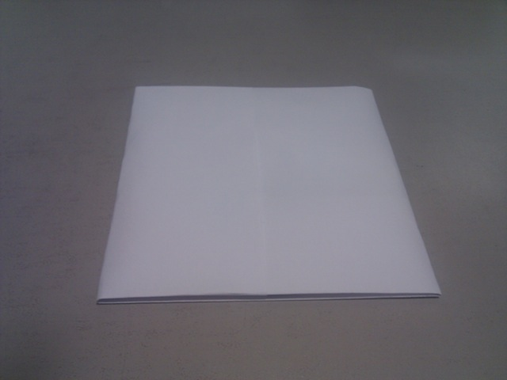

나온지 꽤 된 내용이지만 가끔씩이라도 필요한터라 기록해둔다.

1\. A4 용지를 바닥에 대고 CD를 뒤집은 상태로 반쯤 걸친다. (위 아래 종이 여백도 비슷하게. 사진은 각도 때문에 저렇지만 실제론 비슷)

2\. A4 용지의 위 아래 남아있던 부분을 CD에 딱 맞게 접어준다.

3\. 위의 그림에서 CD를 고정시킨 채로 A4용지를 접어서 아래 그림처럼 CD의 윗면이 오도록 한다.

4\. 이제 남는 A4의 부분도 CD 크기에 맞게 접어준다.

5\. 접었던 부분을 다시 펼쳐서 아래 그림처럼 A4의 모서리 부분을 접는다.

6\. CD와 A4 사이의 공간에 모서리를 접었던 부분을 넣어준다.

7\. 완성

매우 간단하다.
