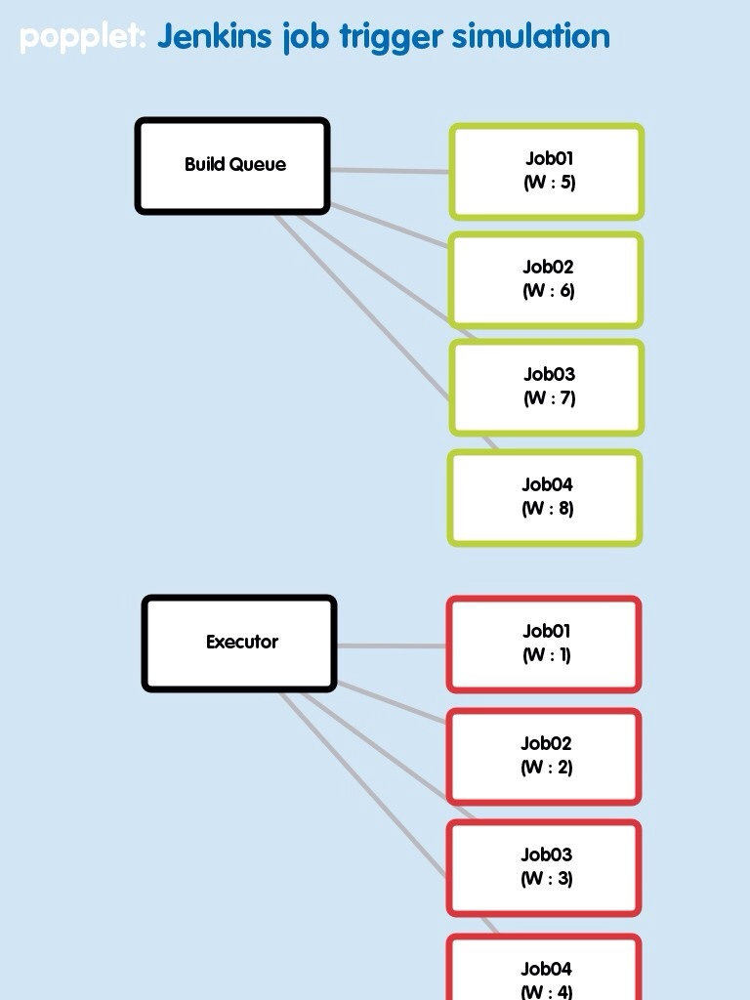

**0\. 준비**

Jenkins에 있는 job을 remote trigger 할 일이 생겼다. 자동화를 해야 하기 때문에 적절히 trigger 될 수 있어야 한다. 여기에서 '적절히'는 trigger 되는 job이 후보군 중 일부에만 몰리는 일이 없어야 하며, 동시에 slot (Jenkins의 executor)이 비는 경우도 없어야 하고 가급적 빠르게 시작할 수 있어야 한다는 것을 의미한다.

**1\. 환경**

현재 환경이 가지고 있는 조건들은 아래와 같다.

#1 : 거의 동일한 내용의 작업을 수행하는 job이 복수로 존재한다. (이름만 다른 job)

#2 : 각 job은 parameter를 받도록 되어있고, parameter의 조합은 항상 다르다.

#3 : 각 job은 master / slave 어디에서든 실행될 수 있어야 한다.

**2\. Executor / Build Queue 특징**

**2-1. Executor**

Jenkins에서 job이 실제 실행될 때 위치하는 공간인 executor는 같은 이름의 job을 단 하나만 가질 수 있다. Executor의 내용을 json이나 xml로 뽑아보면 각 job이 가지고 있는 속성 중에 progress 라는게 있는 것을 확인할 수 있는데 job이 시작된지 얼마나 흘렀는지를 표시하는 값으로 보인다. (진행시간을 second 단위로 표시하는 것으로 추측됨)

**2-2. Build Queue**

Build Queue는 executor와는 조금 다르게 같은 이름의 job이라도 여러개 위치할 수 있다. 모든 job이 여러개 위치할 수 있는 것은 아니고 parameter가 다른 경우 같은 이름의 job이라도 다른 것으로 인식하는 것으로 보인다. Executor처럼 queue의 내용을 뽑아보면 executor의 progress 대신에 inQueueSince 라는 값으로 처음 queue에 들어온 시간을 저장해두고 있다.

**3\. 목표**

내가 처한 환경에서는 job이 지속적으로 생성되는데(당연하지만), 한 개 job이 작업을 마치는데 시간이 몇분에서 길게는 한시간 이상 소요될 수 있기 때문에 필연적으로 job이 쌓일 것으로 예상된다. Executor는 동일한 이름의 job을 받아 들이지 않기 때문에 동일한 이름의 job을 trigger하게 되면 queue에 쌓이게 될 것이다. Executor가 비어있는데도 queue에 쌓이는 일을 막기 위해서 executor에 없는 job을 우선적으로 trigger 할 수 있어야 한다. Executor가 꽉 찬 경우에는 어쩔 수 없이 queue에 job이 등록될텐데 이 경우 가장 빨리 실행될 수 있을 것 같은 job을 고를 수 있어야 하고 그 job을 trigger 해야한다. 또 queue에는 동일한 이름의 job이 여러개 위치할 수 있기 때문에 복수의 job에 대해서도 고려되어야 한다.

**4\. Modeling**

**4-1. Sorting / Weight**

전체 job list를 T라고 하자. Executor에 위치한 job list를 E, queue에 있는 list를 Q라고 했을 때 각각을 적당한 기준으로 sorting을 하면 우선순위를 매기기 편할 것이라고 생각했다. 그 기준이 애매할 수 있는데 감사하게도 Jenkins에는 위에 설명된 것처럼 적당한 값들을 저장하고 있다. E는 progress, Q는 inQueueSince를 기준으로 sorting 하기로 했다. Progress는 클수록 시간이 오래 흘렀음을 의미하므로 progress 값이 큰 job은 우선적으로 종료될 가능성이 높다. 그래서 E는 progress를 기준으로 내림차순 정렬하고 Q의 inQueueSince는 progress와 반대이기 때문에 오름차순으로 정렬한다. 이렇게 두 세트를 만들어 보면 정렬된 리스트 중 가장 앞에 위치한 job이 선택에 있어서 가장 높은 우선순위를 갖게 된다.

Executor에 없는 job이 항상 queue에 있는 job 보다는 우선순위가 높아야 하기 때문에 queue에서는 절대 넘을 수 없는 벽 같은 것을 만들어야 했다. 그래서 weight의 개념을 사용하기로 했는데, E와 W의 가중치를 각각 다르게 주되 그 차이를 각각 가질 수 있는 weight의 가용범위보다 크게 하면 벽처럼 사용가능할 것 같았다.

**4-2. Model**

위에서 정렬된 리스트 E, Q에서 순서대로 weight를 부여한다. 수식으로 만들어보면 아래처럼 되는데 Jw는 job의 가중치 총합계를 의미하고 아래첨자 i는 정렬된 리스트의 index 값 (낮을수록 우선순위 높음), executor와 queue를 분리하기 위한 기본 weight 값이다. Qc는 queue에 존재하는 동일한 job의 갯수이다.

Jw = Ei + (Qi + Wb) \* Qc

여기에서 Wb를 결정하기 위해서는 Ei가 가질 수 있는 최대값을 알면 되는데 Ei의 최대값보다 Wb를 크게만 만들면 executor에 없는 job의 우선순위를 queue 보다 높일 수 있다. 고민 끝에 Wb를 적절한 값으로 선택할 수 있었는데 바로 executor의 Total Executor 값이다. Ei 값은 index이기 때문에 job의 갯수에 맞춰서 설정할 executor의 총합보다 클 수가 없기 때문이다. Queue에 복수로 존재하는 job의 경우에는 queue에 하나만 존재하는 job 들보다 우선순위가 확연이 떨어지는데 이것 역시도 절대 넘을 수 없는 경계를 만들 수 있어야 한다.

**5\. Case**

위의 내용을 바탕으로 일단 간단한 경우만 그려보면 아래처럼 된다. 덕분에 복잡할 수 있는 구현을 비교적 단순하게 할 수 있었다. 여러 경우를 고려했을 때 아직은 문제가 없어보이지만 혹시 발견되면 수정할 예정이다.

