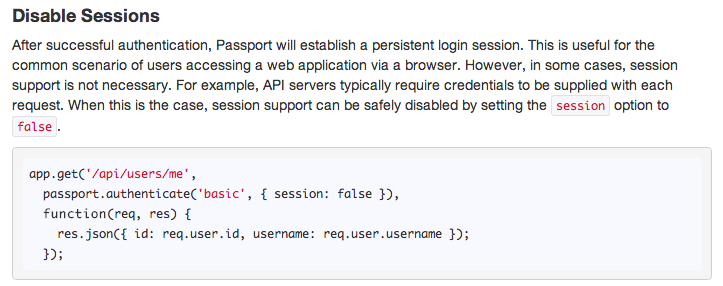
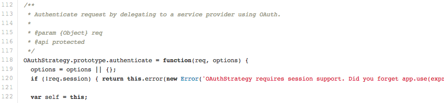

**1\. Disable session**

구현중인 REST API에서 SNS 연동이 필요한 부분이 있다. (API server에서 SNS 연동까지 해야하는지는 고민중이지만)

REST API는 session 유지를 해서는 안된다고 많은 참고자료들에서 언급이 되고 있는데 (인증에 대한 정보를 API 호출시 넘기도록 함)

SNS와의 OAuth를 위해 살펴본 node.js의 passport 모듈에도 관련 내용이 기술되어 있다.

참고 링크 : [http://passportjs.org/guide/authenticate/](http://passportjs.org/guide/authenticate/)

Passport는 인증과 관련된 기능을 좀 더 쉽게 처리하고자 만들어진 모듈인데, 인증 기능을 다룬 부분에 session이 필요없을 경우 disable이 가능하도록 옵션을 제공하고 있는 것을 알 수 있다. 그리고 굳이 API server와 같은 상황을 예로 들고 있다.

**2\. Passport를 활용한 strategy의 구현부 (Session 강제)**

Passport를 활용하고 있는 모듈들이 몇가지 있는데 주로 passport의 API만 가지고 구현하기 번거로우니 특화된 기능을 사용하기 쉽게 정리해놓고 있다. passport-oauth, passport-twitter, passport-facebook 등이 그 예인데, twitter와 연동해보려고 간단히 사용해보니 session을 사용하지 않으면 오류가 발생하는 걸 확인했다. passport-twitter가 포함하고 있는 passport-oauth1 (OAuth 1.0을 구현, 링크 : [https://github.com/jaredhanson/passport-oauth1](https://github.com/jaredhanson/passport-oauth1))의 strategy.js (실제 대부분의 기능을 담고 있는 구현부)를 보니 120번째 라인에서 request에 session이 없는 경우 오류를 리턴하도록 구현되어 있었다.

passport-oauth1은 passport-oauth와도 관계가 있는 모듈로 passport 자체는 session을 disable 할 수 있도록 되어있지만 passport를 활용한 다른 모듈들은 사실 session을 강제하고 있다. 실험삼아 session disable이 가능한 authenticate 함수에서 disable option을 담아서 호출해 봤는데 결국 마지막에 호출되는 passport-oauth1에서 오류가 발생하는 걸 확인할 수 있었다.

**3\. 결국 oauth 구현**

passport.js만을 이용해서 SNS 연동을 할 수도 있겠지만 passport 자체가 OAuth만을 위해 만들어진게 아니라서 작업이 번거로울 것 같다는 생각이 들었다. 어찌되었든 비슷한 기능을 하는 다른 모듈을 찾거나 결국은 내가 직접 구현을 해야하는 상황. node-oauth (npm에서는 oauth라는 이름, 링크 : [https://github.com/ciaranj/node-oauth](https://github.com/ciaranj/node-oauth)) 라는 모듈을 passport 대신 사용해서 직접 구현할 생각이다.
