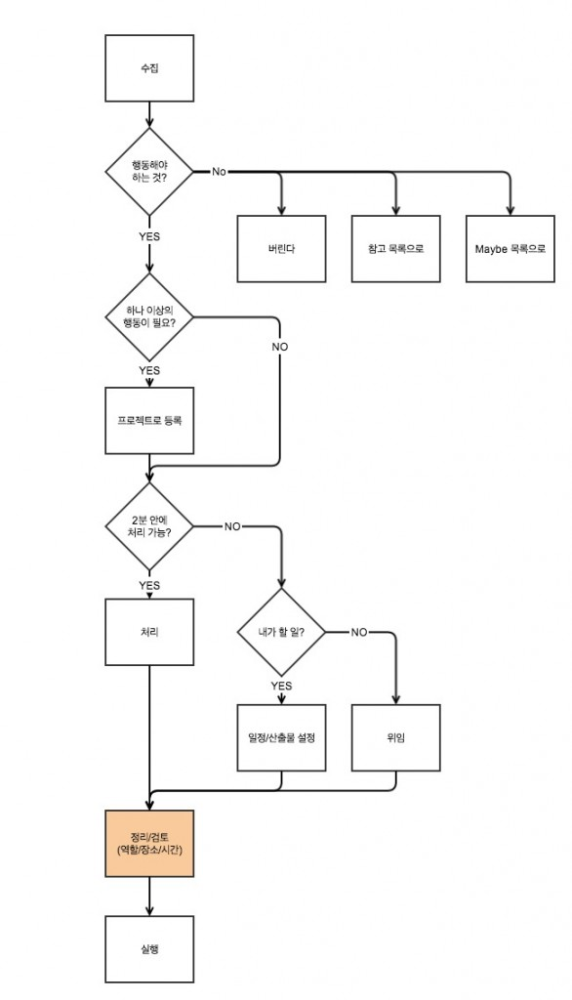

시간이 지날수록 스트레스가 심해지는 것 같아서 GTD를 사용해 보기로 했다.

스트레스는 마음의 병이라 치유하지 않으면 그게 곧 말이나 행동에 반영이 되는 것처럼 느껴졌다.

그럼 나의 스트레스는 주로 무엇때문에 발생하는가? 를 생각해보니 보통 이런 것들에 기인했던 것 같다.

(1) 기대(이상)와 현실의 괴리

(2) 업무와 사생활의 불균형

(3) 복잡한 상황의 누적

 

(1)은 개인마다 차이가 있겠지만 나의 경우에도 스스로에게 거는 기대치가 실제 내 역량이나 상황보다 높았다고 생각된다.

이렇다보니 업무와 사생활이 비대칭을 이루게 되었는데 여기서 오는 스트레스도 상당했는데 가족들에게 소홀하니 미안함에 스스로를 더 피곤하게 만들었고 그게 나 자신에게 또 하나의 과부하를 거는 요소로 작용했다. 이런 환경에서는 대부분의 일과 상황들이 복잡하게 엉켜서 한꺼번에 닥치곤 하는 것 같다. 여기에 스트레스를 해소하기 위한 나만의 어떤 방법들, 예를 들면 취미 같은 것들이 마땅치 않아서 상황은 더 좋지 않았다.

 

나의 경우를 봤을 때 스트레스가 누적되면 처음엔 짜증이 생기고, 연이어 불안, 우울이 동반되는 것 같다.

그래서 이런 상황을 개선하기 위해서 몇가지를 스스로에게 테스트해 보기로 했고 그 중에 하나가 GTD 활용이다.

 

**1\. GTD의 개념**

GTD(Getting Things Done)는 David Allen이라는 사람이 주장한 관리 방법이라고 한다.

유명한 Franklin Covey의 관리 기법과의 차이를 가지고 풀어보면, Franklin의 방법은 본인이 추구하는 가치가 더 높은 것에 집중할 수 있도록 하는데 반해 GTD는 먼저 할 수 있는 것부터 처리하라고 장려하고 있다. GTD가 스트레스를 줄여줄 수도 있겠다고 생각한 이유는 아래와 같다.

(1) Franklin의 방법을 사용했을 때에는 좀 더 가치있는 일을 먼저 해야 했는데 이런 종류의 일은 보통 시간을 오래 투자해야 하기 때문에 중간에 어떠한 이유로든 방해를 받기 쉬웠다. 훈련이 되면 좀 나아질 수도 있겠지만, 사람 일이라는게 예측이 쉽지 않아서 예상대로 흘러가지 않는 경우 다음으로 미루어야 하는 경우가 종종 발생했고 여기에서 오는 스트레스는 최소한 줄일 수 있을 것 같았다. 빨리 끝날 것 같은 것부터 하면 되기 때문에 그만큼 방해를 받을 여지가 줄어들 것이다. GTD는 좀 더 유연하게 계획하고 실행하기 쉬울 것 같다는 생각이 든다.

(2) GTD는 생각나는대로 할 일을 Inbox에 집어넣고(수집), 다음 단계로 넘어가 분류한 후에 일정 등을 세우고 검토하도록 되어있다. 이런 일련의 과정이 한 번 끝나고 나면 조건과 상황 (Context)에 따라 리스트대로 보고 마음대로 골라서 실행하면 된다. 즉 장기적인 관점에서 복잡하게 고민할 것이 없다. 내가 이해한 내용이 맞다면 그냥 생각나는대로 넣고 보이는대로 하면 되는 것이다.

 

GTD에서 일의 단위를 처리하는 과정은 아래와 같다.

 

 

**2\. GTD의 단점을 극복하기 위한 방안**

GTD에 대한 자료를 찾아보니 단점들도 있다. 가장 눈에 띄는 것은 개인의 창의성을 저해할 수도 있다는 내용이었다. 분류를 하기는 하지만 가치에 대한 평가가 덜 한 상태에서 할 일 리스트를 무작정 넣어두고 실행만하는 방법이기 때문에 효율성은 높을 수 있지만 고민을 상대적으로 덜고 (장점이기도 하지만) 진행하는 것이므로 충분히 그럴 수 있겠다는 생각이 든다. 그래서 GTD를 좀 응용해서 해 볼 계획인데, 실행하는 절차는 GTD의 방법대로 하되 무엇을 실행할지는 장기적인 관점에서 고민해서 결정하면 어떨까 싶다. Franklin의 방법처럼 더 높은 가치를 갖는 일들을 많이 배정하는 식으로 해도 괜찮을 것이다.

 

**3\. 참고했던 자료**

(1) David allen의 page : [http://www.davidco.com/about-gtd](http://www.davidco.com/about-gtd)

(2) GTD의 기본 내용을 살펴봤던 자료 : [http://www.slideshare.net/phploveme/gtd-how-to-start-gtd](http://www.slideshare.net/phploveme/gtd-how-to-start-gtd)

(3) [Omnifocus를 활용한 GTD 관리 방법](http://projectresearch.co.kr/2012/07/25/evernote%EC%99%80-omnifocus%EB%A1%9C-%EA%B0%9C%EC%9D%B8%EC%9A%A9-%ED%94%84%EB%A1%9C%EC%A0%9D%ED%8A%B8-%EA%B4%80%EB%A6%AC%ED%95%98%EA%B8%B0/)
