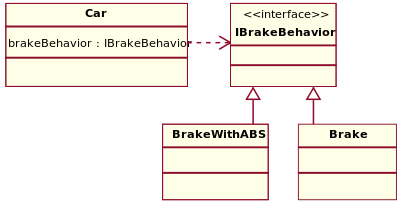

Strategy pattern은 간단히 생각하면 strategy를 runtime에 결정할 수 있도록 만드는 pattern으로 생각하고 있다.

개인적으로는 pattern 공부하면서 가장 인상적이고 재미있는게 strategy pattern 이었다.

 

**1\. Strategy pattern의 특징과 구조**

Strategy pattern을 사용하면 알고리즘(또는 strategy)의 행위를 runtime에 변경하는 것이 가능하다. Strategy pattern을 적용한다는 것은 알고리즘군을 정의해서 캡슐화하며 서로 교환할 수 있게 만드는 과정이라고 생각할 수 있는데, 알고리즘과 알고리즘을 사용하는 객체나 기능과의 독립성을 유지하고 좀 더 쉽게 다양화할 수 있다. 아래의 구조를 바탕으로 설명하면,

 

Strategy interface를 사용함으로써 하나의 알고리즘군을 따로 정의해서 캡슐화하며, 각각의 알고리즘들은 별개의 Concrete class에 구현한다. 알고리즘을 사용하는 객체와의 독립성 유지는 interface로 분리된 알고리즘 자체만으로도 어느정도 가능하지만 핵심은 Context에서 상속대신 composition (UML은 composition으로 표기되어 있지만 aggregation 이어도 문제없다고 생각함)으로 알고리즘과의 관계를 구성한다는 사실이다.

아래의 구조로 strategy pattern을 사용하지 않을 때와 비교를 해보자.

 

Accelerate와 Brake라는 행위가 가능한 Car class를 만든다고 했을 때 자동차 모델에 따라 Accelerate와 Brake도 다양하게 늘어날 것임을 예상할 수 있다. 이 부분이 변경될 가능성이 높은 부분인데 일반적인 경우처럼 상속을 받아 subclass로 구현을 해버리면 행위가 늘어날수록 변경해야 하는 소스가 늘어나게 된다. 그러므로 이런 경우 변경 가능성이 높은 부분 (Accelerate, Brake)을 따로 분리해서 캡슐화를 해버리고, 행위를 사용하는 Car class에서 각각의 행위를 composition (위 UML에서는 dependency 관계로 되어있지만) 관계로 연결을 하면 행위와 주체와의 결합도를 낮추고 독립성을 높일 수 있다. 위와 같은 구조에서 행위는 그것을 사용하는 class와 관계없이 변경하는 것이 가능하다.

 

**2\. Dependency injection과 strategy pattern**

Wikipedia에서는 dependency injection과 strategy pattern을 별개의 design pattern으로 분류하고 있지만 runtime에서 dependency 있는 부분의 변경을 위해 결합도를 낮추기 위해 strategy pattern을 확장한 사례라고 생각한다. Dependecy injection은 SW testing에도 종종 사용되는 기법이다.

 

**3\. 참고자료**

Strategy Pattern : [http://en.wikipedia.org/wiki/Strategy\_pattern](http://en.wikipedia.org/wiki/Strategy_pattern)

Dependency Injection : [http://en.wikipedia.org/wiki/Dependency\_injection](http://en.wikipedia.org/wiki/Dependency_injection)
