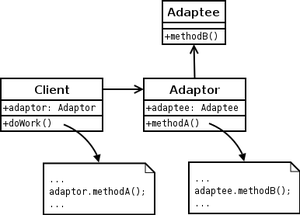
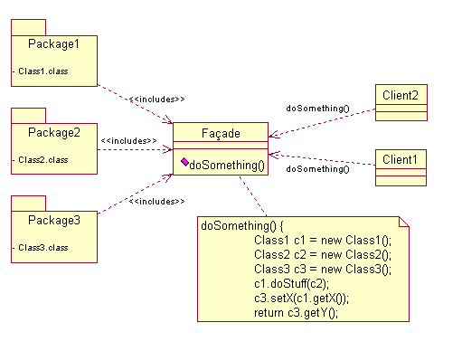

**1\. Adapter pattern**

Wrapper pattern 혹은 단순히 wrapper 로도 불리우는 디자인 패턴으로 서로 호환성이 없는 상황에서 하나의 인터페이스를 다른 인터페이스로 변환하는 과정을 거쳐 사용이 가능하도록 만들어준다. 호환성이 없어서 한 인터페이스를 구현한 클래스들을 사용하지 못할 때 가능하게 만들어주는 역할을 하는 것을 Adapter라고 부르며, Adapter에 맞춰서 변환하는 대상을 Adaptee로 한다. (아래 그림 참조)

 

위 UML에서는 인터페이스와 구현 클래스에 대한 구분이 없지만 유연성을 위해 일반적으로 인터페이스와 인터페이스 간의 composition을 많이 활용하는 것 같다. 쉽게 실제 사물을 이용한다고 가정해보자. Macbook 사용자들은 외부 디스플레이 출력을 위해서 Mini Display Port만 사용해야 한다. 반면에 일반적인 모니터들은 HDMI, DVI, RGB(VGA) 입력만을 받는다. 그 중 DVI를 사용해 연결하겠다 마음을 먹었다면 Mini Display Port to DVI adapter를 시중에서 구매해야만 가능하다. 둘의 인터페이스가 다르기 때문이다. UML상에서 보면 Mini Display Port는 Client가 되고 DVI는 Adaptee가 된다. 그리고 Mini Display Port to DVI adapter는 이름대로 Adapter의 역할이다. Adapter의 구현은 Mini Display Port의 인터페이스를 그대로 구현하되 내부에서는 Adaptee인 DVI의 객체를 갖고 DVI 객체가 갖고 있는 함수를 호출하는 방식으로 진행하면 된다. 실제 Mini Display Port 변환 adapter가 내부에서 함수를 호출하지는 않겠지만...

 

**2\. Facade pattern**

Facade의 의미는 [Wikipedia](http://en.wikipedia.org/wiki/Facade)를 인용하자면 앞면, 얼굴 등을 의미하는 프랑스어에서 넘어온 단어로 일반적으로 빌딩의 외형을 의미한다고 되어있다. 의미 그대로 facade pattern은 여러 라이브러리를 사용할 때나 많은 양의 코드에 대해 간단한 인터페이스를 제공하기 위한 디자인 패턴으로 facade는 그러한 인터페이스를 제공할 수 있는 object를 말한다. Facade는 간단한 함수들을 제공함으로써 라이브러리나 코드들에 대해 깊이 알지 못해도 사용을 쉽게 하고자 하는데 의의가 있다. 또 Adapter pattern과 마찬가지로 여러 API들을 wrapping 하는 역할을 할 수도 있다.

 

예를 들어 로봇을 만드는데 '잔다' 기능을 구현한다고 하자. 자기 위한 절차만 간단히 정리하자면 욕실에 가서 씻고 (치약을 짜서 양치질을 하고, 세수를 하거나 경우에 따라서는 화장을 지워야 할 수도 있고 샤워를 한다) 이부자리를 정리한 후, 물을 한모금 마시고, 현관문이나 창문이 열려있지는 않은지 검사하고, 불을 끈 후에 눕는다. 이 모든 세부 기능들이 각각의 버튼으로 제공되고는 있지만 (매번 누를 수는 없으니) 버튼 하나로 '잔다' 기능을 수행하도록 만들고 싶다면 Facade pattern을 사용해 Facade 클래스와 sleep 함수를 구현하면 되겠다.

 

**3\. 참고자료**

Adapter Pattern : [http://en.wikipedia.org/wiki/Adapter\_pattern](http://en.wikipedia.org/wiki/Adapter_pattern)

Facade Pattern : [http://en.wikipedia.org/wiki/Facade\_pattern](http://en.wikipedia.org/wiki/Facade_pattern)
