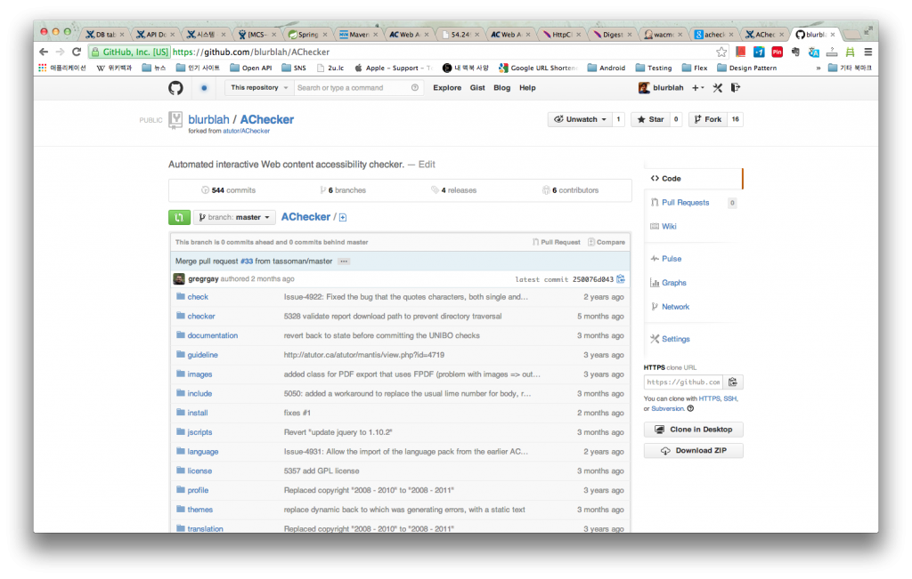
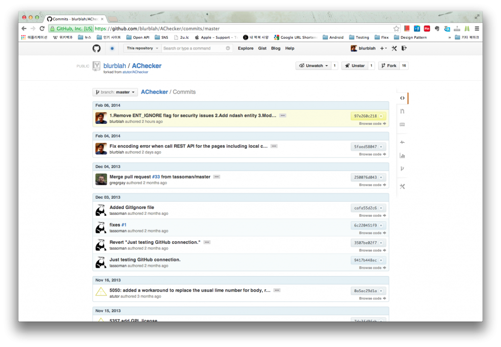
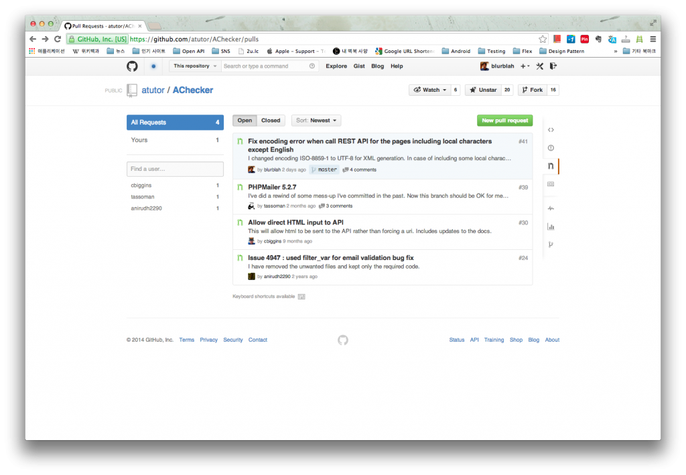

웹 접근성 관련 작업을 할 일이 생겨서 [AChecker](http://achecker.ca/checker/index.php)라는 서비스를 살펴보게 되었다.

AChecker는 사용자가 입력한 URL에 대해서 지정한 웹접근성 Guideline(이하 WAG)을 준수하고 있는지 검사를 해주는데, 기본으로는 HTML 형태로 출력해주지면 감사하게도 REST API 역시 제공하고 있다. REST API를 사용할 경우 Output type은 XML 뿐이다.

**1\. 문제점에 대한 인지**

사용해보면서 기능에 대해 몇가지 검토를 하는 도중에 검사 대상이 되는 페이지에 한글이 포함되어 있는 경우 XML 이 깨지는 문제를 발견하게 되었고 좀 더 명확한 문제의 원인을 알기 위해 소스코드를 살펴보기로 했다. AChecker의 소스코드는 [Github](https://github.com/atutor/AChecker)에 등록되어 있어서 브라우저로 소스를 살펴보기가 나름 편하다. 깔끔하기도 하고.

PHP로 되어있는 코드를 이리저리 살펴보니 (난 PHP를 잘 모른다. 하지만 상세한 문법과 함수들을 모르더라도 훑어보고 문제가 될만한 부분을 찾는데에는 문제가 없다고 생각했다) REST API에 대한 클래스의 인코딩이 조금 이상하다는 걸 발견할 수 있었다. (ISO-8859-1 이었음) EUC-KR이나 UTF-8이 아니라면 한글 표시에 문제가 발생할 수 있겠다 생각을 하면서 REST 말고 HTML 생성하는 부분도 살펴보니 HTML은 UTF-8로 생성하고 있었다. 문제가 되는 URL에 대한 검사 결과를 비교해보니 역시나 HTML로 output을 받을 때에는 전혀 문제가 발생하지 않았고 최종적으로 encoding이 원인이라는 것을 확신하게 되었다. 또 어디를 수정해야 하는지도... (PHP를 몰라도 검색을 좀 해보니 해결책을 찾기가 어렵진 않았음)

**2\. Contribution을 하자**

내가 업무에 쓸거니 그냥 나만 수정해서 쓸까 했는데, 예전부터 마음먹고 있던 Open source 활동을 시작하는 기회로 만들면 어떨까하는 생각이 들었고 별 고민없이 진행하기로 했다. 어차피 수정할 내용이 많지도 않아서 시간 소모가 작을 것 같다는 생각이 마음을 좀 더 편안하게 해주었다.

**3\. Fork**

우선은 AChecker 저장소를 fork 하기로 했다. Github에서 fork는 원래의 저장소를 따와서 내 계정에 동일한 저장소를 만드는 과정을 의미한다. Fork를 하니 아래의 그림처럼 내 계정에 동일한 저장소가 만들어진다.

**4\. 작업**

Fork한 저장소를 clone해야 내가 수정할 수 있다. 물론 원래의 저장소를 clone해서 수정해도 되겠지만 pull request를 할 것이므로 fork한 저장소를 clone 해야 한다. SSH로 clone도 하고 push 하는게 편하기 때문에 미리 github에 public key를 등록해 주었다. 그 이후엔 내가 쓰는 환경에서 코드를 수정했고, 테스트를 해봤다. 잘 된다. 문제가 해결되었다. 그 다음엔 commit. 내가 등록하는 commit message가 그대로 남기 때문에 혹시나 AChecker만 가지고 있는 commit message rule 같은게 없는지 살펴봤는데 제약사항이 없는 것 같았으므로 적당히 알아볼 수 있도록 message를 등록했다. 그리고 push해서 fork한 내 저장소에 commit이 제대로 올라갔는지 확인.

**5\. Pull request**

Fork한 저장소에는 반영되었으니 이제 pull 해가라고 요청해야 한다. AChecker 저장소 페이지로 이동해 Pull Requests 메뉴로 가보니 새로 등록하는 버튼이 있다. (아래 그림 오른쪽 상단 녹색 버튼) 버튼을 누르니 fork한 저장소에 등록된 commit message가 title에 입력되어 있다. 적당히 제목과 내용 적어서 완료.

등록하고 나면 Pull Requests list에 표시되고 Issues에도 함께 나타난다.

이제 결과만 기다리면 되겠다.
