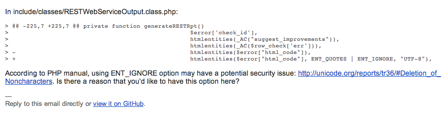
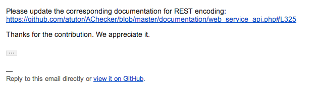
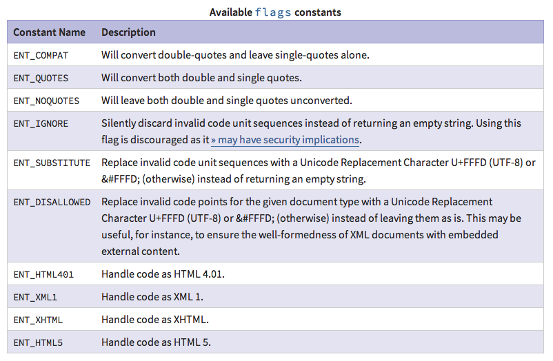
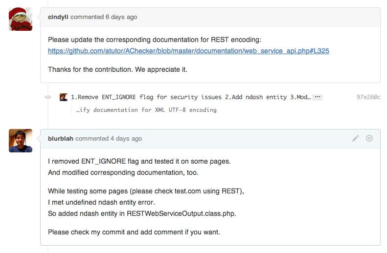

이전에 pull request 한 것에 대한 메일이 왔다.

**1\. Commit에 대한 comment**

누군가가 github에서 내가 올려둔 pull request에 comment를 달았는데 같은 내용이 메일로 온 것이다. 내용은 내가 수정할 때 사용한 ENT\_IGNORE라는 option (flag)가 보안 이슈가 있는 건데 사용한 특별한 이유가 있냐는 것이었다. 앞서도 언급했지만 난 PHP를 잘 모른다. Flag list들을 문서에서 참고했을 때 있으면 좋을 것이라고 생각했던 것이었는데 그게 보안 이슈가 있는지는 미처 몰랐다.

추가로 comment 단 사람이 관련 문서도 함께 수정해 달라고 요청했다. 문서가 있는지도 몰랐네.

그리고 contribution 해준게 고맙단다. 사실 나도 고맙다. 내 입장에서는 경험을 쌓는건데 그걸 또 고맙다고 하니까. 뭔가 훈훈하다.

**2\. 정보 수집**

제기된 보안 이슈는 정말 그런 것일까? 문제가 된 ENT\_IGNORE에 대한 자료를 찾아보자. 우선 사용한 함수 htmlentities에 대한 문서부터 다시.

아. 문서([http://kr1.php.net/htmlentities](http://kr1.php.net/htmlentities)) 자체에도 언급이 되어있다. may have security implications 라고. 왜 미처 저 부분을 못 봤는지...(공식 API 문서에도 언급된 부분이라 신뢰도는 높다고 판단된다) 보안 이슈에 대해 더 자세히 확인하고 싶지만 생략하기로 한다. 기술적인 부분 보다는 open source 활동과 과정에 대한 정리가 지금은 중요하다고 생각하기 때문이다.

**3\. 작업**

어찌되었든 혹시나 해서 넣어둔 flag인데 빼도 문제가 없는지 검토해 보기로 한다. 제거하는 것으로 코드를 수정한 후에 문제가 없는지 테스트를 진행했다. 다행히 ENT\_IGNORE를 제거함으로 인해 발생하는 문제는 없었는데 또 다른 문제를 발견할 수 있었다. AChecker가 XML을 생성하면서 정의되지 않은 entity가 포함되는 경우가 있었는데 이에 대한 정의가 없었기 때문에 정상적인 XML로 인식되지 못했다. 그래서 보너스로 그 부분까지 함께 수정. 그리고 commit / push.

**4\. Pull request에 대한 update**

이전에 올린 pull request를 제거하고 다시 등록해야 하나 고민을 했다. 고민을 하면서 최소한 이전에 comment 단 사람에게 댓글은 달아줘야겠다는 생각이 들어서 github에 가보니...

 

이전의 comment 아래에 내가 fork한 저장소로 push 했던 수정사항이 자동으로 달려있다. Comment에 수정할 파일과 라인넘버까지 명시되어 있었기 때문에 그 부분을 수정한 commit을 자동 감지하는 것인지, 원래 pull request로 등록한 branch에 대한 모든 변경사항들이 pull request가 close 되기 전까지 자동으로 update 되는게 맞는지는 좀 더 살펴봐야 하겠지만 일단 예상했던 자잘한 작업을 안해도 되기 때문에 무척 편리하다는 생각이 들었다.

마지막으로 수정한 부분에 대한 comment를 달아줬다. 영작이 이상하더라도 문제 삼지는 말자. 원래 영어를 잘하지도 못하고 native도 아닌데 우선은 의사전달만 제대로 되면 큰 문제는 없다고 본다. 그래도 영어공부는 계속 해둬야 겠다는 생각은 한다.

 

역시 이 작업까지 마치고 다음을 기다리기로 했다.
