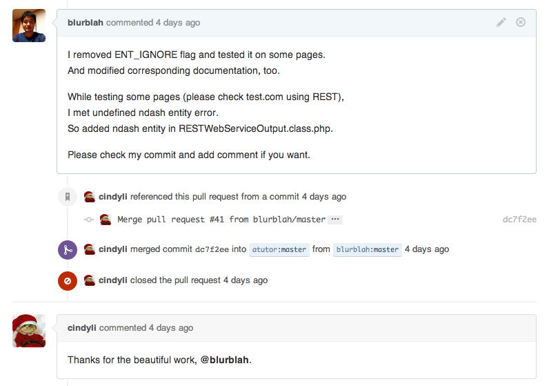
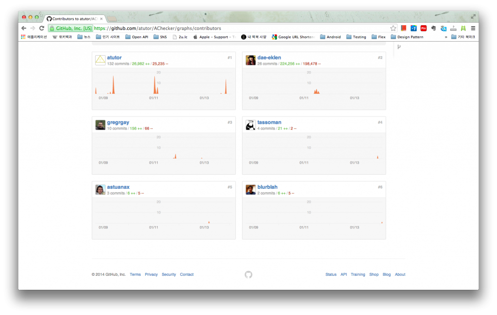

역시 메일이 왔다. 참 재미있는 세상이 아닌가? 어디에 있는지도 모르고 얼굴도 모르는데 하나의 공통된 주제 때문에 메일을 주고 받을 수 있다니.

**1\. Merged and beautiful work**

메일의 내용은 단순한 메세지였다. Merged #41. 41번째 merge인 것이다. 메일 본문이 어차피 github에 등록된 comment이니 github으로 가본다.

별 문제가 없었는지 (사실 문제의 여지가 별로 없다. 비즈니스 로직을 수정한 것도 아니고 단순히 버그가 있는 부분을 약간 고친 것에 불과하니까) 내 pull request를 받아줬다. 그래서 merge를 했다. 내가 수정한 부분을 모르는 타인이 받아줬다는 것도 상당히 흥미로운데, beautiful work라고 지나가는 말로라도 한 마디 던져준다. 그래 고맙다. 너네도 beautiful work를 많이 해왔구나. 역시 훈훈하다.

Open source 마다 차이가 있다고 알고 있지만 한두건의 commit 만으로는 contributor로 등록되지 않을 수 있다고 어디선가 봤던 기억이 있는데 혹시나 싶어 contributor list를 열어봤다.

우오오...젠장. Contributor에 들어있다. 내가 한 건 단지 몇 개 고친 것 뿐인데 기여했다고 인정해주다니. 혹시 pull request 받아들여지기만 하면 자동으로 등록되는거 아닌가? 모르겠지만 여하튼 기쁘다.

**2\. Open Source 활동은 자격증을 취득하기 위한 과정이 아니다.**

AChecker와 관련된 작업을 마치고 생각을 해보았다. 이게 사실 자랑할 거리는 아니지 않는가? 라고. 계속 기록했지만 PHP를 잘 아는 것도 아닌데다가 엄청나게 좋은, 효율적인, 아름다운 코드를 나열한 것도 아니고 많은 부분을 수정하거나 하지 않았기 때문에 내 현재의 능력을 표현하지는 못할거라는 생각이 든다. 그렇기 때문에 '나 contributor, 혹은 committer에요' 라고 내세울만한 그런 일은 아닌 것 같다.

하지만 내가 이런 저런 부분에 관심이 있으며, 흥미와 재미를 느끼고 있다는 점에 대해서는 어필하는 것은 충분히 가능하다고 생각한다. 실제로 업무 이외에 작은 시간을 쪼개서 진행을 했고 이런저런 과정을 거쳐 얻은 성과이기도 하고 그 과정 자체가 충분히 재미있었기 때문에 앞으로도 이런 활동을 지속하게 될 것 같다.

 

Open source 활동은 자격증을 취득하기 위한 과정이 아니다. 그냥 그 과정 자체를 즐기는 과정이다. 정도로 결론내릴 수 있지 않을까.

AChecker에 또 수정할 부분이 보여서 pull request 하러 간다.
