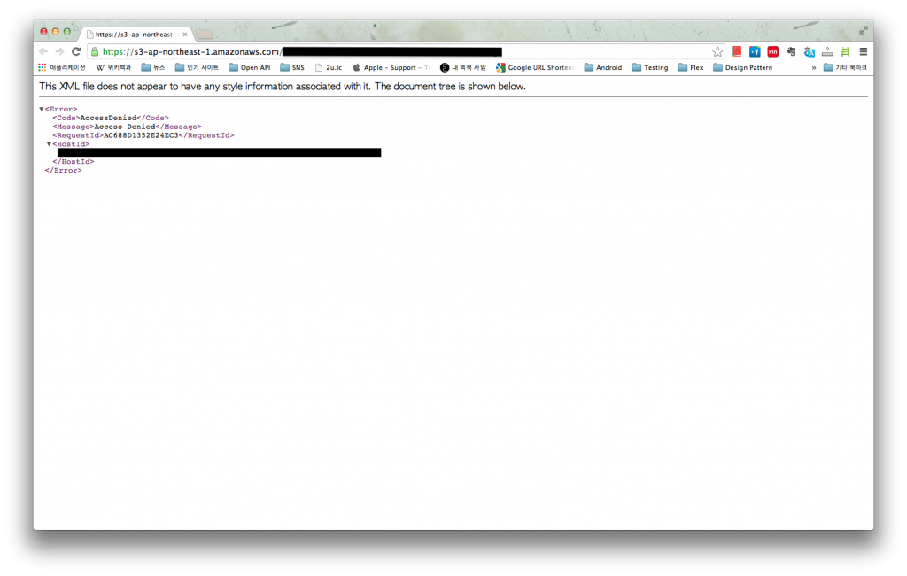
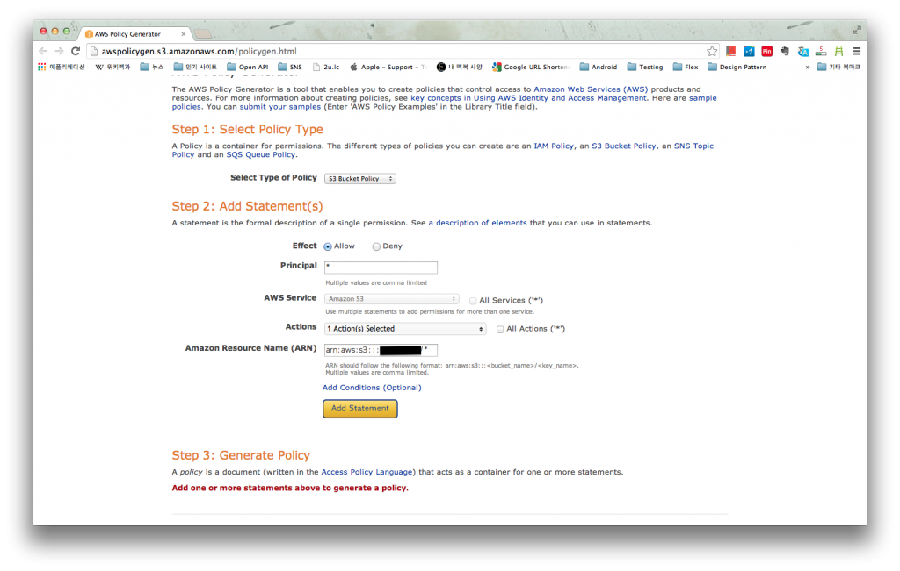

Amazon의 S3 서비스를 사용할 때 기본 설정만으로는 upload 한 파일에 대한 접근이 안된다.

Permission 설정이 있길래 건드려 보기도 했는데 permission 만으로는 해결할 수 없었다.

이 부분은 조금 이상하다. 많은 사람들이 permission 설정만으로 접근 권한 제어가 가능할거라 인식할 거라고 보기 때문이다.

또 서비스들이 계속 변경되어서 그런지 검색을 통해 얻는 정보들이 부정확한 것들이 많아서 정리해보기로 했다.

**1\. 현상**

Browser로 간편하게 확인해보기 위해 image를 upload 했다.

그 image의 properties를 확인하면 기본 정보들이 표시되는데 그 중에 link를 열어보면 아래와 같은 화면이 나타난다.

 

XML 형태로 output을 내주고 있는데 AccessDenied로 표시하고 있다.

**2\. Policy 설정**

결론부터 얘기하면 모든 resource는 기본적으로 private이라 policy 설정을 해야 접근이 가능한 것으로 보인다. Policy는 (S3에서 얘기하는) bucket 마다 설정이 가능한데, 하위의 디렉토리나 각각의 파일에 대해서는 설정할 수 없다. Bucket의 Properties를 열고 Permission 항목을 확인하면 bucket policy 추가하는 버튼이 있다.

버튼을 눌러보면 텍스트 입력 팝업이 나타나고 하단에 AWS Policy Generator가 보이는데 처음이라 policy의 형식을 잘 모르니 generator를 사용해봤다. Generator를 열어서 필요한 입력 필드에 원하는 정보를 입력한다.

Principal은 policy 적용 대상(사용자)을 의미하는데 익명 사용자에 대해 지정하고 싶다면 \*로 입력하고, ARN (Amazon Resource Name)은 표시된 형식대로 입력한다. (arn:aws:s3:::\<bucket\_name\>/\<key\_name\>) Action은 S3에 대한 약간의 지식이 필요한데, 이미지 표시 및 다운로드 (어차피 같은 의미)만 테스트 해볼 것이므로 GetObject를 선택한다. ARN의 key\_name은 resource에 대한 key를 의미하는 것으로 보인다. 나의 경우엔 특정 디렉토리에 있는 모든 image를 대상으로 하므로 arn:aws:s3:::my\_bucket/sub/dir/\* 형태로 입력했다.

모든 필드를 채워서 Generate Policy 버튼을 누르면 S3에서 원하는 형식의 텍스트를 표시해준다. 복사해서 이전의 Bucket Policy Editor에 붙여넣기 한 후 저장하면 적용됨.

**3\. 결과**

아까 전 AccessDenied 응답을 받았던 link를 그대로 열어보면 image가 제대로 browser에서 표시된다. 다른 사용자나 특정 referer에 대한 허가, 거부 등의 세밀한 조정이 필요할 수 있겠다 싶은데 그 부분은 [Example Cases for Amazon S3 Bucket Policies](http://docs.aws.amazon.com/AmazonS3/latest/dev/AccessPolicyLanguage_UseCases_s3_a.html)를 좀 더 참고해봐야한다.
