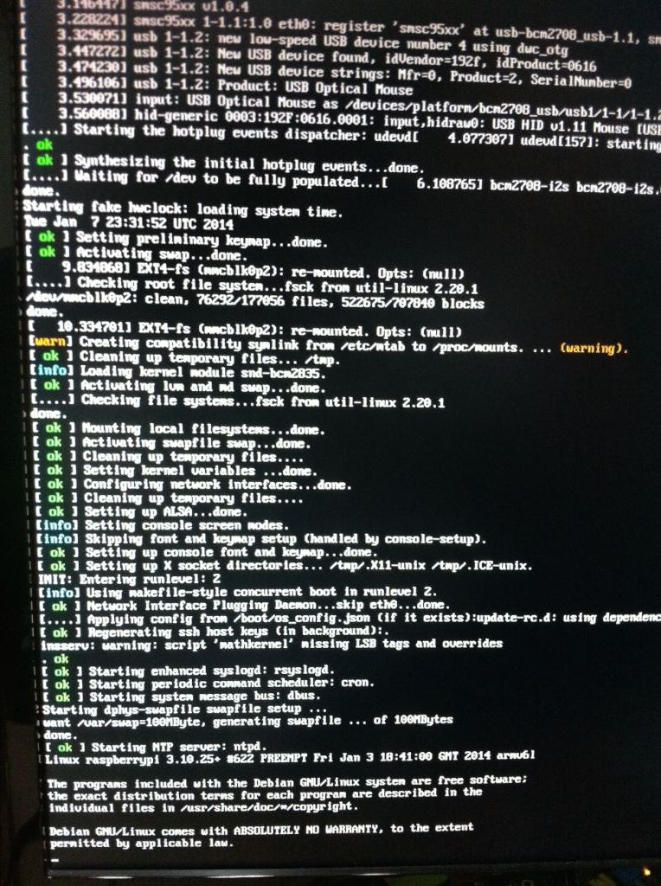
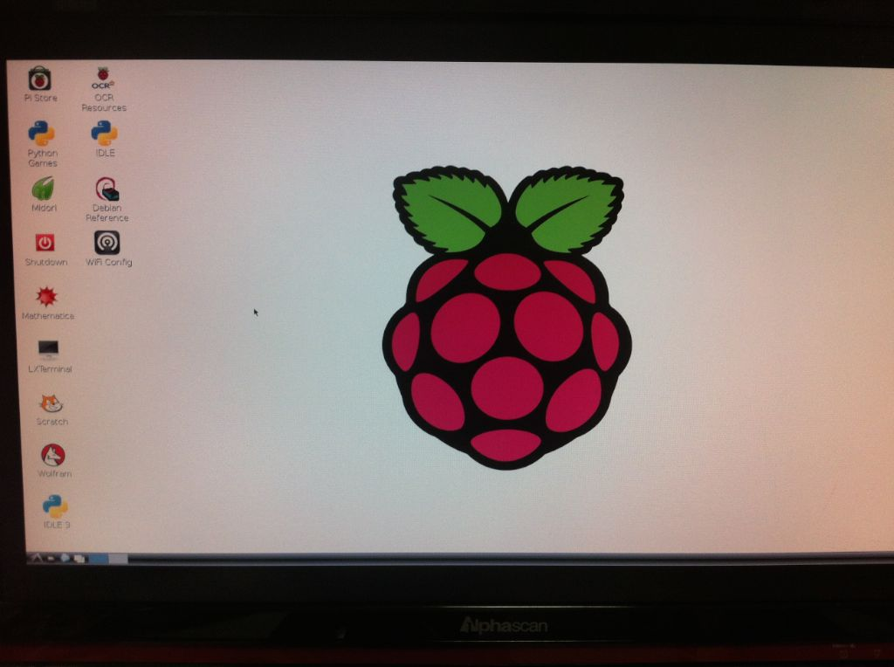

부모님용으로 무작정 구매했다.

SD 카드도 필요해서 마트에 가서 Sandisk 8GB짜리 하나도 집었다. 할인해서 7000원대.

Class도 적혀있지 않고 bulk인 것처럼 생겼는데 그냥 써볼거라 문제되지 않을거라 생각했었다. 하지만 어떤 것들은 사용할 수 없는 것 같기도 하다. ([SD Card compatibility list](http://elinux.org/RPi_SD_cards))

**1\. Raspbian 준비**

공식 페이지에서 Raspbian (데비안 계열 raspberry pi용 linux os) 이미지를 다운로드 받은 후 (엄청 느림, [http://www.raspberrypi.org/downloads](http://www.raspberrypi.org/downloads)) dd command로 부팅 가능한 SD card를 만들었다. [Guide](http://elinux.org/RPi_Easy_SD_Card_Setup)에는 좀 헷갈리게 되어있는데 /dev/disk_n_s_n_ 형태가 아닌 /dev/disk_n_ 경로를 사용해야 한다.

**2\. 기타 장치 준비 (PS/2 문제)**

Display는 HDMI로만 연결 가능하다. 무선 인터넷은 나중에 설정하면 가능한 것 같기도 한데 Model B의 경우 우선은 유선으로만 가능하다. 키보드와 마우스를 연결해야 하는데, Model B는 USB Port가 2개 뿐이고 PS/2 port는 보이지 않는다. 아쉬운대로 PS/2 to USB 젠더를 이용해서 전원을 연결해봤다. (Raspberry pi는 USB 전원을 연결하자마자 부팅된다. 별도 전원버튼 없음)

사진처럼 여느 리눅스처럼 부팅로그가 나타나고 설정 화면으로 이동하는데 로그상으로만 보면 문제점은 없었으나 키보드를 인식하지 못했다. 자료를 찾아보니 PS/2 type 키보드나 마우스의 경우 소모전력 문제로 Raspberry pi에서는 인식이 잘 안되는 것 같다. 특정 젠더나 별도 전원이 있는 hub 같은 걸 사용하면 되는 경우도 있는 것으로 보이나 내가 사용한 젠더로는 인식 불가.

USB용 키보드도 가격이 꽤 나가고 USB port 수도 제한적이라 USB용 RF를 사용하는 키보드/마우스 콤보를 구매했다. (핫트랙스에서 17,900원) 바로 사용가능했음.

**3\. 인터넷**

부팅 / 설정을 끝내고 X window를 띄웠다.

X window에 포함된 기본 브라우저 중 하나인 Midori를 실행해서 이메일 확인 및 몇가지 검색을 해봤는데 좀 답답한 감은 있지만 사용못할 수준은 아니다. (SD Card를 class 높은 걸로 바꿔서 다시 해 볼 예정)

**4\. 기타**

최초 부팅 후 설정을 마치지 않더라도 ssh 접속이 가능하다. 접속 계정 정보는 pi / raspberry 이며, sudoer로 등록되어 있는 것 같으니 root 계정을 꼭 사용할 필요는 없다. 또 키보드/마우스, 모니터가 없어도 ssh 접속 상태에서 기본 설정을 진행할 수 있다.
