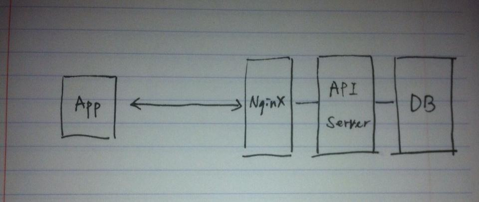
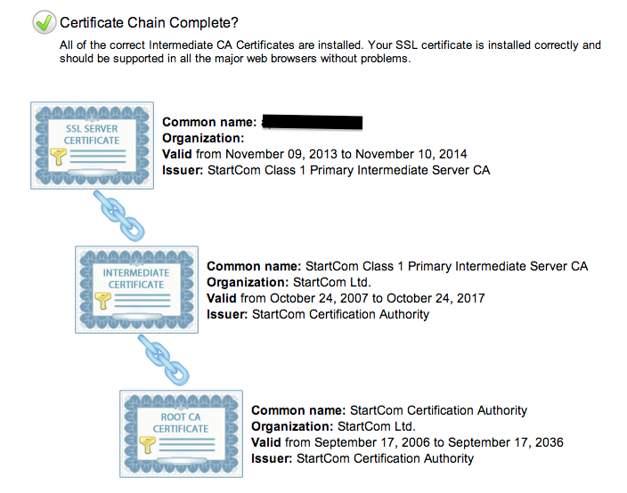

아래와 같은 단순한 구조를 가진 service에서 android app (Phonegap)이 AJAX로 API server와 SSL 통신을 하고 있다. SSL 설정은 reverse proxy 역할을 하는 NginX에 되어 있는 상태였는데 개발단계에서는 나타나지 않았던 문제가 app publish 이후에 발생해서 현상과 해결책을 정리해본다.

 

**1\. 현상**

App에서 API call을 했는데도 오류나 정상 응답이 떨어지지 않는다. API server 쪽에서 로그를 확인해보니 호출된 기록이 없다. 전혀 호출되지 않는다고 판단할 수 있었다. 혹시나 싶어서 NginX의 로그도 확인해봤는데 access 자체를 하지 않는 것으로 보였다. (호출 후 access log, error log 모두 기록되는게 없음)

두번째 이상한 현상은 android app의 manifest에서 debuggable 설정에 따라 API 호출이 되거나 되지 않는다는 사실이었다. debuggable이 true (debug mode)인 경우에는 API 호출에 문제가 없었는데 publish를 위해 packaging 하려고 debuggable을 false로 바꾸면 호출이 불가능했다.

 

**2\. 조사**

Stackoverflow에서 힌트를 찾았는데 자문자답한 사용자의 얘기로는 android app의 debug mode에서는 인증서 확인을 하지 않는데 그렇지 않은 경우 SSL 인증서를 엄격하게 검사한다고 한다. ([http://stackoverflow.com/questions/14363994/android-debuggable-false-causing-jquery-ajax-post-to-fail-in-cordova-phonegap-ec](http://developer.android.com/reference/android/os/StrictMode.html)) 그래서 링크된 [ssl checker](https://www.geocerts.com/ssl_checker)로 API service되는 url (NginX가 처음 받는 url)을 검사해봤더니 다른건 문제가 없었는데 인증서 체인이 제대로 되어있지 않았다. Root CA 인증서가 없다는 내용의 메세지와 함께.

 

**3\. 해결**

Startssl에서 인증서를 발급받아 사용하고 있었는데 생각해보니 도메인에 대한 인증서와 그에 맞는 private key는 발급받았는데 startssl(CA)에 대한 인증서는 없었다. Startssl에서 안내하는대로 ca.pem, sub.class1.server.ca.pem을 추가로(내가 사용하는게 startssl의 class1 certificate) 받아서 기존의 인증서를 합쳐 인증서 체인을 만들고 NginX에 설정했다. ([https://www.startssl.com/?app=42](https://www.startssl.com/?app=42))

설정 이후에 다시 SSL 검사를 해보니 아래처럼 문제있던 부분이 정상. Android app도 수정없이 제대로 호출되는 걸 확인했다.

 

 

**4\. 결론**

나의 경우엔 CA의 인증서 하나를 누락한 경우지만 개발할 때 self sign된 인증서를 사용하는 경우도 있는데 이 경우에도 publish 할 때에는 반드시 교체해야 한다. 이 부분은 사실 개발할 때 문제가 없었기 때문에 간과하고 넘어가기 쉬운 부분인데 publish 이전에 packaging 해서 한 번 확인은 해봐야 할 것 같다. 아니면 Android developer site에서 발견한 StrictMode class를 이용하는 것도 방법이 될 수 있을 것 같다. ([http://developer.android.com/reference/android/os/StrictMode.html](http://developer.android.com/reference/android/os/StrictMode.html))
