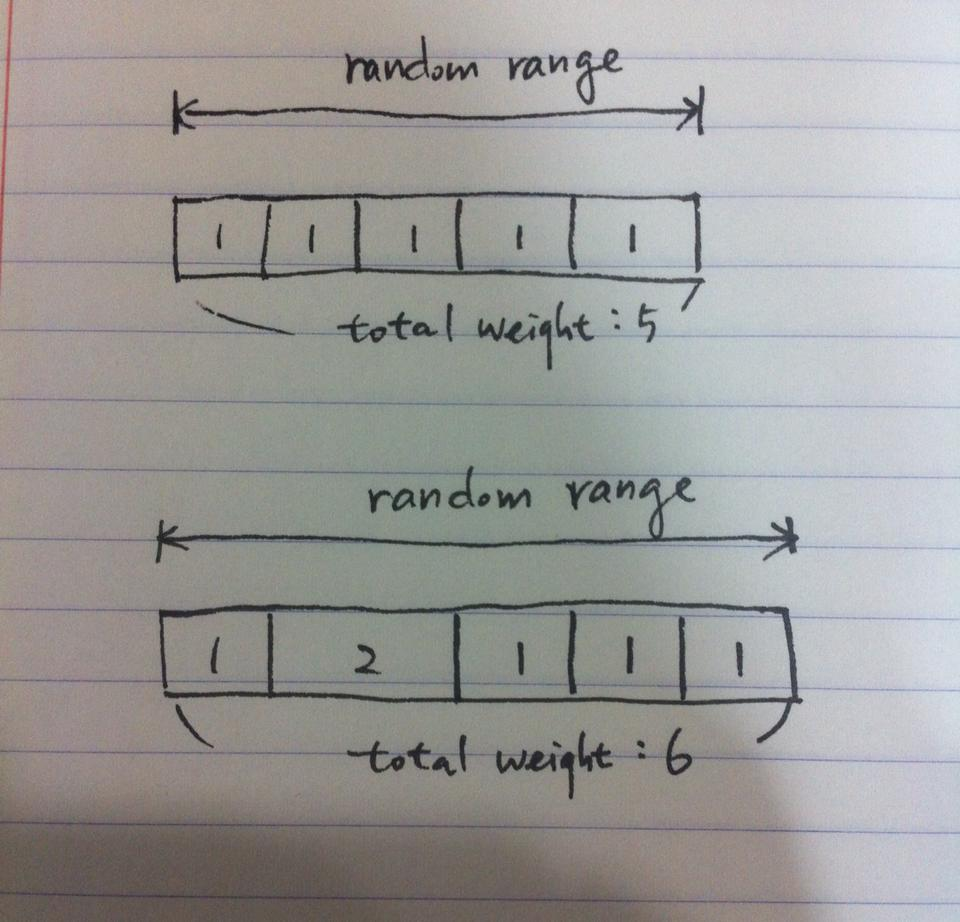

이 글이 작성된 해는 2014년도입니다. 최근(2016년 ~) 유행하고 있는 추천서비스 등과는 관련이 없는 내용이고 개인적인 필요에 의해서 뭔가 실험하고 작성한 내용이에요. 방문자가 별로 없는 블로그이지만 검색 등을 통한 이 글로의 유입량이 많아서 혹시 오해가 있을까하여 미리 밝혀둡니다.

* * *

복수의 아이템이 들어있는 자료구조에서 추첨을 해야하는 경우가 있다. 보통 추첨을 한다하면 무작위로 선택되어야 하는데 때에 따라서는 특정 아이템의 선택 확률을 높여야 할 수도 있다.

 

언어에 따라 조금 차이가 있기는 하지만 보통 random number 생성에 관계된 API들은 수학과 관련된 package로 묶여 있거나 연산에 특화된 기능들끼리 모여있다. 따라서 단순 random number 생성 이외의 기능, 가중치를 고려하는 부분은 직접 구현할 수 밖에 없다. 또는 가중치 고려가 가능하게 만들어진 오픈소스 라이브러리가 있을지도 모르겠는데 그리 복잡하지 않을 것 같아 직접 구현하기로 했다.

 

### **1\. 가중치를 통해 선택확률 높이기**

아래의 그림을 보면 윗 부분은 가중치가 1로 동일한 상태이고 아래는 특정 아이템에 가중치를 더 높임으로써 선택될 확률을 높인 상태이다. 칸으로 구별된 bar를 다루게 될 아이템이 담겨있는 자료구조로 보자. 각 칸에는 하나의 아이템이 담겨있고 좌측을 시작으로 우측으로 갈 수록 index가 높다고 하자. [](https://blurblah.net/wp-content/uploads/2014/05/random_weight.jpg)

 

이렇게 하는 것이 어떻게 선택될 확률을 높일 수 있을까?

Java를 기준으로 random number 생성을 살펴보면 단순히 [Math.random()](http://docs.oracle.com/javase/7/docs/api/java/lang/Math.html#random()) 호출시 0과 1사이에 있는 double 값을 생성해서 돌려주게 되어있다. (정확히 0.0 이상 1.0 미만의 값) Random number의 range를 0 ~ total weight로 설정하면 위 그림의 bar 상단에서 좌측에서 우측으로 증가하는 1차원 그래프를 상상해볼 수 있다. 즉 생성된 random number 가 찍히는 점의 아래에 있는 아이템이 선택될 수 있다.

Weight가 동일한 경우는 그래프에서 차지하는 영역이 동일하기 때문에 random number가 동일한 확률로 생성된다면 아이템이 선택될 확률도 동일하다고 볼 수 있다. 반면에 특정 아이템의 weight가 높은 경우 차지하는 영역이 넓어지기 때문에 그만큼 그 영역안에서 random number가 생성될 가능성이 다른 영역에 비하면 높아진다.

 

### **2\. 그렇다면 구현은 어떻게 할까?**

위 그림과 그래프를 상상해보면 구현은 간단하다. 각 아이템이 갖는 가중치를 모두 더해서 Math.random() 등으로 random number를 생성할 때 0부터 가중치합 사이의 값이 생성되도록 한다. (역시 언어에 따라 다르지만 random number 생성시 seed 값을 설정할 수 있어야 random number 생성의 중복을 방지할 수 있다. Java의 경우 Math 보다는 Random class를 사용하는게 나을 것으로 판단됨) 그렇게 생성된 random number를 가지고 자료구조에서 index를 증가시키며 각각의 아이템이 가진 가중치를 뺀다. (가중치를 빼지 않고 더해서 하는 방법도 있을텐데 그 경우 random number와의 비교구문이 약간 달라져야 할 것이다) 그렇게 진행하다보면 어느 순간 random number가 0이나 음수가 되는데 그 때의 아이템이 가중치에 따라 선택된 아이템이 된다. Pseudo code로 간단하게 작성하면 아래와 같다.

```java
List<Item> list = getItemList();
double total = getTotalWeight(list);
for(int i = 0; i < list.size(); i++) {
  total -= list.get(i).getWeight();
  if(total <= 0) {
    selectedIndex = i;
    break;
  }
}
return list.get(selectedIndex);
```
