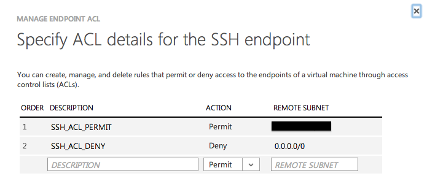
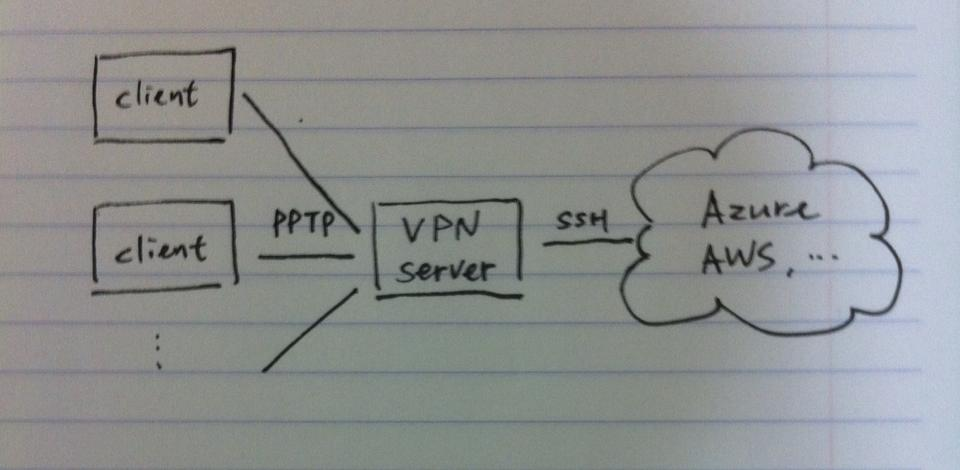

AWS, Azure 등을 사용하면서 로그 확인중에 누군가가 지속적으로 SSH 로그인 시도를 하는 것을 확인했다. IP를 확인해보니 대부분은 중국이었는데 개중엔 네팔도 있더라. 다른 계정은 알기가 어려우니 당연한 거겠지만 항상 root 계정으로 로그인을 시도했는데 그냥 두어도 무슨 문제가 있겠냐 싶었지만 뒤돌아서면 찜찜한게 마음에 걸려서 아래의 방법을 사용해보기로 했다.

 

### **1\. ACL 설정**

[ACL](http://ko.wikipedia.org/wiki/%EC%A0%91%EA%B7%BC_%EC%A0%9C%EC%96%B4_%EB%AA%A9%EB%A1%9D)에 특정 IP와 subnet을 등록해서 접근을 제어하는 방식을 일반적으로 많이 사용하는 것 같다. 원격지 또는 클라우드 환경에서 중요한 보안을 강화할 수 있는 간단하면서도 확실한 방법이라는 생각을 한다. 현재 사용하는 Azure에서는 설정이 매우 간단하다. 사실 복잡할 이유도 없다. 리스트에 넣기만 하면 되는거니까. Azure에서는 AWS와 달리 Endpoints 항목에서 열어놓을 port를 설정하는데 (AWS는 Security group 이라는 이름으로 관리한다) 현재 문제가 되는 서비스가 SSH라서 SSH에 대한 ACL만 설정했다.

위 그림처럼 모든 IP에 대해서는 접근을 거부하고 특정 subnet에 대해서만 허용하도록 했는데 subnet이 다른 환경에서 접근이 필요한경우 ACL에 추가 설정을 해야 하겠다는 생각이 들었다. 집이나 카페에서 접속하는 경우도 있고 때에 따라서는 테더링으로 연결하는 경우도 있는데, 또 나 혼자만 SSH로 접속할게 아니지 않는가. 이렇게 환경이 변경될 때마다 리스트를 추가하는건 귀찮은 일이 아닐 수 없다. 그래서 다른 방법을 생각해야만 했다.

 

### **2\. VPN**

ACL에서 관리할 리스트를 최소로 줄이기 위해서는 Azure에 접근하는 경로를 최소한으로 줄이면 된다. 하지만 실제는 여러 경로이기 때문에 여러 경로를 최소한으로 줄일 수 있는 방법을 찾으면 되는 건데, 여러 방법이 있을 수 있지만 우선은 [VPN](http://ko.wikipedia.org/wiki/%EA%B0%80%EC%83%81_%EC%82%AC%EC%84%A4%EB%A7%9D)을 구성해 보기로 했다. (RDP로 특정 서버에 접속해서 할 수도 있겠다는 생각을 하는데 VPN에 비해 상대적으로 귀찮을 것 같다) 구성하면 아래와 같은 그림이 된다.

난 VPN server를 구축하면 되고 SSH 접속이 필요한 사용자들은 VPN에 연결한 후 SSH를 사용하면 된다. VPN server의 IP에 대해서만 접근을 허용하도록 ACL에 subnet을 추가하면 불편함도 좀 덜고 동시에 SSH 로그인 시도는 막을 수 있다.

 

### **3\. VPN 구성**

공유기에도 VPN server 기능을 할 수 있는게 있다는 것 같은데 불행히도 가지고 있는 공유기들은 지원하지 않았다. 그래서 그냥 ubuntu 12.04에 설정하기로 했는데 2가지 방법을 시도해봤다. 많이 사용한다는 OpenVPN을 (이름도 마음에 든다) 우선 적용해봤는데 설정이 약간 복잡하고 몇가지 문제가 있었다. 가장 큰 걸림돌 중 하나가 OS X이나 Windows에 기본으로 사용 가능한 VPN 연결 기능에서 프로토콜을 지원하지 않는 것이었다. 별도의 client tool을 사용해야만 하는 것 같은데 VPN 연결마저도 귀찮을 수 있는데 따로 툴을 설치해야 한다는건 더 귀찮을 것 같았다. 그래서 pptpd를 사용하기로 했다. Ubuntu에 사용되는 pptpd는 OpenVPN에 비해 설정도 상대적으로 간단했다. 설정했던 내용은

(1) apt-get으로 pptpd 설치

(2) VPN에 연결하는 client에 분배할 IP 대역 설정 (/etc/pptpd.conf)

(3) 네임서버 설정 (/etc/ppp/pptpd-options)

(4) VPN 계정 및 허용 IP 설정 (/etc/ppp/chap-secrets)

(5) IP forwarding 설정 (/etc/sysctl.conf)

(6) iptables masquerade 설정

 

VPN 구성하다보니 네트웍 부분에 대해 더 깊게 알아야겠다는 생각이 든다.
