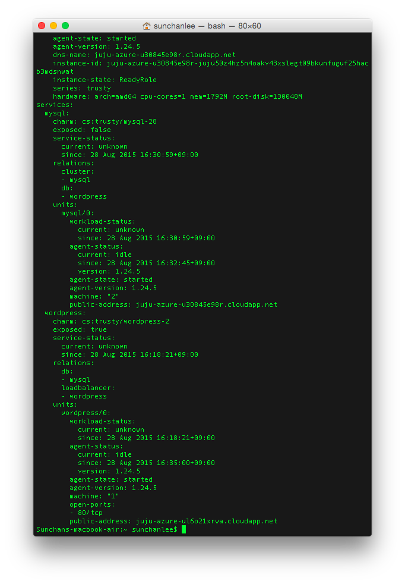
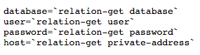

Ubuntu를 배포하고 있는 Canonical에서 사용자가 cloud 환경에서 쉽게 서비스를 모델링하고 배포하기 위한 tool을 Juju라는 이름으로 내놓았다. Server instance를 간편하게 관리한다는 측면에서는 Chef와 유사하지만 instance 자체를 생성하거나 제거할 수 있기 때문에 또 다른 것 같다. Juju는 instance가 아닌 service 위주의 관리와 배포를 목적으로 하고 있는 것으로 보인다. 실제로 특정 서비스 (charm이라고 부르는)를 deploy하면 신규 instance를 추가해서 charm에 정의된 내용대로 서비스를 배포하게 된다. (option에 따라 이미 추가된 instance에 배포하는 것도 가능)

참고 : 아래의 모든 터미널 이미지에 표시된 dns name과 instance-id 들은 이미 다 destroy 해서 사용할 수 없는 정보들임

#### 1\. Juju의 구조

[](https://blurblah.net/wp-content/uploads/2015/08/juju_architecture.jpg)
\<출처 : http://www.slideshare.net/LeonardoBorda/leonardo-borda-maas-and-juju-introduction\>

Juju는 위 그림처럼 client가 state server에 상태값을 추가하거나 update 하도록 되어있고 하위의 모든 machine 들은 state의 변경에 따라 특정 동작을 처리하도록 되어있는 것으로 보인다. 예를 들어 wordpress와 mysql을 연결하라는 명령을 client에서 보내면 내부적으로 event가 발생되고 wordpress, mysql이 event에 맞는 hook을 실행해 세부적인 동작을 처리하게 되며 그 과정에서의 상태값들은 모두 state server에 저장되거나 변경된다. (State는 Mongo DB로 관리되는 것으로 보임)

#### 2\. Bootstrap

Juju client 설치 후 내가 사용하는 cloud 환경 (AWS, MS Azure, Openstack, Joyent, GCE, VMWare 등 대부분의 환경을 지원한다)에 대한 설정을 마친 후에 bootstrap 명령을 내리면 bootstrap instance를 생성하고 필요한 tool들의 설치, 설정까지 진행한다. Bootstrap instance는 state server로서 동작하게 된다.

[](https://blurblah.net/wp-content/uploads/2015/08/juju_bootstrap.png)

Azure의 경우 vnet 생성 후에 instance를 생성해서 연결하게 되고 hash가 포함된 것으로 보이는 문자열로 DNS name을 설정하는 걸 확인할 수 있다. 사실 Juju로 관리할 경우 DNS name은 크게 중요한 요소는 아닌데 아래의 그림처럼 state server에서 별도로 일련번호(0)나 unit name을 붙이고 있어서 client에서는 DNS name이 아니라 일련번호나 unit name으로 대부분의 관리가 가능하다.

[](https://blurblah.net/wp-content/uploads/2015/08/juju_status_after_bootstrap.png)

#### 3\. Charm

Juju에서 배포하고자 하는 service들은 charm이라는 이름으로 정의되고 관리된다. (Chef에서 cookbook이나 recipe처럼) Charm의 구성요소는 아래와 같다.

(1) Metadata

(2) Hooks

(3) Custom contents

Metadata는 name, description, relation, configuration option 등으로 구성이 되는데 이 중 중요한 것은 relation이다.

[](https://blurblah.net/wp-content/uploads/2015/08/juju_wordpress_metadata.png)예를 들어, Wordpress charm의 metadata는 위의 그림처럼 정의되어 있는데 requires와 provides, peers로 된 부분이 relation 설정이다. Relation은 interface, kind, name으로 구성되어 있는데 각각의 정의는 이렇다.

Interface : Hook을 통해서 정보를 교환하기 위한 protocol (진짜 interface의 의미도 있지만...)

Kind : Relation의 종류로 requirer, provder, peer 중 하나를 의미하는데 requirer는 이런 relation이 필요해, provider는 이런 relation을 내가 해줄게, peer는 클러스터링 할 때는 이런 걸로 하자로 이해하면 편할 것 같다.

Name : identifier로서의 역할이고 위 wordpress metadata에서 보면 name 항목의 wordpress,  requires: db: interface: mysql 항목의 mysql을 모두 name이라고 생각하면 된다.

Hook은 위에서도 언급했듯이 event가 발생했을 때 실행되는 script로 어떤 언어로 된 script도 관계없다고 명시되어 있다. 그러니까 특정 event 발생시 각 service unit들이 해줘야 하는 동작을 script로 정의하면 되는데 몇 개 charm을 둘러보니 대부분 bash와 python으로 구현하는 것으로 보인다.

#### 4\. Deploy

Bootstrap 한 이후에 위의 charm을 가지고 deploy하는 과정은 단순히 juju deploy \<charm name\> 형태의 command만 실행하면 된다. 정말 간단하다. 실행하면 charm이 올라갈 instance를 생성하고 instance 생성이 완료되면 charm에 정의된 install hook이 실행되서 필요한 tool을 설치하거나 설정하게 된다. 그리고 deploy 후에 state server (bootstrap instance)에 상태 정보를 요청하면 아래와 같은 내용을 확인할 수 있다.

#### [](https://blurblah.net/wp-content/uploads/2015/08/juju_status_after_deploy.png)5\. Instance에 접속하고 싶다면

대부분의 관리가 juju command로 가능하지만 그래도 배포된 instance에 접속해야하는 상황이 있을 수 있다. 그 경우 juju ssh 0 (0번은 bootstrap instance에 대해서 붙여진 번호), juju ssh \<unit\_name\> 형태의 command를 사용하면 ssh로 접속이 가능하다. 실제로 bootstrap instance나 다른 instance를 생성할 때 juju client에서 관리하는 public key를 전송해서 각 instance (machine)의 authorized\_keys에 추가하기 때문에 juju command가 싫다면

```bash
ssh -i <private_key_path> ubuntu@<dns_name>
```

으로 접속할 수 있다. (Juju client가 설치된 장비의 private key는 기본적으로 ~/.juju/ssh 경로에 생성됨)

#### [](https://blurblah.net/wp-content/uploads/2015/08/juju_ssh_using_private_key.png)6\. Add relation

4에서처럼 charm을 deploy 하고나면 단지 설치만 된다. Wordpress charm의 경우 설치했을 때 wordpress만 설치되고 mysql 등의 DB는 별도로 설치되지 않는다. MySQL이 필요하니 deploy를 한다해도 역시 설치만 되고 각 service는 별개의 것으로 남아있게 된다. juju add-relation wordpress mysql 명령을 실행해보자. (wordpress, mysql은 charm의 이름이지만 이미 설치된 것이고 state server에서 각 service unit에 대한 상태를 관리하고 있으니 문제없다)

[](https://blurblah.net/wp-content/uploads/2015/08/juju_db_relation_joined.png)[](https://blurblah.net/wp-content/uploads/2015/08/juju_db_relation_changed.png)위 그림은 순서대로 mysql과 wordpress가 설치된 instance에서 수집한 로그인데 add-relation 명령 실행시 mysql에서는 db-relation-joined, wordpress에서는 db-relation-changed가 순차적으로 실행되는 것을 확인할 수 있다. db-relation-joined와 db-relation-changed는 각각 mysql과 wordpress charm에 정의되어 있는 hook으로 add-relation 명령이 수행되면 wordpress와 mysql이 provide하고 require하고 있는 항목인 db에 대한 relation-joined hook이 실행되는데 db-relation-joined hook은 mysql에만 정의되어 있으므로 먼저 실행된다.

[](https://blurblah.net/wp-content/uploads/2015/08/juju_relation_set.png)db-relation-joined hook의 내용을 살펴보면 위 그림처럼 relation-set 명령을 호출해서 db 접속정보를 설정하는 것을 알 수 있다. 위의 접속정보는 state server에 저장되고나면 변경사항이 발생되었기 때문에 db-relation-changed hook이 실행되는데 이것은 wordpress에만 정의되어 있는 hook이므로 wordpress에서만 실행되며 state server에 저장된 db 접속정보를 받아와서 설치된 wordpress에 설정파일들을 수정하거나 다른 조작을 가하도록 정의되어 있어 wordpress와 mysql 사이의 연결이 가능해진다.

[](https://blurblah.net/wp-content/uploads/2015/08/juju_relation_get.png)

#### 7\. Expose

Deploy와 relation의 과정을 거치고 나더라도 바로 wordpress를 이용할 수는 없다. Cloud service 들의 특성상 보안 등의 이유로 대부분의 port는 연결이 되지 않도록 막혀있기 때문에 특정 port를 열어주는 작업이 필요하다. 위의 과정으로 deploy 한 것은 wordpress와 mysql 뿐이고 wordpress만 열면 되기 때문에 간단하게

```bash
juju expose wordpress
```

명령만 실행하고 나면 약간의 시간 후에 아래의 그림처럼 endpoint 설정이 추가된 것을 확인할 수 있다. (Azure 기준)

[](https://blurblah.net/wp-content/uploads/2015/08/juju_expose.png)Wordpress나 MySQL charm에서 어떤 부분이 expose를 가능하게 하는지 아직 찾지 못했다. MySQL을 expose 해보니 status에서 exposed flag 값만 false에서 true로 바뀔 뿐 실제 endpoint 설정이 추가되지는 않는데 이 부분은 좀 더 살펴볼 필요가 있을 것 같다.

#### 8\. 참고

https://jujucharms.com/docs/stable/getting-started

http://blog.labix.org/2013/06/25/the-heart-of-juju

http://askubuntu.com/questions/55179/what-is-the-purpose-of-the-bootstrapping-instance-in-juju

http://www.slideshare.net/LeonardoBorda/leonardo-borda-maas-and-juju-introduction
