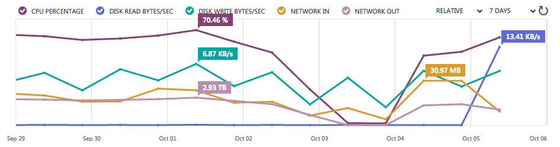
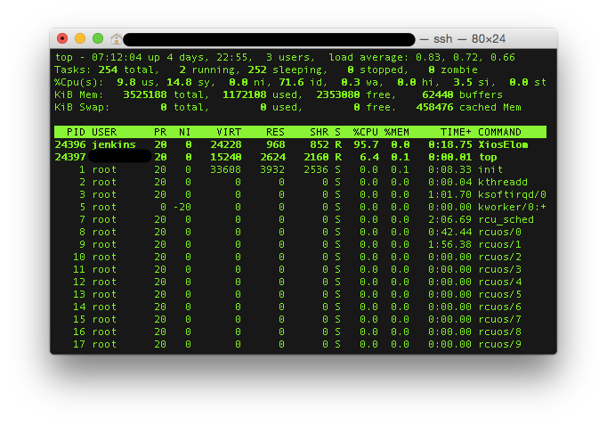
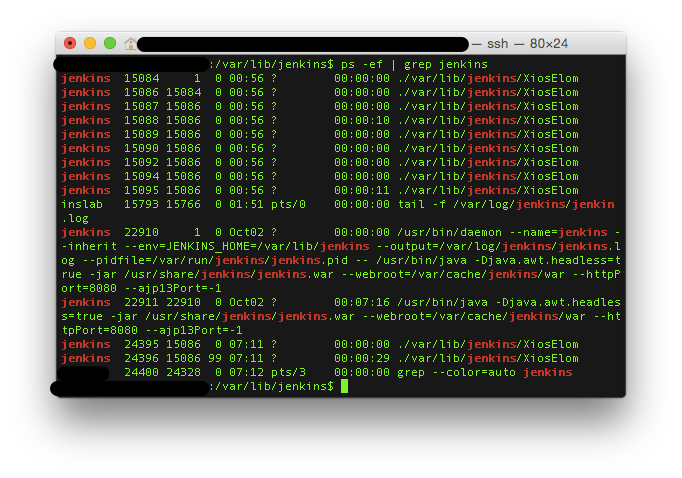

Azure 사용중인데 얼마전 연락을 받았다. 비용이 좀 과다하게 나오고 있는 것 같다고.

#### **1. Outbound traffic**

확인해보니 outbound traffic이 약 2주동안 63TB 정도.

Azure 정책상 inbound는 무료, outbound에는 GB당 얼마씩 과금이 되는데 합하니 약 천만원 정도의 비용이 찍혀있었고 billing history 상세 내역을 확인해보니 (날짜, category, vm 별로 상세 데이터가 csv로 제공됨) 특정 vm 2개가 매일 2~6TB씩 outbound traffic을 발생시키고 있었다. 뭐 특별한거 서비스하는 것도 아니었는데...

#### **2\. Process 확인**

해당 VM 중 하나에 접속해서 우선 top으로 CPU 점유 / Memory 사용량과 사용되는 process 들을 확인해봤다.

jenkins user가 사용하는 XiosElom이라는 process가 눈에 띄었는데 지금까지 본 적 없는 이름이어서 더 상세한 process 정보를 확인해보니 jenkins 설치 경로 하위에 처음 보는 이름의 파일이 복수의 process로 실행중이었다. 이상하다.

#### **3\. File / 문서 확인**

XiosElom 이라는 파일을 확인해보니 9월 22일에 생성이 되어있었고 관련 자료를 검색해보니 malware라는 얘기가 위키에 올라와있다. 10월 1일 날짜로 등록된 것으로 보아 비교적 최근에 발견되고 있는 문제인 것으로 보인다.

[https://wiki.jenkins-ci.org/display/SECURITY/Jenkins+Security+Advisory+2015-10-01](https://wiki.jenkins-ci.org/display/SECURITY/Jenkins+Security+Advisory+2015-10-01)

#### **4\. 원인 / 조치**

문제가 된 2개의 VM 모두 테스트용 jenkins가 설치되어 있는 상태라 process를 중단하고 jenkins를 purge로 삭제한 후 재설치를 하고 security 설정을 enable 했다. 근본적으로는 jenkins를 통해 누군가가 설치하고 실행한 process가 원인이지만 방심하고 security 설정을 하지 않은게 그것을 가능하게 했다고 생각한다. 또 급하게 조치하고 나서 보니 추가로 분석할 로그 파일과 실행 파일을 남겨두지 않은게 후회된다.
