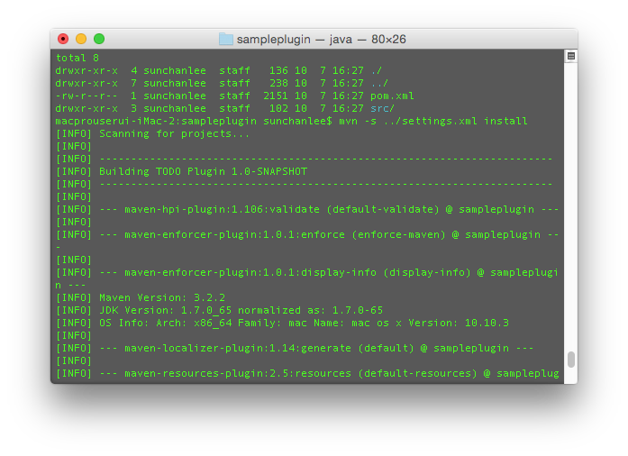

Jenkins plugin 중 하나를 수정할 일이 있어서 clone 해서 빌드를 해봤는데 테스트에서 실패하는 문제(테스트 코드 상으로는 전혀 문제가 없어보였는데)가 생겨서 plugin 개발 과정 그대로를 진행해봤다.

OS : OS X Yosemite (10.10.3)

IDE : Eclipse Luna

#### **1\. settings.xml 준비**

Jenkins plugin은 maven으로 dependency 관리 및 빌드를 하도록 되어있는데 라이브러리나 모듈 등을 maven 중앙 저장소 대신 별도 저장소에서 관리하고 있다. 그렇기 때문에 jenkins 저장소들에 대한 경로를 maven이 인식할 수 있어야 하므로 settings.xml 파일에 아래 내용을 추가하라고 가이드하고 있다.

나의 경우에는 별도로 settings.xml 파일을 변경해서 사용하고 있지 않기 때문에 maven 기본 설정을 따라가게 되어있는데 위의 내용을 ~/.m2/settings.xml 파일로 생성해 놓으니다른 maven project들이 의존관계를 갖는 모듈을 찾지 못하는 문제가 있었다. 그래서 별도로 eclipse에서 workspace를 생성해서 그 위치에 settings.xml 파일을 두고 그 workspace에 있는 project들만 위의 settings.xml 내용을 따르도록 조치해두었다. 불편한 점인데 maven의 기본 settings.xml 내용을 안다면 위의 내용만 추가해서 처리할 수 있을 것 같은데 뒤로 미뤄두기로 했다.

#### **2. Plugin 생성 (skeleton)**

[Plugin tutorial](https://wiki.jenkins-ci.org/display/JENKINS/Plugin+tutorial)을 따라서 해보니 아래의 command로 새로운 plugin을 생성해줘야 한다.

mvn -U org.jenkins-ci.tools:maven-hpi-plugin:create

그런데 위의 내용대로 하면 maven에 설정된 settings를 따라가게 되기 때문에 jenkins에 대한 의존관계를 찾지 못해 아래와 같은 오류가 발생한다.

그래서 별도로 생성한 settings.xml을 적용할 수 있게 command를 변경했다.

mvn -s settings.xml -U org.jenkins-ci.tools:maven-hpi-plugin:create

아래 이미지처럼 groupId와 artifactId를 입력하면 skeleton project가 생성된다.

#### **3\. mvn install (optional)**

튜토리얼에는 hpi로 packaging 하기 위해 아래의 command를 사용하라고 되어있다.

mvn install

단순 packaging인데 goal을 install로 하라는게 이상하다. 어차피 IDE에서 드럼과 장구를 칠테니 이 과정은 없어도 될 듯 하다. 그래도 command 변경해서 한 번 해봤다.

mvn -s ../settings.xml install

전형적인 install 처럼 maven 로컬 저장소 경로에 packaging 된 파일들이 생성된다. packaging 과정을 거쳐서 진행되는거니 /project\_path/target 에도 hpi가 생성되고 goal을 package로만 지정해도 target에는 hpi가 생성된다.

#### **4\. mvn hpi:run**

Dependency 중에 jenkins war도 있어서 hpi:run을 goal로 지정하면 플러그인이 설치된 상태로 jetty로 jenkins를 실행시켜준다. 이 때 기본 context path는 /jenkins이고 port는 8080

mvn -s ../settings.xml hpi:run

#### **5\. Project import**

Skeleton project는 기본으로는 maven을 사용하고 있으므로 'Existing Maven Project'로 import 해도 된다. 나의 경우엔 특이한 현상이 있어서 eclipse project로 변환해 보기도 했는데 변환할 경우 아래의 command 형태를 사용하도록 튜토리얼에 기술되어 있다.

mvn -DdownloadSources=true -DdownloadJavadocs=true -DoutputDirectory=target/eclipse-classes -Declipse.workspace=/path/to/workspcae eclipse:eclipse eclipse:add-maven-repo

이제 수정하거나 이것저것 만들어서 빌드하고 실행해볼 수 있다.

#### **6\. 특이한 현상**

경험했던 특이한 현상이 아래의 두가지였다.

(1) Skeleton project를 run 했을 때 configuration에 나타나지 않는 문제

Skeleton project를 그대로 실행하면 원래는 아래 그림처럼 jenkins configuration에 'Hello World Builder' 라는 section이 추가되고 job 설정에서 프랑스어로 인사를 print 할 수 있는 기능을 build에 넣을 수 있게 되어있는데 어느 곳에도 project와 관련된 부분이 나타나지 않는 현상이 있었다.

(2) Clone한 project build시 test에서 실패하는 문제

수정하려고 했던 plugin을 clone해서 packaging을 했는데 테스트에서 실패하는 문제가 있었다. 아래 그림처럼 단순한 형태의 테스트 코드였는데 객체가 얻어지지 않는게 테스트 실패의 원인이었다.

두 가지 문제를 해결하려고 시도하던 중 eclipse project로 변환하면서 문제들이 저절로 해결되었다. source를 download 하라고 설정되어 있어서 source가 꼭 필요한 무언가가 있어서 해결된 것인가 (그래도 이상하다) 아니면 변환 과정에서 의존성을 가진 일부 모듈을 download 하는 건지 추측을 해봤지만 정확하지는 않다. 아래는 같은 현상을 경험했던 분이 stackoverflow에 올려놓은 글.

[http://stackoverflow.com/questions/23002818/jenkins-plugin-shows-on-plugin-page-but-does-not-show-on-configuration-page](http://stackoverflow.com/questions/23002818/jenkins-plugin-shows-on-plugin-page-but-does-not-show-on-configuration-page)
