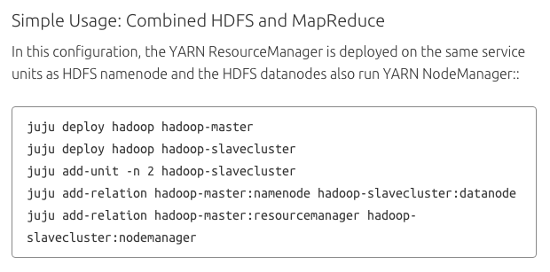
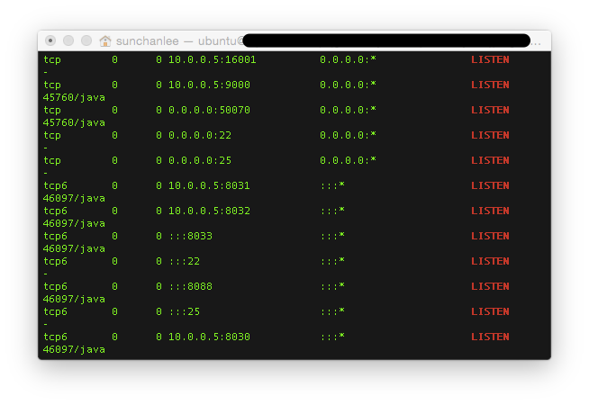
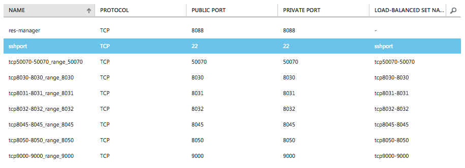
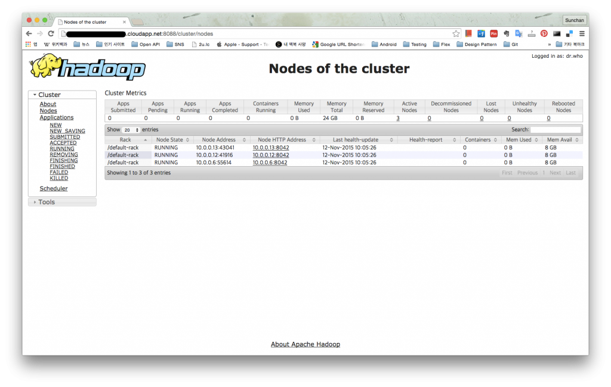

1주에 한번씩 스터디 중이고 이번주는 hadoop을 deploy 해서 가야 한다.

Hadoop에 대해서는 잘 모른다. 하지만 배우면 되겠지라고 생각하면서 시작.

#### **1\. Juju charm**

Charm을 찾아보니 간단하게 기술되어 있다.

(Charm 자체는 간단하겠지만 hadoop에 대한 내용은 어려울 것이다.)

기술된 내용을 읽다보니 HDFS와 MapReduce가 혼합된 형태로 deploy 하는 부분이 있다.

Scale out을 위해 분리된 형태로 deploy 하는 내용도 있었지만 일단은 가볍게 시작하기로 하고 순식간에 deploy / relation 완료.

#### **2\. Web UI**

Apache Hadoop 페이지를 대강이라도 읽어두어야겠다는 생각이 들어서 살펴보니 Hadoop cluster를 올리고나면 web ui가 있으니 확인해보라는 내용이 있었다. Name node는 default 50070, Resource manager라는 애는 default port가 8088이다. 그런데...위의 이미지처럼 간단하게 deploy를 해보니 Azure (연습용이라 Azure를 사용한다)에 생성된 VM에 Endpoint 설정이 SSH 말고는 되어있질 않았다. 역시 이런 부분은 문제가 있다고 생각하며 넘어가기로 했다.

#### **3\. Listening port 확인**

설마 혹시 제대로 deploy가 안된 것은 아닌가 다른 문제가 있는 것은 아닌가 의심하기 시작. 하지만 로그를 봤을 때 특이사항이 없었으므로 Apache 문서가 맞다면, 또 deploy가 제대로 되었다면 port는 listen 상태로 있겠지라는 생각이 들었다. 그래서 netstat.

Hadoop의 구조는 잘 모르지만 master, slave로 나뉘어 있는 것으로 보아 master만 보면 되겠다며 port를 확인하니 Apache 문서대로 8088, 50070 등의 port로 들을 준비를 하고 있더라. 그렇다면 문제는 하나.

#### **4\. Expose**

Charm 문서에는 기술되어 있지 않지만 Azure endpoint 설정이 안되어 있으므로 expose를 해보기로 했다. (직접 VM에서 열어도 되지만...) 해보니 자동으로 몇 개 설정이 추가된다.

그런데 왠지 중요해보이는 resource manager가 사용할거라던 8088은 추가되지 않았다.

그래서 손으로 추가.

#### **5\. Hadoop Resource Manager**

접속해보니 잘 열린다. hadoop-slavecluster를 deploy 한 후 unit을 2개 더 추가했기 때문에 총 3개가 active node로 잡힌다.

근데 이것으로 무엇을 해야하는건지는 모르겠다.

#### **6\. 결론**

Juju로 hadoop cluster 구성하는건 매우 간단하다.

하지만 Azure로 진행하는건 여전히 몇가지 문제가 있다.

Azure의 특성 때문이기도 하지만 charm을 만들 때 고려해야할 문제이기도 한 것 같다.
