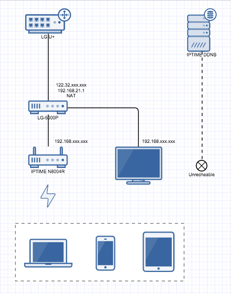
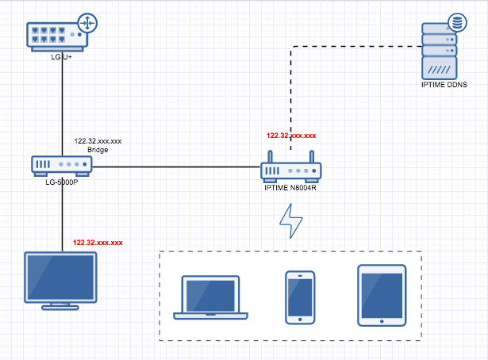

U+ TV 사용시 불편한 점 하나가 그들의 공유기(나의 경우엔 LG-5000P)를 최상단에 위치시켜야 한다는 점이다.

일반적인 경우라면 문제가 없을 수 있지만 이미 공유기를 하나 사용중이었고 DDNS로 외부에서 접근하곤 했었는데 TV 하나 보자고 조치를 취해야 하는 상황이었다. 초기에는 설치된 상태를 바꿔 LG 공유기를 내 공유기 아래에 붙여 봤었는데 얼마 안가서 TV가 안나오기 시작했다. (지금은 어쩌면 변경할 경우 처음부터 아예 안되게 막혀있는지도 모른다) 고객센터에 전화해서 얘기도 몇번인가 했었는데 기술부서와 연결이 되서 대화해봐도 그들의 공유기가 최상위가 아니면 안된단다. DDNS가 꼭 필요한 것은 아니었지만 외부에서 내 공유기 네트웍에 연결하고 싶었다.

#### 1\. 초기 상태

그림처럼 LG-5000P가 집 내부 네트웍의 최상위에 있고 TV를 제외한 device들은 무선으로 IPTIME 공유기에 붙어있다. 인터넷 연결에는 별 문제가 없는 상황이지만 IPTIME 공유기가 DHCP로 내부 IP를 할당받아 동작하고 있기 때문에 외부에서 접근하지 못한다. 내 공유기를 서랍에 모셔두고 LG 공유기만 사용하면 되지 않느냐 할 수 있지만 LG-5000P는 무선 네트웍이 안된다. (무선이 되는 다른 모델을 받을 수도 있긴 하다) 그리고 포트포워딩 등의 설정을 옮기는 작업이 싫었다. 해본 사람들은 느끼겠지만 LG-5000P 관리화면에 접속하는 순간 그냥 브라우저를 닫고 싶어진다.

#### 2\. 일반적인 조치방법들

사용자가 많아져서인지 처음 사용하기 시작했던 2~3년 전보다 알아서 조치해서 사용하는 사례가 많이 보이는데 대충 이렇다.

(1) MAC address 복제

아마도 인증 등의 과정에 LG 공유기의 MAC이 이용되는게 아닌가 싶은데 개인 공유기의 MAC을 LG의 MAC으로 교체하면 LG 공유기는 서랍에 던져놔도 된다고 한다. (IPTIME 공유기의 경우 최근 firmware로 업데이트 해보면 IPTV 설정을 업체별로 할 수 있는 기능도 제공한다.) 이게 제대로만 된다면 가장 깔끔한 방법일 것 같은데 과거에는 TV 볼 때 끊김이 있거나 하는 문제상황들에 대한 글들을 본 기억이 있다.

(2) DMZ 사용

(1)과는 달리 공유기를 모두 사용하되 하단에 위치한 개인 공유기를 LG 공유기의 DMZ에 넣어두고 사용하는 방법이다.

#### 3\. Bridged

내 공유기 네트웍에 연결하지 못하는 것은 공유기 IP가 NAT로 동작하는 LG 공유기에서 할당된 내부 IP인 것이 원인이다. 그렇기 때문에 공유기 IP를 LG 공유기 위에서 받을 수 있기만 하면 된다. (LG 공유기도 상위에서 할당받은 외부에서 접근 가능한 IP가 설정되어 있고 개인 공유기를 최상단에 위치하는 것과 같은 효과) 그래서 LG 공유기를 Bridge mode로 변경해보기로 했다. 역시 손대기 싫었던 LG-5000P 관리화면에서 설정을 변경했고 대충 이런 모양으로 바뀌었다. (물리적인 변경은 없음)

TV와 내 공유기가 LG-5000P와 같은 네트웍 대역에서 동일한 위치로 올라왔고 각각 외부에서 접근가능한 IP를 할당받았고 IPTIME의 DDNS에서도 과거엔 등록된 호스트를 찾지 못하다가 정상상태가 되었다. 한 사용자가 외부 IP를 여러개 할당받는게 가능한지 의심스러웠는데 아직 큰 문제는 없는 것 같다.

#### 4\. 결론

물리적인 변경없이 NAT를 bridge로 변경하는 것만으로도 필요한 걸 얻을 수 있었다. 하지만 mode 변경 후 IPTIME 공유기가 새로운 IP 할당받는데 시간이 꽤 소요되는 현상이 있었고 이것 때문인지 가끔 TV나 인터넷 연결이 끊어지는 것 같은 느낌이 드는 경우가 있었다. 이런 현상이 지속되면 MAC address 복제하는 방법을 시도할 생각이다.

#### **Update #1.**

Bridge mode에서 인터넷, TV 모두 끊기는 현상이 지속되서 결국 MAC address 복제하는 방법을 사용했다.
