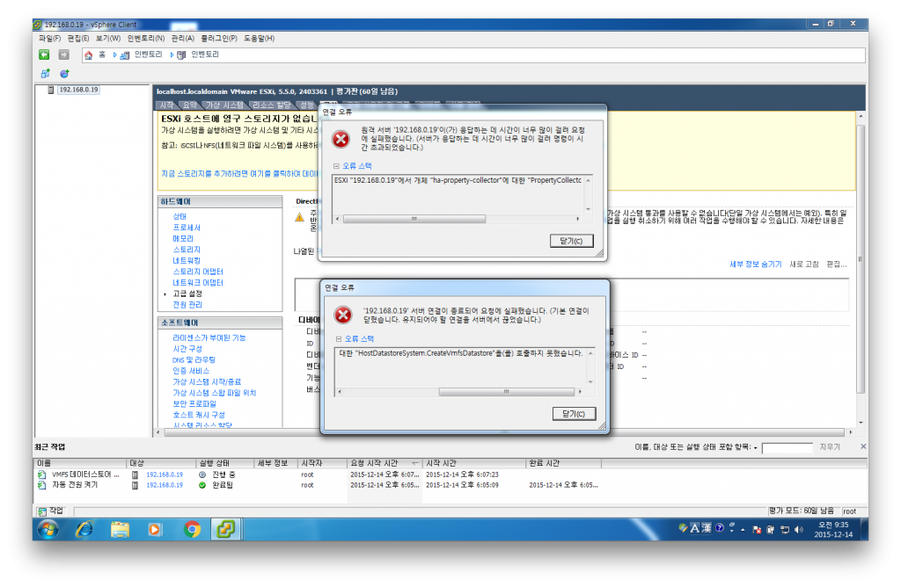
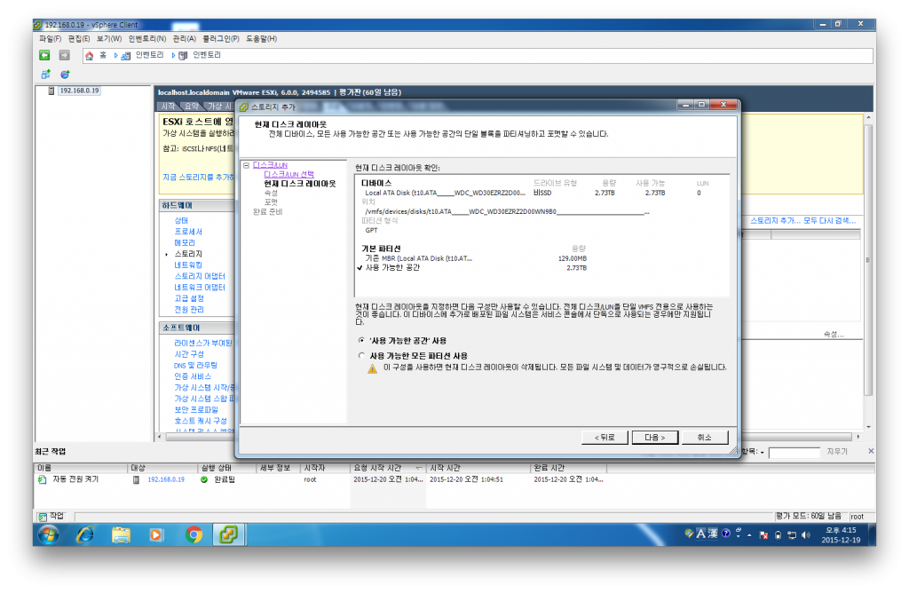
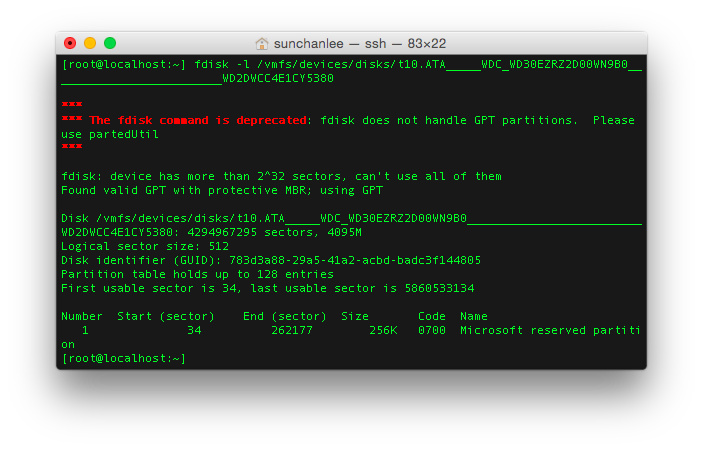
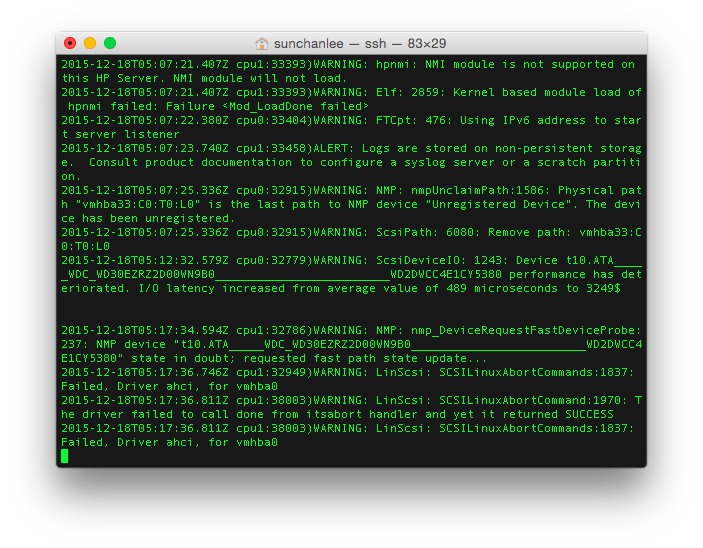
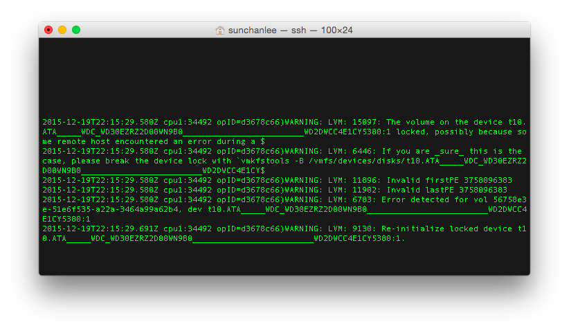

내 안의 무언가가 답보상태에 있는 것이 아닌가라는 답답함을 이겨내보고자 아이가 잠든 후에 무언가를 해보기로 했다.

그것이 무엇이든 그렇게라도 좀 더 의미있는 시간을 만들어가야 스스로에게 미안하지 않을 것 같았기 때문이다.

그렇게 2주에서 3주 정도를 지속해보고 있는데 답답함은 줄어드는 것 같고 전반적인 생활에 의욕이 조금씩 생겨나는 듯한 느낌이 든다.

#### 1\. Gen8

여러가지를 진행했지만 지난 2~3주 야간에 가장 많은 시간을 투입한 것은 Gen8 (HP의 마이크로서버 제품군)에 ESXi (VMware의 hypervisor)를 올리는 작업이었다.

2주 전쯤 중고/신품으로 구매한 장비들이 도착한 것이 시발점이 되었고 다양한 가상화 환경을 경험해 보고싶다는 생각도 있었지만 이런 류가 대부분 그렇듯이 좀 더 그럴싸한 환경을 갖는게 목적이었음을 부정할 수 없다. (사실은 장비욕)

굴러다니는 아이의 DVD를 재생할 수 있게 해주겠다는 감언이설로 부인을 설득했는데 평소에는 워낙 보살같은 분이라 그냥 넘어가준 것 같다. (이 비용이면 DVD player를 몇 개 사고 남은 돈은 맛있는 걸 사먹거나 플레이스테이션4를 사고도 남는다)

아무튼 나의 진정한 목적은 따로 있었지만 DVD play를 1차 목표로 작업을 진행해봤다.

#### 2\. ESXi 6.0 올리기

한글, 영문을 따지지 않고 정말 수많은 웹사이트를 참고했다. 'gen8 esxi'로만 검색해도 내용이 정말 많이 나온다.

하지만 나와 같은 특이한 현상을 경험한 사람은 거의 없었던 것 같다.

많은 사람들이 사용하는 방법대로 sd card를 넣고 (보드에 slot이 내장되어 있다) gen8의 훌륭한 ilo의 remote client로 붙어서 가상 cd/dvd rom에 iso 파일을 추가해 설치를 진행했다. (이런게 된다. remote로...)

처음 6.0을 sd card에 올릴 때에는 전혀 문제가 없었다. 정상적으로 올라간 걸 확인하고 새로 구매한 하드를 장착한 후 data store 등록까지 한 번에 완료할 수 있었다.

이렇게 그냥 가면 되는 거였는데 뭔가 의심병 같은게 도져서 6.0이 아닌 5.5를 올리는게 낫지 않을까라는 생각을 하게 되었다.

(1) SD card / USB format은 필수가 아닌가

보통 os 같은 걸 설치해보면 이미 존재하는 경우 파티션을 새로 잡거나 하면서 포맷을 알아서 하도록 진행할 수 있다.

그런데 6.0이 설치된 sd card에 5.5를 올리려고 하니 진행하다 멈춰버렸다.

이후 과정에서도 멈췄다 라고 판단한 이유는 야밤에 30분 이상 졸다 깨거나 책을 수십페이지 읽다 쳐다봐도 progress가 동일했기 때문이다.

깔끔하게 포맷하고 다시 설치했더니 별 문제없이 끝났다.

(2) CreateVmfsDatastore 오류

6.0이 설치된 상태에서 하드를 data store로 등록했기 때문에 5.5로 내리기 전에 등록된 data store를 삭제했었는데 5.5에서 다시 등록하려고 하니 아래와 같은 오류가 발생했다.

이후에도 수없이 마주한 저 오류는 사실 esxi 버전의 문제가 아니라 하드 초기화 여부가 원인으로 보인다.

그런데 이 때에는 그 사실을 몰랐기 때문에 '5.5는 뭔가 문제가 있나보군' 이라 생각하며 다시 6.0으로 올리기로 마음먹음.

(3) 5%, 16%, 22%, 90%

이 때부터 문제였다.

sd card를 포맷하고 설치를 시도했음에도 어느 시점부터 설치가 진행되지 않고 멈춰있는 현상이 생겼다.

주로 90%에서 멈추는 경우가 많았는데 실제로 같은 경험을 하신 분이 있다.

[https://www.2cpu.co.kr/bbs/board.php?bo\_table=vm&wr\_id=3017](https://www.2cpu.co.kr/bbs/board.php?bo_table=vm&wr_id=3017)

이 분은 sd card 종류를 타는 것이 아니냐 결론 내리셨던데 그게 원인은 아니라고 판단하고 있다.

왜냐하면 처음엔 문제없이 설치된 card였기 때문이다.

수없이 반복.

sd card도 새로 사서 해보고 usb도 종류를 바꿔가며 올려봤고, remote client로 붙어서 진행했기 때문에 iso 이미지를 실제로는 네트웍으로 전송하는 것이었을테니 iso를 usb에 얹어서도 설치해보고 ilo의 intelligent provisioning으로도 해봤다.

결과는 경우에 따라 달랐지만 5%, 16%, 22%, 90% 진행도중 멈춰버렸고 왜 안되는지 원인을 알 수 없었다.

ilo에 보이는 로그에는 특이사항이 없었던 데다가 더 상세한 로그를 볼 수 있는 방법을 몰랐기 때문이다.

하지만 방법을 바꿔가며 며칠을 시도하다 꿈까지 꿔가며 '이제 슬슬 사리가 만들어지겠구나' 라는 느낌이 들 때 되더라.

왜 된건지 알 수 없었다. 딱 이런 상황.

\<출처 : [http://www.imawebdeveloper.com/photos/memes/](http://www.imawebdeveloper.com/photos/memes/)\>

#### 3\. Data store 등록

간신히 usb에 esxi를 올리고 data store를 등록할 차례가 되었다.

분명 ESXi 6.0에서 문제없이 등록되었던 하드인데 5.5에서와 동일한 오류가 발생하기 시작.

오류 메세지로 검색해보니 역시 많은 내용이 보였다.

많은 사람들이 겪는 문제인가 싶어서 금방 해결될 것 같은 느낌이 들었지만 결과적으로는 이것도 며칠 걸렸고 역시 왜 된건지는 지금도 알 수가 없다.

처음에도 아래의 내용대로 진행해서 실패했고, 마지막에도 아래의 내용대로 진행해서 성공했다.

[http://www.virtualizationteam.com/server-virtualization/call-hostdatastoresystem-createvmfsdatastore-for-object-ha-datastoresystem-on-esxi-xxx-xxx-xxx-xxx-failed.html](http://www.virtualizationteam.com/server-virtualization/call-hostdatastoresystem-createvmfsdatastore-for-object-ha-datastoresystem-on-esxi-xxx-xxx-xxx-xxx-failed.html)

(1) Format

하드가 WD사 제품이었기 때문에 그들의 툴을 써서 포맷을 했다.

[http://uplaza.co.kr/customer/view.aspx?id=pds&code=23&category=&page=&search=](http://uplaza.co.kr/customer/view.aspx?id=pds&code=23&category=&page=&search=)

윈도우용 툴밖에 없는 것 같아서 윈도우에서 진행했는데 위와 같이 포맷하고 data store 등록하려고 하면 아래와 같은 화면을 볼 수 있다.

분명 파티션을 다 날린 상태인데 MBR로 파티션 잡힌게 보인다.

실제로 ESXi console에서 fdisk로 확인해보면 파티션이 있다. 왜 있지?

그래서 파티션만 날려보고 해봤더니 동일한 오류가 발생했다.

(2) AHCI driver?

로그를 보면 대충 아래와 같은 내용들이 반복해서 등장한다.

반복되는 내용 중 가장 마지막 라인이 신경쓰였다.

RAID를 구성하지 않을거라서 Gen8에서 SATA AHCI로 설정한 상태였는데 로그는 AHCI driver를 로딩하는데 문제가 있는 것처럼 생겼다.

혹시나 RAID가 필수인가 싶었는데 생각해보니 처음엔 분명 잘 되었었기 때문에 이것도 원인이 아니다.

드라이버 로딩 문제인가 싶어 별 자료를 다 찾아서 살펴봤는데 딱히 AHCI 드라이버가 로딩이 안 될 이유가 보이질 않았다.

(3) Device locked

하드 포맷을 윈도우, 맥에서 여러가지 툴로 해보고 파티션은 따로 날려보고 하는 등의 작업을 며칠간 수없이 반복하다가 어느 날 다시 로그를 보니 이런 내용이 등장했다.

'아 디바이스가 잠겨있나보네' 라고 잠깐 생각했는데 포맷하고 바로 밀어넣은 하드인데다 난 추가로 아무런 작업을 하지 않았는데 잠겨있다는게 이상했고 마지막 줄에 다시 초기화를 하는 것 보니 스스로 뭔가 조치를 하는구나 싶었다.

야식으로 라면을 먹고 오니 원래 반복되어야 하는 warning 로그들이 없었다.

'오 뭔가 다른데?' 라고 생각하며 스크린 세이버를 걷어버리니 등록이 되어있더라.

왜? 인지를 알 수가 없었다. 답답...

#### 4\. VM 생성

드디어 VM을 하나 생성해서 윈도우를 올려봤다.

그리고 부인에게 보고하기 위해 곰 플레이어를 설치하고 Gen8에 꽂아넣은 DVD (장치는 기본적으로 없다. 새로 사서 끼워넣은거)에 dvd 한 장을 올려놓고 재생해봤다.

ESXi client에서 재생해보니 그럭저럭 잘 나오기는 하는데 부인은 이런거 사용할 줄 모른다.

고민하다가 방치된 ipad에 remote desktop 앱을 설치해서 연결한 후에 플레이를 해보니 혹시나 했지만 RDP는 역시나 끊긴다.

#### 5\. 다음 여정

VM 하나를 더 생성해서 NAS로 만들어버릴 생각이다.

그리고 DVD는 몽땅 파일로 만들어서 Plex나 기타 서비스로 재생할 계획인데 알 수 없는 문제들을 겪은 터라 벌써부터 겁이 난다.

그래도 해야 한다.

부인 입장에서 뭔가 신기한 효과나 효용성을 보여줘야 내가 다음에 어떤 장비를 사려고 할 때 문제가 없을 것이다.
