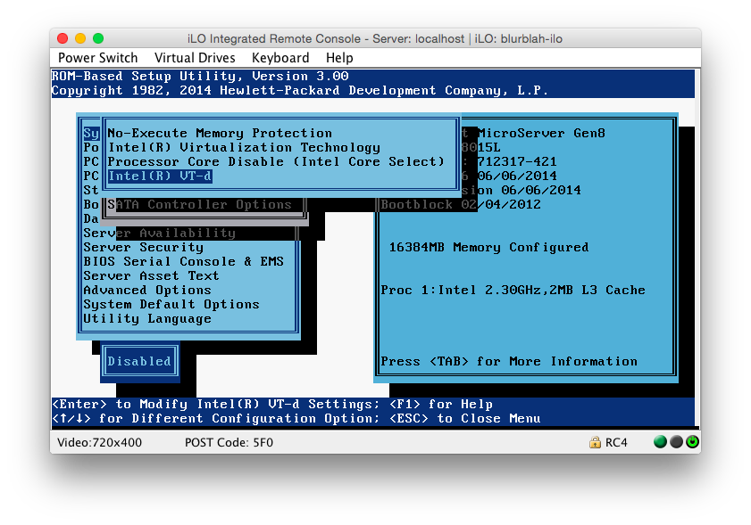
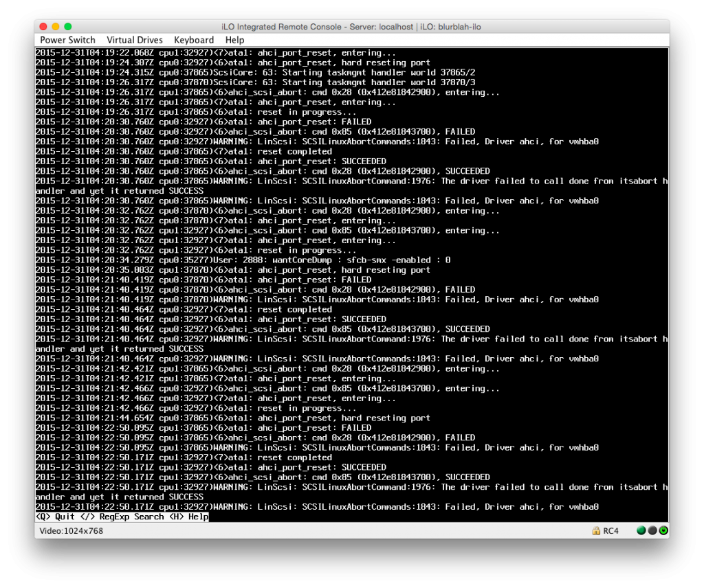
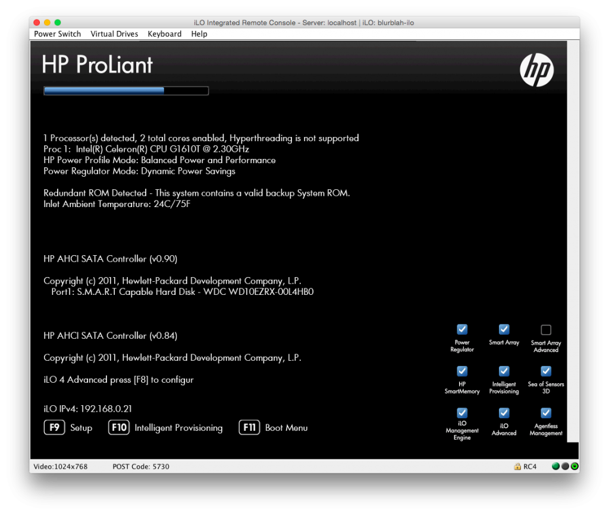
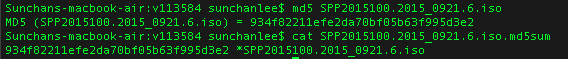
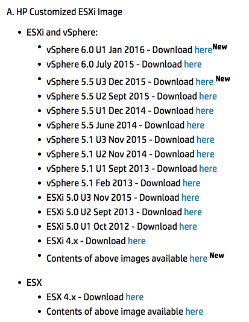
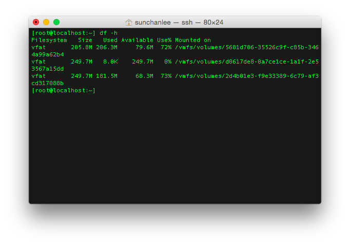

지난번에 2주 정도 고생([덕만이 잠든 시간에 - Gen8 esxi 삽질기](http://192.168.10.23:8088/1222))하고 된다고 생각했는데 착각이었다.

#### 1\. VT-d

HDD가 멈추는 듯한 현상이 지속적으로 발생됐다. 그것도 boot 완료된 시점에서 약 3분후.

아는 분들의 도움으로 BIOS 설정이 잘못된 걸 알게 되었다.

[VT-d](https://software.intel.com/en-us/blogs/2009/06/25/understanding-vt-d-intel-virtualization-technology-for-directed-io) 설정이 enable로 되어있었는데 현재 사용중인 CPU는 VT-d를 지원하지 않는다.

G1610T 라는 Celeron CPU인데 제조사에서 안된다고 하니 잘못 설정한게 맞다.

[http://ark.intel.com/products/71074/Intel-Celeron-Processor-G1610T-2M-Cache-2\_30-GHz](http://ark.intel.com/products/71074/Intel-Celeron-Processor-G1610T-2M-Cache-2_30-GHz)

BIOS 설정을 공장초기화한 값이 enable로 되어있는게 이해되지 않지만 그래도 제대로 설정.

#### 2\. SATA AHCI vs SATA Legacy

VT-d 설정을 변경하고 설치를 다시 진행해봤는데 해결되기를 기대했지만 문제는 여전했다.

현상 만으로는 알 수가 없어서 로그를 뒤져보기로 했다. (이 때부터 커널로그를 보기 시작했다)

Failed, Driver ahci, for vmhba0 라는 부분이 반복되는 걸 알 수 있었다.

AHCI driver 로딩하는데 뭔가 문제가 있는 것 같아서 vmware 자료들을 뒤져봤는데 내 상황에서 특별히 조치할만한게 없었다.

([http://kb.vmware.com/selfservice/microsites/search.do?language=en\_US&cmd=displayKC&externalId=2000641 외 기타](http://kb.vmware.com/selfservice/microsites/search.do?language=en_US&cmd=displayKC&externalId=2000641))

[이런 내용](http://www.v-front.de/2013/11/how-to-make-your-unsupported-sata-ahci.html)도 있었는데 지원안하는 드라이버가 아니었기 때문에 역시 조치할 수 없었다.

드라이버 문제라는 걸 확실히 하기 위해 BIOS setting에서 AHCI 대신 SATA Legacy (IDE 타입의 구형 HDD를 지원하기 위한 내용으로 보인다)를 선택해서 다시 설치를 해보니 문제 해결.

드라이버 문제가 맞다는 확신을 가지고 HDD 등록하고 이런저런 작업을 더 진행해보니 이번엔 너무 느린게 문제였다.

느낌으론 속도가 일반적인 경우에 비해 1/10 또는 그 이상 느린 것 같았다.

순간 '버릴까?' 생각했다.

#### 3\. Service Pack for Proliant 설치

목표가 좀 더 뚜렷해졌다.

"AHCI controller를 사용하면서 ESXi를 올린다"

다시 원래대로 돌아가 AHCI driver 로딩에 문제가 발생하는 상황에서 이런저런 내용을 살펴보니 할 게 하나 생겼다.

SPP (Service Pack for Proliant) 업데이트를 안해봤으니 그걸 해보기로 했다.

최신버전이 2015년 10월에 나온 것 같은데 업데이트 해보니 오! 몇 개 system firmware가 업데이트 된다.

하지만 기대했던 AHCI driver는 업데이트 되지 않았다.

초기 로딩화면에 AHCI 버전이 나오는데 HDD에 대한 드라이버는 0.90 버전이 ODD에 대한 드라이버로 0.84 버전이 로딩되는 것처럼 보인다.

이해 안된다. 그리고 뭔가 잘못 관리되는 듯한 인상을 받았다.

이 때부터 얘네 웹사이트에 올라와있는 파일들의 checksum 값을 확인하기 시작했다.

그래도 SPP 업데이트 후에 몇가지 달라졌다.

(1) SD / USB 설치

ESXi를 SD나 USB에 올리는게 계속 문제가 있었는데 SPP 업데이트 후에는 문제없이 잘 설치된다.

(2) Kernel log

AHCI driver 로딩이 안되는 듯한 로그가 사라졌다!!

잘 되어야 할 것 같았는데 문제는 여전했다.

다시 원점.

#### 4\. HDD에 직접 설치

갑자기 멈춘 시점의 커널로그를 보면 특이사항이 없었다.

다만 vmware 측에서는 무시해도 되는 로그라고 하는 warning이 반복적으로 찍혔다.

Scratch partition에 대한 내용인데 SD나 USB에 설치할 경우 시스템 로그가 저장된다는 scratch partition을 만들지 못하는데 없는 경우 ram disk에 저장하기 때문에 단순히 경고만 할 뿐 특별히 시스템에 문제는 주지 않는다고 한다.

ESXi를 SD에 올리고 HDD를 추가한 후 reboot (boot 후 약 3분 후에 freeze 되고 HDD 추가할 때 쯤이면 시간이 얼마 없다)하고

warning을 없애기 위해 HDD에 scratch partition 경로를 지정해줬다.

그래도 문제는 해결되지 않았는데 아무래도 SD나 USB에 ESXi를 올리는게 불안해졌다.

그리고 RAID 구성을 하지 않을거라 굳이 SD 등에 ESXi를 올릴 필요가 없다는 생각이 들었다.

그래서 HDD에 ESXi를 직접 올리기로 했다.

iLO의 remote console에서 가상드라이브 할당해서 해보니 이번엔 HDD 설치 도중 문제가 생긴다.

(1) device or resource busy

(2) 설치 도중 멈춤

난 아무 작업을 하지 않았고 깨끗하게 포맷한건데 이랬다.

이쯤에서 다시 한 번 버릴까 생각했다.

그래도 포기하지 않고 Intelligent provisioning 기능으로 설치해보기로 했다.

참고로 전혀 intelligent 하지 않다.

USB에 여러 버전의 iso 이미지를 담아놓고 설치를 시도했다.

ESXi 6.0 이미지는 intelligent provisioning에서 인식하지 않는다.

ESXi 5.5, 5.1의 여러 버전중에서 최신 순으로 설치해봤다.

이미 SD나 USB로 여러번 반복했던 거였지만 HDD로 설치할 때는 조금씩 현상이 달랐다.

예를 들어 5.5 U2는 device or resource busy 라는 메세지 때문에 설치를 시작조치 못했다.

완전히 동일한 환경에서 설치 버전에 따라 문제가 나타나거나 그렇지 않다는 것은 뭔가 잘못 만든거다.

결국 2014년에 배포된 것으로 보이는 5.5 U1 까지 내려가서야 설치가 완료되었다.

그리고 그 버전 설치 이후에 더이상 문제는 발생하지 않았다.

힘들었다.

#### 5\. 기타 문제점들

HP의 문제인지 VMWare의 문제인지 모르겠지만 발견한 기타 문제점들은 아래와 같다.

(1) SD/USB 사용시 scratch partition

http://blog.pasion.kr/esxi-warning-host-solution1/

위에서 기술했던 내용이지만 SD나 USB에 ESXi 설치시 scratch partition을 만들지 않는다.

SD나 USB에 여유공간이 많아도 절대 만들지 않는다.

난 16GB짜리 micro SD를 사용했는데 (요즘 마트가면 16GB 이하 제품을 찾기 힘들다) 위 그림에서 몇백메가씩 잡혀있는 나머지 공간은 그냥 버리게 된다.

(2) Driver 버전차이에 따른 문제들

장비 특성상 수많은 controller들과 driver들이 있는건 알겠는데 각 driver 버전에 따른 문제점들이 많은 것 같다.

이번에 내가 경험한 문제도 그런 문제 중 하나로 추측되고 인터넷에는 수많은 문제들이 보고되어 있다.

(3) HP의 esxi custom image 관리

[http://www8.hp.com/us/en/products/servers/solutions.html?compURI=1499005#tab=TAB4](http://www8.hp.com/us/en/products/servers/solutions.html?compURI=1499005#tab=TAB4)

이곳에 기록되어 있는 날짜를 신뢰할 수가 없었다.

VMWare 어느 사이트에는 각 이미지별 release date가 위와는 달랐고 일부 해외 유저들이 기술한 문서와도 날짜가 달랐다.

날짜와 Update 번호로는 알기가 너무 어려워서 결국은 Build number를 비교하면서 문서들을 읽었다.
