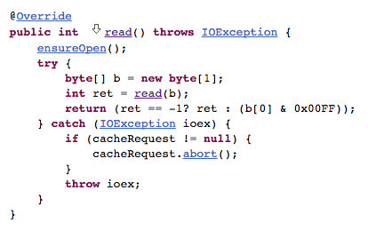

Java로 웹에 있는 영상 파일을 다운로드하는 기능을 간단하게 구현하면서 기본함수에 대한 의문이 생겼다.

실제로 영상 파일이 깨지는 문제도 있었다.

#### 1\. FileOutputStream write(byte\[\] b)

아래 구문에서 사용된 write 함수는 byte buffer, offset, length를 parameter로 받는다.

좀 더 간단한 형태인 write(byte\[\] b)를 사용하는 것으로 코드를 변경하면 문제가 발생한다. (테스트했던 영상파일들에서는)

```java
InputStream is = conn.getInputStream();
FileOutputStream fos = new FileOutputStream(filename);
byte[] buffer = new byte[4096];
int readBytes = -1;
while((readBytes = is.read(buffer)) != -1) {
  fos.write(buffer, 0, readBytes);
}
```

write(byte\[\] b)의 내용을 보자.

[![fileoutputstream-write(byte[])](images/fileoutputstream-writebyte.png)](https://blurblah.net/wp-content/uploads/2016/01/fileoutputstream-writebyte.png)내용은 간단하다. byte 배열의 길이만큼 file output stream에 쓰는 기능이다.

#### 2\. 왜 문제가 생겼는가?

결과적으로 보자면 HTTP로 들어온 input stream을 읽어들인 byte 수가 byte array의 총 크기보다 작은 경우가 있기 때문이다.

보통의 파일을 읽으면 마지막만 제외하고 buffer로 사용하는 byte array를 꽉꽉 채웠었는데 이 경우는 그렇지 않았다.

궁금해서 살펴보니 HttpInputStream의 read(byte\[\])는 이렇게 구현되어 있다.

[![httpinputstream-read(byte[])](images/httpinputstream-readbyte.png)](https://blurblah.net/wp-content/uploads/2016/01/httpinputstream-readbyte.png)read(byte\[\], int, int) 함수를 호출하지만 상속트리를 뒤지다보면 결국 자신이 구현한 read() 함수 호출이 기본이 된다.

read() 함수는 아래 그림처럼 -1이 나오기 전까지 1바이트씩 읽어들이도록 되어있고 read(byte\[\], int, int) 함수도 -1을 만나기 전까지는 byte array의 길이만큼 읽어들이게 된다.

[](https://blurblah.net/wp-content/uploads/2016/01/httpinputstream-read.png)

그러니까 byte array 만큼 읽어들이지 못하는 경우가 있을 수 있는데 이에 대해서 고려하지 못했던게 문제였다.

실제로 찍어보면 사용된 byte array는 4096만큼 0으로 초기화되어 있고 계속 사용하기 때문에 byte array의 길이는 4096으로 항상 동일하고 읽어들인 실제 byte 수는 그것보다 작은 경우가 지속적으로 발생했다.

이런 상태에서 FileOutputStream의 write(byte\[\]) 함수를 사용하면 byte array의 길이만큼 쓰게된다. 실제 읽어들인 byte 만큼이 아니라 과거에 사용했던 일부 byte가 섞이게 되는 거다.

#### 3\. 결론

가능하면 write(byte\[\]) 함수는 사용하지 않을 생각이다.

조금 불편해보여도 확실한게 낫다.
