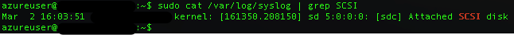

MS Azure에서 Ubuntu VM을 생성해 사용하던 중에 어느 시점부터 ssh 연결이 되지 않는 경우가 생겼다.

Portal dashboard 상에서는 running 상태로 표시되고 있고 실제 DNS나 IP는 제대로 할당된 것으로 보였는데 ssh 접속을 시도하면 connection refused라고 표시되었는데 verbose option으로 메세지를 봐도 특별한 내용은 없었다.

#### **1\. Reset remote access**

해결을 위해 Azure에서 제시하고 있는 방법은 아래 링크와 같다.

[https://azure.microsoft.com/en-us/documentation/articles/virtual-machines-troubleshoot-ssh-connections/](https://azure.microsoft.com/en-us/documentation/articles/virtual-machines-troubleshoot-ssh-connections/)

가장 손쉬운 방법은 remote access를 reset하는 것인데 별 문제가 아니라면 이 기능으로 해결이 되는 것 같다.

예전 portal ([https://manage.windowsazure.com](https://manage.windowsazure.com))에서 VM dashboard를 보면 해당 기능에 대한 링크가 있고 누르면 새로운 portal로 이동해서 진행하도록 되어있다.

대략 10분 이내에 reset이 되는데 이걸로 해결이 안된다면 아래의 방법을 참조한다.

#### **2\. Disk만 분리해서 문제해결 후 VM을 재생성하는 방법**

VM에 접속이 안되니 문제를 확인할 수도, 추측되는 문제의 원인을 해결할 수도 없다.

국내 IDC에 있거나 근처에 있는 장비라면 직접 가서 상태를 확인할 수도 있겠지만 클라우드라 그럴 수도 없다.

이 방법은 VM의 disk만 따로 떼어내서 원인 확인 및 해결 후에 다시 VM에 연결해서 살리는 방법이다.

참조한 링크문서는 아래와 같다.

[https://social.msdn.microsoft.com/Forums/en-US/54c600c0-f4d6-4b20-ad87-1358fa10d27a/linux-vm-ssh-connection-refused?forum=WAVirtualMachinesforWindows](https://social.msdn.microsoft.com/Forums/en-US/54c600c0-f4d6-4b20-ad87-1358fa10d27a/linux-vm-ssh-connection-refused?forum=WAVirtualMachinesforWindows)

**(0) 사전에 유의할 내용**

Disk를 attach, detach 하거나 VM 삭제하면서 남겨둔 disk 정보가 리스트에 늦게 반영되는 경우가 있었다.

관련 작업을 하면서 disk가 보이지 않는다면 몇 분 정도 후에 다시 시도해보면 확인할 수 있다.

임시로 사용할 VM은 삭제하는 VM과 동일한 storage account를 사용하고 있어야 한다.

Disk는 storage account 별로 동일한 공간에 위치하기 때문이다. (물리적으로는 다른 영역일 수 있지만)

**(1) VM 삭제**

우선 VM을 삭제해야 하는데 삭제할 때 관련 disk는 남겨둔다. (select "Keep the attached disks")

VM에 attach되어 있는 disk는 다른 VM에 붙일 수 없게 되어있기 때문이다.

**(2) 새로운(임시) VM에서 attach disk / mount**

새로운 VM을 생성하거나 이미 사용중인 VM에서 attach disk 버튼을 눌러 (1) 과정에서 남겨둔 disk를 붙여준다.

정상적으로 붙었다면 dashboard에 표시되지만 임시 VM에서 확인하면 보이지 않는다.

하지만 /var/log/syslog를 SCSI로 grep을 해보면 새롭게 추가된 disk를 확인할 수 있다.

일반적인 경우라면 /dev/sda1가 root filesystem으로 /dev/sdb1이 붙어있는 상태이고 신규로 추가한 disk는 sdc로 연결된다.

VM에서 mount할 임시 경로를 만들고 /dev/sdc1을 (sdc인 경우) 생성한 경로에 mount 해준다.

mount /dev/sdc1 mount\_point

**(3) 문제 분석 / 해결**

위 과정까지 문제가 없었다면 ssh 연결이 되지 않던 VM의 disk 내용을 고스란히 볼 수 있다.

boot log나 syslog, dmesg 등을 mount 된 경로에서 확인하고 문제의 원인을 분석한다.

나의 경우에는 fstab에서 webdav로 mount 하고 있는 외부 disk 연결에 문제가 발생하는게 원인이었던 것으로 보여 fstab에서 그 부분을 주석처리 해버렸다.

(fstab에서 사용한 option을 좀 수정해야 하겠지만 우선은 VM을 살리는게 목적이었으니 그냥 진행)

**(4) Detach disk / VM 생성**

다시 booting을 해도 문제가 없을 것처럼 손을 봤으면 임시 VM에서 disk를 umount하고 portal dashboard에서도 detach 해준다.

그 이후에는 실제로 사용할 VM (과거에 제거한 VM과 동일하게 해도 문제없음. Cloud service만 같이 제거한 상태라면)을 생성하는데 detach된 disk를 가지고 생성해야 한다. (VM 생성시에 Gallery의 MY DISKS 항목에서 수정된 disk를 선택)

사전 유의사항에도 명시한 것처럼 disk list가 갱신되는데 시간이 좀 걸릴 수 있으니 list에 disk가 보이지 않으면 얼마 후에 다시 시도해야 한다.
