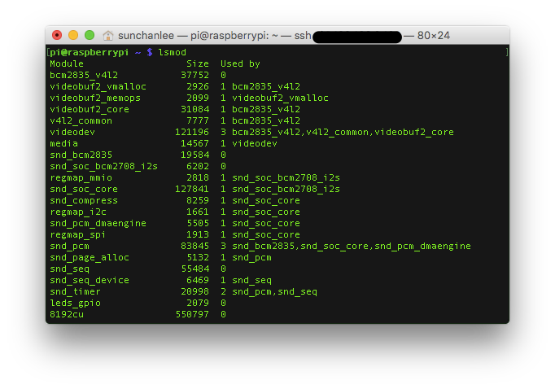

Raspberry pi로 뭘 해볼까 하다가 요즘 진행중인 프로젝트도 있고 해서 CCTV로 활용해보기로 했다.

어차피 카메라 모듈은 있고 기본 제공되는 툴로 스틸사진은 찍어본 적이 있으니 가볍게 접근할 수 있을거라 생각했다.

#### 1\. Motion 사용

검색을 해보니 motion이라는 툴을 CCTV로 활용할 때 많이 사용하는 것 같았다.

MJPEG으로 스트리밍 비슷하게 해주고 별도의 클라이언트 없이 브라우저로 가볍게 영상확인도 가능한 것 같아서 선택.

OS로 데비안 계열의 Raspbian을 사용하고 있으므로 apt-get으로 간단하게 설치할 수 있고 /etc/motion/motion.conf 파일에서 각종 설정을 변경할 수 있다.

원격으로 영상 확인과 설정을 제어하기 위해 webcam\_localhost와 control\_localhost를 변경하고 restart를 했는데 (default로 localhost에서만 접근 가능하도록 설정되어 있음) 영상이 나오질 않았다.

이상해서 시스템 로그를 확인해보니

device를 열 수 없다고 한다.

예전에 카메라 모듈 장착하고 raspi-config에서 enable 설정도 해줬는데 실제 /dev에 보니 video0이 없었고 motion의 설정 파일은 video capture를 위해 default로 /dev/video0를 읽도록 되어있었다.

#### 2\. modprobe

로딩되어 있는 모듈들을 살펴보기로 했다.

그림처럼 이런저런 모듈들은 보이지만 video 관련된건 없다.

그래서 문서를 좀 찾아보니 camera는 v4l2 driver를 사용하도록 되어있고 ([https://www.raspberrypi.org/documentation/hardware/camera.md](https://www.raspberrypi.org/documentation/hardware/camera.md)) 사용중인 raspberry pi가 broadcom의 bcm2835 chip이 박혀 있어서 bcm2835-v4l2라는 모듈을 raspbian에 넣어둔 것으로 보인다.

modprobe 명령으로 bcm2835-v4l2를 로딩하고 나서 확인해보면 아래 그림처럼 video 관련 모듈이 뜬다.

모듈을 로드한 후 motion을 restart 하니 문제없이 영상을 확인할 수 있었는데 modprobe는 일시적으로 모듈을 올려주는 것이기 때문에 boot 이후에 항상 사용하기 원한다면 /etc/modules 파일에 모듈 이름을 추가해야 한다.

#### 3\. LED off

Video가 정상으로 나오는건 확인했는데 카메라 모듈에 달려있는 적색 LED가 항상 켜져있는게 마음에 걸렸다.

상당히 밝아서 눈에 거슬리고 작지만 쓸데없이 파워를 소모하긴 싫으니 꺼보기로 했다.

관련 문서가 있을 것 같아서 찾아보니 역시...

[https://www.raspberrypi.org/documentation/configuration/config-txt.md](https://www.raspberrypi.org/documentation/configuration/config-txt.md)

문서에 의하면 Raspberry PI는 BIOS 대신 /boot/config.txt 파일에서 각종 설정을 변경할 수 있도록 해뒀다고 한다.

/boot/config.txt에 disable\_camera\_led = 1 을 추가해주고 reboot 하면 카메라는 동작중이지만 LED는 켜지지 않는 걸 확인할 수 있다.

#### 4\. 결론

결국 해놓고 보니 뚝뚝 끊어지긴 하지만 훌륭한 퀄리티를 원했던 것은 아니니까 그냥 넘기기로 했음

(framerate 조절해도 별 차이 없었음)
