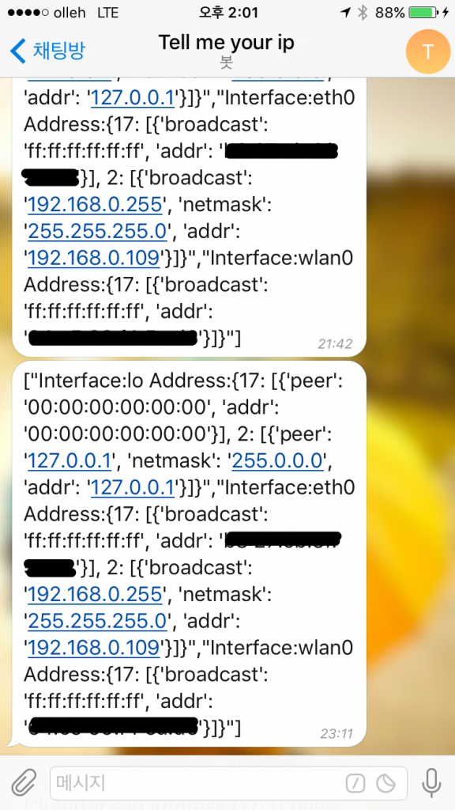

Raspberry pi를 가지고 놀다보니 불편한 점이 하나 있었다. 작아서 휴대성이 좋기는 한데 새로운 환경에서 전원을 켰을 때 접속 정보를 알기 위해서 번거로운 작업을 해야 한다는 것이다. HDMI 케이블, USB 혹은 무선 키보드/마우스를 들고 가서 다 연결한 후에야 사용 가능한데 주변기기들이 훨씬 크기 때문에 여간 불편한게 아니다. 특히 나의 경우엔 ssh로 붙어서 작업하는 빈도가 높고 연결된 모니터를 직접 보며 작업하는 일은 거의 없기 때문에 위의 과정이 좀 무의미했다.

그래서 인터넷 연결이 되면 IP 정보만 telegram으로 전달하는 모듈을 만들어보기로 했다.

#### 1\. Github

[https://github.com/blurblah/tell\_me\_your\_ip](https://github.com/blurblah/tell_me_your_ip)

위 저장소에 올려두고 대략적인 설명을 써넣었으니 참조.

#### 2\. Telegram bot의 제약사항

예전에 telegram bot을 만들어봤을 때 한가지 제약 혹은 유의할 점을 하나 알았는데 하나의 token을 가진 bot은 한 곳에서만 동작해야 한다는 점이다. 두 군데 이상 동작하려고 하면 하나는 오류를 뱉고 실행되지 않는다. 위 저장소에 있는 소스는 device에서 직접 동작하게 되어있기 때문에 telegram bot을 직접 생성해서 token을 넣게 되어있다. 여러개의 device를 대상으로 활용하기 위해서는 방식을 변경해야 할 것 같다. 특정 서버 한 곳에서 bot이 동작하게 하고 device를 등록한 후에 관리되게 만들어야 할 것 같은데 나중에 필요성이 생기면 작업해봐야겠다.

#### 3\. 동작 결과

Raspberry pi를 새로운 곳에서 LAN 케이블을 연결하고 전원을 올리면 곧 아래와 같은 메세지가 telegram으로 전달된다. 모든 network interface의 정보를 다 뿌리게 되어있는데 필요한 정보만 선별해서 다듬은 후에 전송할 필요가 있어보인다.

