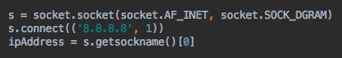

[지난번에 만들어놓은게](http://192.168.10.23:8088/1278) 고작 IP를 얻기 위해서 package를 별도로 설치해야 한다는게 마음에 걸렸다. 어차피 그 package도 IP 정보를 얻기위해 네이티브 API를 사용하지 않을까 싶어서 방법을 찾아보기로 했다. 사실 가장 좋은 방법은 그 package 소스를 보고 분석하는 것이겠지만 시간이 꽤 걸릴 것 같기도 해서 우선은 간단히.

#### 1\. socket.gethostbyname()

원래 처음에 사용했던 방법은 socket의 [gethostbyname 함수](https://docs.python.org/3/library/socket.html#socket.gethostbyname)를 사용하는 것이었다. 이 함수는 hostname을 ip address로 변환해주는데 hostname을 얻기 위해서 gethostname() 이나 getfqdn()을 사용해봤다. OS X에서는 특별한 문제가 없어서 그냥 사용하려고 했는데 raspberry pi로 넘어가니 IP가 자꾸 '127.0.0.1'로 나온다. /etc/hosts와 관련이 있는데 예전에 Java로 했을 때도 비슷한 현상이 있었던 것 같다.

아무튼 hostname과 관련된 다른 작업을 해주지 않으면 gethostbyname은 사용하기 어려울 것 같다는게 결론.

#### 2\. netifaces

이름처럼 network interface와 관련된 기능을 구현해놓은 package로 설치만하면 정말 간단하게 interface 별로 원하는 정보를 얻을 수 있다. 예를 들어 interfaces 함수를 호출하면 존재하는 모든 interface가 다 튀어나오고 ifaddresses 함수를 사용하면 해당 interface가 가지고 있는 address 정보를 던져준다.

하지만 설치가 귀찮아서...

#### 3\. socket.connect() / socket.getsockname()

그래서 최종적으로 사용한 방법은 socket으로 어딘가에 연결한 후에 연결된 socket 정보로부터 IP를 얻어오는 방법이다.

그림처럼 socket을 생성한 후에 아무곳이나 연결한다. 아무곳이라는게 그래도 연결이 가능한 곳이어야 하니 google이 망하지 않는한 유지될 것 같은 걔네 DNS에 연결해본다. [socket.connect() 함수](https://docs.python.org/3/library/socket.html#socket.socket.connect)는 address를 받게 되어있는데 AF\_INET family로 socket을 생성했으니 (host, port)로 이루어진 tuple을 넣는다. port는 아무거나 해도 관계없겠지만 사용되지 않을 것 같은 1을 넣어줬다. ([0을 넣을 경우 OS X에서는 오류가 발생함](http://stackoverflow.com/questions/166506/finding-local-ip-addresses-using-pythons-stdlib/25850698#25850698))

연결된 이후에는 socket의 주소를 받아본다. ip와 port가 넘어오니 그 중에 ip 정보만 받으면 끝. (port는 실제 8.8.8.8의 1번 포트와 연결을 맺은 임의의 port 번호가 날라옴)
